# Detailed Design — Core Account E-Wallet System

**Version**: 1.1
**Date**: 2026-05-28
**Status**: Draft
**Companion**: `wallet_HLD.md`, `wallet_onboarding.md` (BRD onboarding + wallet opening + KYC tier), `finance_transaction.md` (BRD + API for topup/deposit/withdraw/transfer/reversal/history with Fee & VAT), `wallet_seed.sql` (operational seed + helper functions + bulk test-data generator)

**Changelog**
- v1.6.6 (2026-05-28): **Transaction metadata + client-info snapshot + client change-data audit**. Extend `WLT_TRAN_HIST` (§2.5) with two JSONB columns: `METADATA` (caller-supplied open bag, ≤ 1 KB, P1-forbidden) and `CLIENT_INFO` (SP-computed snapshot at posting time, ≤ 512 B, P2-only). Add `FM_CLIENT_AUDIT_LOG` (§2.13) with a generic SECURITY DEFINER trigger `fn_audit_client_change` that captures every INSERT/UPDATE/DELETE on `FM_CLIENT_KYC` (and recommended on FM_CLIENT*) with OLD/NEW JSONB + diff'd `CHANGED_FIELDS[]` + maker-checker fields. Application sets `SET LOCAL audit.actor/source/reason/request_id/...` GUCs per TX so the trigger can attribute changes. Posting and audit are **decoupled**: the posting SP does **not** read `FM_CLIENT_AUDIT_LOG` (would add ~500 reads/sec at peak); investigators join `WLT_TRAN_HIST.POST_DATE` ↔ `FM_CLIENT_AUDIT_LOG.CHANGED_AT` by time-range instead. PII rules: audit columns inherit §8.3 masking + every P1 read appends to `WLT_PII_ACCESS_LOG`; retention 18mo hot → 10yr archive (§9a).
- v1.6.5 (2026-05-28): **Transactional outbox + withdraw disbursement tracking** — close the two P0 gaps from the senior-SA architecture review. Add `WLT_OUTBOX` (§2.11): every posting SP writes one row inside the same TX as `WLT_TRAN_HIST`, ensuring Kafka emission is atomic with the ledger commit. Relay topology: Debezium CDC on `WLT_OUTBOX` (primary) with Go polling worker using `SELECT ... FOR UPDATE SKIP LOCKED` as Y1 fallback. Add `WLT_WITHDRAW_TRACK` (§2.12): mutable disbursement state machine (`SUBMITTED → ACKED → DISBURSING → COMPLETED | FAILED → REVERSED`) keyed by `EXT_PAYOUT_REF`, separate from append-only `WLT_TRAN_HIST`. Add `post_withdraw_reversal` SP signature (§2.12) — idempotent on `EXT_PAYOUT_REF`, refunds amount + fee + VAT in one TX. The Treasury → Wallet callback mechanism that drives this SP lives in the Treasury Service spec (out of scope).
- v1.6.4 (2026-05-28): **Fix `CALC_BAL` invariant**. Change `CALC_BAL` to `GENERATED ALWAYS AS (ACTUAL_BAL - TOTAL_RESTRAINED_AMT) STORED` instead of a regular column + `CHECK`. Remove `chk_acct_calc` (structurally true). Reason: the SPs in §3.7 only UPDATE `ACTUAL_BAL` without updating `CALC_BAL` → CHECK fails on every posting. Generated stored eliminates this entire bug class. Impact: remove `CALC_BAL` from the target list of every INSERT/UPDATE into `WLT_ACCT` (PG forbids writing to a generated column); `WLT_ACCT_BAL.CALC_BAL` remains as is (separate snapshot).
- v1.6.3 (2026-05-28): **Sub-account sharding pattern** for merchant/agent hot wallets > 30 TPS. Add `WLT_ACCT_GROUP` (§2.2a), 3 new columns on `WLT_ACCT` (`GROUP_ID`, `SHARD_INDEX`, `ACCT_ROLE`), official DDL for `WLT_RESTRAINTS` (§2.6a) with `GROUP_ID` for group-level scope, audit `WLT_SWEEP_LOG` (§2.6b), views `v_wlt_group_balance` + `v_wlt_active_restraints_effective` (§2.6c). Seed adds tran types: `SWEEPO`, `SWEEPI`, `RVSWP`, `MERCHWD`, `FEEMW`, `RVMWD`. SP catalog (§3.7.1) adds 4 new SPs: `provision_acct_group`, `fn_resolve_shard_acct_no`, `post_sweep_shard`, `post_sweep_group_all`, `post_merchant_withdraw`. Pattern detail + performance calculation §3.6.6.
- v1.6.2 (2026-05-28): **Full-DB architecture**. All posting logic (Phase 1 validate + Phase 2 commit) packaged inside PostgreSQL plpgsql stored functions. Go service acts as a thin RPC with `context.WithTimeout(3s)`. Timeout layering: Go ctx 3s > PG statement_timeout 2.5s > lock_timeout 1.5s. In-process lock window 0.5-1ms. Adds §3.7 SP catalog (10 functions) with example `post_transfer`; §3.8 Go client patterns (pgxpool config, retry, observability).
- v1.6.1 (2026-05-28): Narrow scope to **internal sync transactions only**. Remove `WLT_MEMO_TRAN` (DROP TABLE), remove `HOLD_AMT` column on `WLT_ACCT`. Add denorm flags `TOTAL_RESTRAINED_AMT`, `CR_BLOCKED`. `CALC_BAL = ACTUAL_BAL - TOTAL_RESTRAINED_AMT`. Pipeline §3 rewritten from 7-step pessimistic to 3-phase deferred locking (Phase 1 no-lock validate → Phase 2 atomic UPDATE → Phase 3 post-commit). State machine §6.1 collapsed: PENDING/EXPIRED removed.
- v1.6: Patched schema gap — add DDL for `WLT_ACCT_TYPE` (§2.1b, previously existed only in the mermaid ERD without a CREATE TABLE) and seed the missing GL `401.03` (broken FK with `WLT_GL_MAP`). The procedure that creates clients/opens wallets and the bulk data generator are split into a separate file `wallet_seed.sql`.
- v1.5: Upgrade target to **PostgreSQL 17**. Remove `seq_tran_hist`, use `IDENTITY` directly on partitioned `WLT_TRAN_HIST` (newly supported in PG17). Add partition lifecycle with `MERGE/SPLIT PARTITION` (PG17 native, no need for detach + reinsert).
- v1.4: Migrate all DDL/DML to **PostgreSQL 16** dialect — `VARCHAR2→VARCHAR`, `NUMBER→BIGINT/NUMERIC/SMALLINT`, `CLOB→TEXT`, `SYSDATE/SYSTIMESTAMP→NOW()/CURRENT_DATE`, sequence (`.NEXTVAL→nextval()`), declarative partitioning (range + sub-hash), `MERGE` → `INSERT ... ON CONFLICT`, generated columns `STORED`, LZ4 compression for payload TEXT, materialized view `REFRESH CONCURRENTLY`.
- v1.3: Add **Fee & VAT** — extend `WLT_TRAN_DEF` with fee config columns (FEE_TYPE, FEE_AMT, FEE_RATE, FEE_MIN, FEE_MAX, VAT_RATE, FEE_GL_CODE, VAT_GL_CODE). Posting engine generates additional fee + VAT legs into the same `TRAN_INTERNAL_ID`. No new tables created.
- v1.2: Narrow scope — remove FX, BIC/SWIFT, Settlement Instructions, Org structure, Reference codes, BRD Onboarding flow.
- v1.1: Refactor to 2-tier FM + WLT.
- v1.0: Initial version.

---

## 0. Architecture 2-tier — FM + WLT

The entire design below assumes the 2-tier model (see HLD §3a):

```
WLT (transactional) ──FK──▶ FM (master, read-only from WLT)
```

**FK rules**:
- Every `*_NO`, `*_CODE` in WLT that points to FM has an FK constraint.
- WLT is only allowed to `SELECT` from FM; every INSERT/UPDATE/DELETE into FM must go through the **FM Admin Service** with maker-checker.

---

## 1. ERD — Entity Relationship Diagram

### 1.1 Overall diagram (mermaid)

```mermaid
erDiagram
    %% ── FM layer (Foundation Master) ──
    FM_CLIENT ||--o{ FM_CLIENT_INDVL : "extends (individual)"
    FM_CLIENT ||--o{ FM_CLIENT_IDENTIFIERS : "IDs"
    FM_CLIENT ||--o{ FM_CLIENT_CONTACT : "contacts"
    FM_CLIENT ||--o{ FM_CLIENT_BANKS : "linked banks"
    FM_CLIENT ||--o{ FM_CLIENT_KYC : "KYC info"
    FM_CLIENT ||--o{ WLT_ACCT : "owns wallet"
    FM_CURRENCY ||--o{ WLT_ACCT : "CCY"
    FM_GL_MAST ||--o{ WLT_ACCT_TYPE : "liability GL"
    FM_GL_MAST ||--o{ WLT_GL_BATCH : "GL feed target"
    FM_GL_MAST ||--o{ WLT_GL_MAP : "GL ref"
    FM_NOS_VOS ||--o{ WLT_NOSTRO_LINK : "links to wallet ledger"
    FM_NOS_VOS ||--o{ WLT_NOSTRO_BAL : "daily snapshot"

    %% ── WLT layer (Wallet transactional) ──
    WLT_ACCT_TYPE ||--o{ WLT_ACCT : "classifies"
    WLT_ACCT_GROUP ||--o{ WLT_ACCT : "contains shards + settlement"
    WLT_ACCT_GROUP ||--o{ WLT_SWEEP_LOG : "sweep audit"
    WLT_ACCT_GROUP ||--o{ WLT_RESTRAINTS : "group-level scope"
    WLT_ACCT ||--o{ WLT_ACCT_BAL : "daily snapshot"
    WLT_ACCT ||--o{ WLT_TRAN_HIST : "posts"
    WLT_ACCT ||--o{ WLT_RESTRAINTS : "acct-level scope"
    WLT_ACCT ||--o{ WLT_STMT_DETAIL : "appears on"
    WLT_TRAN_DEF ||--o{ WLT_TRAN_HIST : "type ref"
    WLT_TRAN_HIST ||--o{ WLT_GL_BATCH : "GL entries"
    WLT_NOSTRO_BAL ||--o{ WLT_RECON_BREAK : "break vs ledger"
    WLT_API_MESSAGE ||--o{ WLT_TRAN_HIST : "originates"
    WLT_API_MESSAGE ||--o{ WLT_API_TRACE : "trace"
    WLT_TRAN_HIST ||--o{ WLT_OUTBOX : "emits event (same TX)"
    WLT_TRAN_HIST ||--|| WLT_WITHDRAW_TRACK : "withdraw disbursement state"
    FM_CLIENT ||--o{ FM_CLIENT_AUDIT_LOG : "field-level change history"
    FM_CLIENT_KYC ||--o{ FM_CLIENT_AUDIT_LOG : "field-level change history"

    FM_CLIENT {
        VARCHAR CLIENT_NO PK
        VARCHAR GLOBAL_ID
        VARCHAR GLOBAL_ID_TYPE
        VARCHAR CLIENT_NAME
        VARCHAR CLIENT_SHORT
        VARCHAR CLIENT_TYPE
        VARCHAR COUNTRY_LOC
        VARCHAR COUNTRY_RISK
        VARCHAR ACCT_EXEC
        VARCHAR TAX_FILE_NO
        VARCHAR TAXABLE_IND
        VARCHAR NON_RESIDENT_CTRL
    }

    FM_CLIENT_INDVL {
        VARCHAR CLIENT_NO PK,FK
        VARCHAR SURNAME
        VARCHAR GIVEN_NAME_1
        DATE    BIRTH_DATE
        VARCHAR SEX
        VARCHAR RESIDENT_STATUS
        VARCHAR OCCUPATION_CODE
    }

    FM_CLIENT_IDENTIFIERS {
        VARCHAR CLIENT_NO PK,FK
        VARCHAR GLOBAL_ID PK
        VARCHAR GLOBAL_ID_TYPE
        DATE    DT_OF_ISSUANCE
        DATE    EXPIRY_DATE
        VARCHAR NATIONALITY
        SMALLINT IS_CURRENT
    }

    FM_CURRENCY {
        VARCHAR CCY PK
        VARCHAR CCY_DESC
        SMALLINT DECI_PLACES
        SMALLINT DAY_BASIS
        VARCHAR CCY_GROUP
    }

    FM_GL_MAST {
        VARCHAR GL_CODE PK
        VARCHAR GL_CODE_DESC
        VARCHAR GL_CODE_TYPE
        VARCHAR CONTROL_GL_CODE
        VARCHAR BSPL_TYPE
        VARCHAR GL_TYPE
    }

    FM_NOS_VOS {
        BIGINT  NOS_VOS_NO PK
        VARCHAR ACCT_TYPE
        VARCHAR CCY
        VARCHAR CLIENT_NO
        VARCHAR GL_CODE FK
        VARCHAR ACCT_NO
        BIGINT  INTERNAL_KEY
    }

    FM_CLIENT_KYC {
        BIGINT  KYC_ID PK
        VARCHAR CLIENT_NO FK
        VARCHAR PHONE_NO UK
        VARCHAR KYC_TIER
        VARCHAR EKYC_PROVIDER
        VARCHAR EKYC_REF
        NUMERIC FACE_MATCH_SCORE
        VARCHAR LIVENESS_RESULT
        VARCHAR DOC_URL
        VARCHAR STATUS
        TIMESTAMPTZ VERIFIED_AT
        VARCHAR VERIFIED_BY
    }

    WLT_NOSTRO_LINK {
        VARCHAR NOSTRO_ID PK
        BIGINT  NOS_VOS_NO FK
        VARCHAR GL_CODE FK
        VARCHAR STATUS
        DATE    LAST_RECON_DATE
    }

    WLT_ACCT {
        BIGINT  INTERNAL_KEY PK
        VARCHAR ACCT_NO UK
        VARCHAR CLIENT_NO FK
        VARCHAR ACCT_TYPE FK
        VARCHAR CCY
        VARCHAR ACCT_STATUS
        NUMERIC ACTUAL_BAL
        NUMERIC LEDGER_BAL
        NUMERIC CALC_BAL
        NUMERIC PREV_DAY_ACTUAL_BAL
        NUMERIC TOTAL_RESTRAINED_AMT
        VARCHAR RESTRAINT_PRESENT
        VARCHAR CR_BLOCKED
        INT     VERSION
        DATE    ACCT_OPEN_DATE
        TIMESTAMPTZ LAST_TRAN_DATE
        VARCHAR BRANCH
    }

    WLT_ACCT_TYPE {
        VARCHAR ACCT_TYPE PK
        VARCHAR ACCT_TYPE_DESC
        VARCHAR GL_CODE_LIAB
        VARCHAR PROD_ID
        NUMERIC DAILY_LIMIT
        NUMERIC MONTHLY_LIMIT
        VARCHAR INT_BEARING
    }

    WLT_ACCT_BAL {
        BIGINT  INTERNAL_KEY PK,FK
        DATE    TRAN_DATE PK
        NUMERIC ACTUAL_BAL
        NUMERIC LEDGER_BAL
        NUMERIC CALC_BAL
        NUMERIC PREV_ACTUAL_BAL
    }

    WLT_TRAN_DEF {
        VARCHAR TRAN_TYPE PK
        VARCHAR TRAN_DESC
        VARCHAR CR_DR_MAINT_IND
        VARCHAR REVERSAL_TRAN_TYPE
        VARCHAR CHECK_FUND_IND
        VARCHAR CHECK_RESTRAINT_IND
        VARCHAR SOURCE_TYPE
        VARCHAR CONTRA_GL_CODE
        NUMERIC MIN_TRAN_AMT
        SMALLINT MAX_FUTURE_DATE_DAYS
    }

    WLT_TRAN_HIST {
        BIGINT  INTERNAL_KEY PK
        BIGINT  SEQ_NO PK
        VARCHAR TRAN_TYPE
        DATE    TRAN_DATE
        DATE    EFFECT_DATE
        DATE    POST_DATE
        DATE    VALUE_DATE
        NUMERIC TRAN_AMT
        VARCHAR CR_DR_MAINT_IND
        NUMERIC PREVIOUS_BAL_AMT
        NUMERIC ACTUAL_BAL_AMT
        BIGINT  TRAN_INTERNAL_ID
        BIGINT  TFR_SEQ_NO
        VARCHAR REFERENCE
        BIGINT  ORIG_SEQ_NO
        VARCHAR CCY
        VARCHAR SOURCE_TYPE
        JSONB   METADATA
        JSONB   CLIENT_INFO
    }

    FM_CLIENT_AUDIT_LOG {
        BIGINT      AUDIT_ID PK
        VARCHAR     CLIENT_NO FK
        VARCHAR     TABLE_NAME
        VARCHAR     OPERATION
        TIMESTAMPTZ CHANGED_AT
        VARCHAR     CHANGED_BY
        VARCHAR     CHANGE_SOURCE
        JSONB       OLD_VALUES
        JSONB       NEW_VALUES
        TEXT        CHANGED_FIELDS
        VARCHAR     REQUEST_ID
        VARCHAR     MAKER_ID
        VARCHAR     CHECKER_ID
        VARCHAR     APPROVAL_REF
    }

    WLT_GL_BATCH {
        BIGINT  TRAN_KEY PK
        BIGINT  SEQ_NO PK
        VARCHAR GL_CODE
        VARCHAR CLIENT_NO
        NUMERIC AMOUNT
        VARCHAR TRAN_NATURE
        VARCHAR REFERENCE
        DATE    POST_DATE
        DATE    VALUE_DATE
        VARCHAR STATUS
    }

    WLT_RESTRAINTS {
        BIGINT  INTERNAL_KEY FK
        VARCHAR RESTRAINT_TYPE
        BIGINT  SEQ_NO PK
        NUMERIC PLEDGED_AMT
        DATE    START_DATE
        DATE    END_DATE
        VARCHAR STATUS
        VARCHAR NARRATIVE
    }

    WLT_GL_MAP {
        VARCHAR ACCT_TYPE PK
        VARCHAR EVENT_TYPE PK
        VARCHAR GL_CODE
        VARCHAR GL_DESC
    }

    WLT_NOSTRO_BAL {
        VARCHAR NOSTRO_ID PK,FK
        DATE    BAL_DATE PK
        NUMERIC BANK_REPORTED_BAL
        NUMERIC LEDGER_BAL
        NUMERIC DIFF_AMT
        VARCHAR RECON_STATUS
    }

    WLT_API_MESSAGE {
        BIGINT  SEQ_NO PK
        VARCHAR OBJECT_REF_ID UK
        VARCHAR OBJECT_CHANNEL
        VARCHAR OBJECT_SUBJECT
        TEXT    OBJECT_REQUEST_DATA
        TEXT    OBJECT_RESPONE_DATA
        TIMESTAMPTZ OBJECT_DATE
    }
```



### 1.2 Cardinality principles
- 1 `FM_CLIENT` → N `WLT_ACCT` (one customer can open multiple wallets)
- 1 `FM_CLIENT` → 1 `FM_CLIENT_KYC` (KYC tier per client)
- 1 `WLT_ACCT` → 1 row/day in `WLT_ACCT_BAL` (snapshot)
- 1 transfer transaction → 2 `WLT_TRAN_HIST` rows linked by `TRAN_INTERNAL_ID`
- 1 `WLT_TRAN_HIST` → ≥ 2 `WLT_GL_BATCH` rows (double-entry into GL)
- 1 `FM_NOS_VOS` → 1 corresponding `FM_GL_MAST.GL_CODE` (each nostro has 1 GL)
- 1 posting transaction → 1 `WLT_OUTBOX` row (atomic with `WLT_TRAN_HIST` insert; ≥ 2 for fee/VAT-carrying transfers if downstream needs per-leg events)
- 1 withdraw transaction → 1 `WLT_WITHDRAW_TRACK` row (keyed by `EXT_PAYOUT_REF`; non-withdraw transactions have no track row)

---

## 2. Core tables — DDL

### 2.0 FM tables (read-only from WLT's perspective) — reference DDL

> **Target RDBMS**: PostgreSQL 17+. Conventions:
> `VARCHAR(n)` = bounded string; `TEXT` for unbounded payload; `BIGINT`/`SMALLINT` for integers; `NUMERIC(p,s)` for money/rates; `DATE` for plain date (no time); `TIMESTAMPTZ` for time instants with hour + timezone. Auto-inc PK uses `GENERATED ALWAYS AS IDENTITY` (PG17 supports IDENTITY on partitioned tables too). Use a dedicated sequence only when a value must be shared across multiple rows (e.g. `TRAN_INTERNAL_ID` linking the legs of a single transfer).

In T24 these tables already exist. If built from scratch, the essential structure can be summarized as:

```sql
-- FM_CLIENT — Customer master (108 cols full, ~30 essential cols)
CREATE TABLE FM_CLIENT (
  CLIENT_NO            VARCHAR(48)   PRIMARY KEY,
  GLOBAL_ID            VARCHAR(64),                   -- CCCD/Passport number
  GLOBAL_ID_TYPE       VARCHAR(12),                   -- 'CCCD','PASSPORT'
  CLIENT_NAME          VARCHAR(200)  NOT NULL,
  CLIENT_SHORT         VARCHAR(100),
  CLIENT_TYPE          VARCHAR(12),                   -- 'IND'=individual, 'CORP'=corporate
  CLIENT_GRP           VARCHAR(48),
  ACCT_EXEC            VARCHAR(12),                   -- relationship manager
  COUNTRY_LOC          VARCHAR(8),
  COUNTRY_CITIZEN      VARCHAR(8),
  COUNTRY_RISK         VARCHAR(8),
  STATE_LOC            VARCHAR(8),
  REGISTERED_DATE      DATE,
  MAJOR_CATEGORY       VARCHAR(8),
  NON_RESIDENT_CTRL    VARCHAR(4),
  OWNERSHIP            VARCHAR(4),
  TAX_FILE_NO          VARCHAR(60),
  TAXABLE_IND          VARCHAR(4),
  STATUS               VARCHAR(4)    DEFAULT 'A',
  -- ... (other columns as in FM_CLIENT in TAB_FM.xlsx)
  CONSTRAINT uk_fm_client_gid UNIQUE (GLOBAL_ID, GLOBAL_ID_TYPE)
);

CREATE INDEX idx_fmc_name ON FM_CLIENT(CLIENT_NAME);
CREATE INDEX idx_fmc_gid  ON FM_CLIENT(GLOBAL_ID);

-- FM_CLIENT_INDVL — Individual-specific
CREATE TABLE FM_CLIENT_INDVL (
  CLIENT_NO        VARCHAR(48)   PRIMARY KEY,
  SURNAME          VARCHAR(80),
  GIVEN_NAME_1     VARCHAR(80),
  BIRTH_DATE       DATE,
  SEX              VARCHAR(4),
  RESIDENT_STATUS  VARCHAR(4),
  MARITAL_STATUS   VARCHAR(4),
  OCCUPATION_CODE  VARCHAR(24),
  CONSTRAINT fk_indvl_client FOREIGN KEY (CLIENT_NO) REFERENCES FM_CLIENT(CLIENT_NO)
);

-- FM_CLIENT_IDENTIFIERS — Multiple IDs per client
CREATE TABLE FM_CLIENT_IDENTIFIERS (
  CLIENT_NO         VARCHAR(48)   NOT NULL,
  GLOBAL_ID         VARCHAR(64)   NOT NULL,
  GLOBAL_ID_TYPE    VARCHAR(20)   NOT NULL,
  DT_OF_ISSUANCE    DATE,
  EXPIRY_DATE       DATE,
  PLACE_OF_ISSUANCE VARCHAR(120),
  IS_CURRENT        SMALLINT      DEFAULT 1,
  NATIONALITY       VARCHAR(8),
  PRIMARY KEY (CLIENT_NO, GLOBAL_ID, GLOBAL_ID_TYPE),
  CONSTRAINT fk_idf_client FOREIGN KEY (CLIENT_NO) REFERENCES FM_CLIENT(CLIENT_NO)
);

-- FM_CURRENCY
CREATE TABLE FM_CURRENCY (
  CCY              VARCHAR(4)    PRIMARY KEY,
  CCY_DESC         VARCHAR(80),
  DECI_PLACES      SMALLINT      DEFAULT 2,
  DAY_BASIS        SMALLINT      DEFAULT 360,
  ROUND_TRUNC      VARCHAR(4),
  CCY_GROUP        VARCHAR(4)
);

-- FM_GL_MAST — Chart of accounts (single source of truth)
CREATE TABLE FM_GL_MAST (
  GL_CODE          VARCHAR(32)   PRIMARY KEY,
  GL_CODE_DESC     VARCHAR(120)  NOT NULL,
  GL_CODE_TYPE     VARCHAR(4),                 -- 'A'=Asset,'L'=Liab,'I'=Income,'E'=Expense
  CONTROL_GL_CODE  VARCHAR(32),                -- parent (account tree)
  BSPL_TYPE        VARCHAR(4),                 -- 'B'=Balance sheet, 'P'=P&L
  GL_TYPE          VARCHAR(4),
  TRAN_IND          VARCHAR(4),
  STATUS           VARCHAR(4)    DEFAULT 'A',
  CONSTRAINT fk_gl_parent FOREIGN KEY (CONTROL_GL_CODE) REFERENCES FM_GL_MAST(GL_CODE)
);

-- FM_NOS_VOS — Nostro/Vostro master (segregated settlement account / TKĐBTT)
CREATE TABLE FM_NOS_VOS (
  NOS_VOS_NO       BIGINT        PRIMARY KEY,
  ACCT_TYPE        VARCHAR(12),                -- 'NOSTRO','VOSTRO','TKDBTT'
  CCY              VARCHAR(4),
  CLIENT_NO        VARCHAR(48),                -- = our company client_no
  ACCT_DESC        VARCHAR(120),
  GL_CODE          VARCHAR(32)   NOT NULL,
  ACCT_NO          VARCHAR(80)   NOT NULL,     -- real account at bank
  INTERNAL_KEY     BIGINT,
  CONSTRAINT fk_nos_gl  FOREIGN KEY (GL_CODE) REFERENCES FM_GL_MAST(GL_CODE),
  CONSTRAINT fk_nos_ccy FOREIGN KEY (CCY)     REFERENCES FM_CURRENCY(CCY)
);
```

> In production, FM is usually in its own schema (e.g. `core_fm`), WLT in schema `core_wlt`. PostgreSQL supports cross-schema FK; just `GRANT SELECT, REFERENCES` from schema `core_fm` to the `core_wlt` role.

---

### 2.1 FM_CLIENT_KYC (replaces the old WLT_CLIENT)

```sql
-- WLT_CLIENT has been REMOVED — the customer master lives in FM_CLIENT.
-- WLT only keeps supplementary KYC info that FM does not have.

CREATE TABLE FM_CLIENT_KYC (
  KYC_ID            BIGINT        GENERATED ALWAYS AS IDENTITY PRIMARY KEY,
  CLIENT_NO         VARCHAR(48)   NOT NULL,              -- → FM_CLIENT.CLIENT_NO
  PHONE_NO          VARCHAR(20)   NOT NULL UNIQUE,
  EMAIL             VARCHAR(120),
  KYC_TIER          VARCHAR(4)    DEFAULT '1',
  EKYC_PROVIDER     VARCHAR(40),                         -- 'VNG','FPT','TS'
  EKYC_REF          VARCHAR(80),
  FACE_MATCH_SCORE  NUMERIC(5,3),
  LIVENESS_RESULT   VARCHAR(8),                          -- 'PASS','FAIL'
  DOC_URL           VARCHAR(400),
  STATUS            VARCHAR(4)    DEFAULT 'A',
  RISK_LEVEL        VARCHAR(4)    DEFAULT 'L',
  VERIFIED_AT       TIMESTAMPTZ,
  VERIFIED_BY       VARCHAR(40),
  CREATED_AT        TIMESTAMPTZ   DEFAULT NOW(),
  CONSTRAINT fk_kyc_client FOREIGN KEY (CLIENT_NO) REFERENCES FM_CLIENT(CLIENT_NO),
  CONSTRAINT chk_kyc_tier  CHECK (KYC_TIER IN ('0','1','2','3')),
  CONSTRAINT chk_kyc_st    CHECK (STATUS IN ('A','B','C','P'))
);

CREATE INDEX idx_kyc_client ON FM_CLIENT_KYC(CLIENT_NO);
CREATE INDEX idx_kyc_phone  ON FM_CLIENT_KYC(PHONE_NO);
```

### 2.1b WLT_ACCT_TYPE (classifier — limit & GL mapping)

```sql
CREATE TABLE WLT_ACCT_TYPE (
  ACCT_TYPE        VARCHAR(12)   PRIMARY KEY,
  ACCT_TYPE_DESC   VARCHAR(80)   NOT NULL,
  GL_CODE_LIAB     VARCHAR(32)   NOT NULL,                  -- → FM_GL_MAST (liability GL of the wallet type)
  PROD_ID          VARCHAR(16),
  DAILY_LIMIT      NUMERIC(18,2) DEFAULT 20000000,
  MONTHLY_LIMIT    NUMERIC(18,2) DEFAULT 100000000,
  INT_BEARING      VARCHAR(1)    DEFAULT 'N',
  STATUS           VARCHAR(4)    DEFAULT 'A',
  CONSTRAINT fk_at_gl FOREIGN KEY (GL_CODE_LIAB) REFERENCES FM_GL_MAST(GL_CODE)
);
```

> The seed for this table lives in `wallet_seed.sql` (operational/test data, not part of design).

### 2.2 WLT_ACCT (refactor — FK into FM + sharding support)

```sql
CREATE TABLE WLT_ACCT (
  INTERNAL_KEY         BIGINT        GENERATED ALWAYS AS IDENTITY PRIMARY KEY,
  ACCT_NO              VARCHAR(20)   NOT NULL UNIQUE,
  CLIENT_NO            VARCHAR(48)   NOT NULL,              -- → FM_CLIENT
  ACCT_TYPE            VARCHAR(12)   NOT NULL,              -- → WLT_ACCT_TYPE
  CCY                  VARCHAR(4)    NOT NULL DEFAULT 'VND', -- → FM_CURRENCY
  ACCT_STATUS          VARCHAR(4)    NOT NULL DEFAULT 'A',
  ACTUAL_BAL           NUMERIC(18,2) NOT NULL DEFAULT 0,
  LEDGER_BAL           NUMERIC(18,2) NOT NULL DEFAULT 0,
  TOTAL_RESTRAINED_AMT NUMERIC(18,2) NOT NULL DEFAULT 0,    -- denorm SUM(WLT_RESTRAINTS WHERE type∈{DEBIT,ALL} AND status='A')
  -- CALC_BAL derived structurally — direct writes are forbidden (PG generated column).
  -- Every UPDATE of ACTUAL_BAL or TOTAL_RESTRAINED_AMT auto-updates CALC_BAL → eliminates the D1 bug class.
  CALC_BAL             NUMERIC(18,2) GENERATED ALWAYS AS (ACTUAL_BAL - TOTAL_RESTRAINED_AMT) STORED,
  PREV_DAY_ACTUAL_BAL  NUMERIC(18,2) DEFAULT 0,
  ACCT_OPEN_DATE       DATE          DEFAULT CURRENT_DATE,
  LAST_TRAN_DATE       TIMESTAMPTZ,
  RESTRAINT_PRESENT    VARCHAR(4)    DEFAULT 'N',           -- 'Y' if there is ≥ 1 active restraint (any type)
  CR_BLOCKED           VARCHAR(1)    DEFAULT 'N',           -- 'Y' if there is ≥ 1 active restraint with type ∈ {CREDIT, ALL}
  VERSION              INTEGER       DEFAULT 0,             -- optimistic concurrency
  -- ─── Sub-account sharding (v1.6.3) ───────────────────────────
  GROUP_ID             VARCHAR(20),                          -- NULL if standalone; → WLT_ACCT_GROUP
  SHARD_INDEX          SMALLINT,                             -- 0..N-1 within the group, NULL if standalone/settlement
  ACCT_ROLE            VARCHAR(12)   NOT NULL DEFAULT 'STANDALONE', -- 'STANDALONE' | 'SHARD' | 'SETTLEMENT'
  -- FK to FM (read-only references)
  CONSTRAINT fk_acct_fm_client  FOREIGN KEY (CLIENT_NO)     REFERENCES FM_CLIENT(CLIENT_NO),
  CONSTRAINT fk_acct_fm_ccy     FOREIGN KEY (CCY)           REFERENCES FM_CURRENCY(CCY),
  -- FK within WLT
  CONSTRAINT fk_acct_type       FOREIGN KEY (ACCT_TYPE)     REFERENCES WLT_ACCT_TYPE(ACCT_TYPE),
  CONSTRAINT fk_acct_group      FOREIGN KEY (GROUP_ID)      REFERENCES WLT_ACCT_GROUP(GROUP_ID),
  -- Invariants
  CONSTRAINT chk_acct_bal       CHECK (ACTUAL_BAL >= 0),
  CONSTRAINT chk_acct_avail     CHECK (ACTUAL_BAL >= TOTAL_RESTRAINED_AMT),
  -- (chk_acct_calc removed — the invariant `CALC_BAL = ACTUAL_BAL - TOTAL_RESTRAINED_AMT` is guaranteed structurally by generated stored)
  CONSTRAINT chk_acct_restrained CHECK (TOTAL_RESTRAINED_AMT >= 0),
  CONSTRAINT chk_acct_role      CHECK (ACCT_ROLE IN ('STANDALONE','SHARD','SETTLEMENT')),
  CONSTRAINT chk_shard_consistency CHECK (
    (ACCT_ROLE = 'STANDALONE' AND GROUP_ID IS NULL     AND SHARD_INDEX IS NULL) OR
    (ACCT_ROLE = 'SHARD'      AND GROUP_ID IS NOT NULL AND SHARD_INDEX IS NOT NULL) OR
    (ACCT_ROLE = 'SETTLEMENT' AND GROUP_ID IS NOT NULL AND SHARD_INDEX IS NULL)
  )
);

CREATE INDEX idx_acct_client ON WLT_ACCT(CLIENT_NO);
CREATE INDEX idx_acct_status ON WLT_ACCT(ACCT_STATUS, ACCT_TYPE);
CREATE INDEX idx_acct_ccy    ON WLT_ACCT(CCY);

-- Sharding indexes
CREATE INDEX idx_acct_group_role ON WLT_ACCT(GROUP_ID, ACCT_ROLE) WHERE GROUP_ID IS NOT NULL;
CREATE UNIQUE INDEX uk_acct_shard ON WLT_ACCT(GROUP_ID, SHARD_INDEX) WHERE ACCT_ROLE = 'SHARD';
CREATE UNIQUE INDEX uk_acct_settlement ON WLT_ACCT(GROUP_ID) WHERE ACCT_ROLE = 'SETTLEMENT';
```

> **v1.6.3 (2026-05-28)**: added `GROUP_ID`, `SHARD_INDEX`, `ACCT_ROLE` to support sub-account sharding for merchant/agent hot wallets. Ordinary retail customers have `ACCT_ROLE='STANDALONE'` and are not affected. Pattern detail: §3.6.6.
> 
> **v1.6.4 (2026-05-28)**: `CALC_BAL` switches to **generated stored** `GENERATED ALWAYS AS (ACTUAL_BAL - TOTAL_RESTRAINED_AMT) STORED`. Consequences:
> - Direct INSERT/UPDATE into `WLT_ACCT.CALC_BAL` is forbidden (PG will raise `42601`). Remove this column from every target list.
> - The `post_*` SPs only UPDATE `ACTUAL_BAL` (and `TOTAL_RESTRAINED_AMT` on the restraint path); `CALC_BAL` is auto-synced on each row-write — cost is one subtraction.
> - Remove the `chk_acct_calc` CHECK constraint (structurally true → redundant constraint).
> - Indexes on `CALC_BAL` can still be created normally if needed.
>
> **v1.6 (2026-05-28)**: removed `HOLD_AMT` (no more async settle use case); added `TOTAL_RESTRAINED_AMT` + `CR_BLOCKED` (denorm flags from `WLT_RESTRAINTS`). `CALC_BAL = ACTUAL_BAL - TOTAL_RESTRAINED_AMT`.

### 2.2a WLT_ACCT_GROUP (sub-account sharding container)

```sql
CREATE TABLE WLT_ACCT_GROUP (
  GROUP_ID             VARCHAR(20)   PRIMARY KEY,         -- e.g. 'MCH_KIA', 'AGT_BIG_VIETTEL'
  CLIENT_NO            VARCHAR(48)   NOT NULL,            -- → FM_CLIENT (merchant/agent legal entity)
  GROUP_TYPE           VARCHAR(12)   NOT NULL,            -- 'MERCHANT' | 'AGENT' | 'NOSTRO_HOT'
  SHARD_COUNT          SMALLINT      NOT NULL DEFAULT 0,  -- 0 on creation (no shards); activate to 4/8/16 when hot (4 = hot default)
  SETTLEMENT_ACCT_NO   VARCHAR(20)   NOT NULL,            -- → WLT_ACCT[ACCT_ROLE='SETTLEMENT']
  SHARD_THRESHOLD      NUMERIC(18,2) NOT NULL DEFAULT 200000, -- sweep if shard > X
  SHARD_BUFFER         NUMERIC(18,2) NOT NULL DEFAULT 50000,  -- keep Y on the shard
  SWEEP_INTERVAL_SEC   SMALLINT      NOT NULL DEFAULT 60,     -- periodic sweep cycle
  GROUP_STATUS         VARCHAR(4)    NOT NULL DEFAULT 'A',
  CREATED_AT           TIMESTAMPTZ   DEFAULT NOW(),
  UPDATED_AT           TIMESTAMPTZ   DEFAULT NOW(),
  CONSTRAINT fk_group_client     FOREIGN KEY (CLIENT_NO)          REFERENCES FM_CLIENT(CLIENT_NO),
  CONSTRAINT fk_group_settlement FOREIGN KEY (SETTLEMENT_ACCT_NO) REFERENCES WLT_ACCT(ACCT_NO) DEFERRABLE INITIALLY DEFERRED,
  CONSTRAINT chk_group_type      CHECK (GROUP_TYPE IN ('MERCHANT','AGENT','NOSTRO_HOT')),
  CONSTRAINT chk_shard_count     CHECK (SHARD_COUNT IN (0, 4, 8, 16))  -- 0 = no shard (just-created), 4|8|16 = hot tiers
);

CREATE INDEX idx_group_client ON WLT_ACCT_GROUP(CLIENT_NO);
CREATE INDEX idx_group_status ON WLT_ACCT_GROUP(GROUP_STATUS);
```

> **DEFERRABLE FK** is necessary because of the chicken-and-egg situation: creating the settlement_acct first requires a group_id, but group_id requires settlement_acct_no. Provision via the SP `provision_acct_group(...)` in the same TX (see §3.7).

> **Hot-wallet activation.** Groups are created **cold** (`SHARD_COUNT = 0`, settlement only). `activate_hot_wallet(p_group_id, p_shard_count := 4)` promotes a cold group to a hot wallet: it materialises N empty `SHARD` sub-accounts (`SHARD_INDEX` 0..N-1, balance 0 — no funds move, so no ledger entry, same invariant as `open_account`) and flips `SHARD_COUNT` to the hot tier (4/8/16; 4 = default). Activation is one-way from cold — re-activating raises `GROUP_ALREADY_ACTIVATED` (P0053); an unsupported count raises `INVALID_SHARD_COUNT` (P0052). `SECURITY DEFINER` (wallet_app holds only SELECT on `WLT_ACCT_GROUP`). HTTP: `POST /v1/merchant-groups/:group_id/activate`.

### 2.3 WLT_ACCT_BAL (daily snapshot)

```sql
CREATE TABLE WLT_ACCT_BAL (
  INTERNAL_KEY    BIGINT        NOT NULL,
  TRAN_DATE       DATE          NOT NULL,
  ACTUAL_BAL      NUMERIC(18,2) NOT NULL,
  LEDGER_BAL      NUMERIC(18,2) NOT NULL,
  CALC_BAL        NUMERIC(18,2) NOT NULL,
  PREV_ACTUAL_BAL NUMERIC(18,2),
  PREV_LEDGER_BAL NUMERIC(18,2),
  PREV_CALC_BAL   NUMERIC(18,2),
  CREATED_AT      TIMESTAMPTZ   DEFAULT NOW(),
  PRIMARY KEY (INTERNAL_KEY, TRAN_DATE),
  CONSTRAINT fk_bal_acct FOREIGN KEY (INTERNAL_KEY) REFERENCES WLT_ACCT(INTERNAL_KEY)
) PARTITION BY RANGE (TRAN_DATE);

-- Initial partitions (auto-create monthly going forward via pg_partman or a cron job)
CREATE TABLE wlt_acct_bal_2026_01 PARTITION OF WLT_ACCT_BAL
  FOR VALUES FROM ('2026-01-01') TO ('2026-02-01');
CREATE TABLE wlt_acct_bal_2026_02 PARTITION OF WLT_ACCT_BAL
  FOR VALUES FROM ('2026-02-01') TO ('2026-03-01');
-- ... continue by month. Recommended: use pg_partman with:
--   SELECT partman.create_parent('public.wlt_acct_bal','tran_date','range','1 month');
```

### 2.4 WLT_TRAN_DEF

```sql
CREATE TABLE WLT_TRAN_DEF (
  TRAN_TYPE             VARCHAR(6)   PRIMARY KEY,        -- max 6 chars
  TRAN_DESC             VARCHAR(120),
  CR_DR_MAINT_IND       VARCHAR(2),                      -- 'DR','CR','BOTH'
  REVERSAL_TRAN_TYPE    VARCHAR(6),
  CHECK_FUND_IND        VARCHAR(1)   DEFAULT 'Y',
  CHECK_RESTRAINT_IND   VARCHAR(1)   DEFAULT 'Y',
  SOURCE_TYPE           VARCHAR(8),                      -- MOBILE/PARTNER/BANK/SYS
  CONTRA_GL_CODE        VARCHAR(32),
  MIN_TRAN_AMT          NUMERIC(18,2) DEFAULT 1000,
  MAX_TRAN_AMT          NUMERIC(18,2) DEFAULT 100000000,
  MAX_FUTURE_DATE_DAYS  SMALLINT     DEFAULT 0,
  AUTO_APPROVAL         VARCHAR(1)   DEFAULT 'Y',
  NARRATIVE             VARCHAR(160),
  STATUS                VARCHAR(1)   DEFAULT 'A',
  -- ─── Fee & VAT config (v1.3) ───────────────────────────────
  FEE_TYPE              VARCHAR(8)   DEFAULT 'NONE',     -- 'NONE'/'FIXED'/'PERCENT'
  FEE_AMT               NUMERIC(18,2) DEFAULT 0,         -- if FIXED: gross fee amount (VAT included)
  FEE_RATE              NUMERIC(10,6) DEFAULT 0,         -- if PERCENT: rate (e.g. 0.001 = 0.1%)
  FEE_MIN               NUMERIC(18,2) DEFAULT 0,         -- lower bound (for PERCENT)
  FEE_MAX               NUMERIC(18,2) DEFAULT 0,         -- upper bound (for PERCENT)
  VAT_RATE              NUMERIC(6,4) DEFAULT 0.10,       -- VAT rate; 0 = VAT-exempt
  FEE_GL_CODE           VARCHAR(32),                     -- GL revenue (e.g. '401.01') — must exist in FM_GL_MAST
  VAT_GL_CODE           VARCHAR(32),                     -- GL VAT payable (e.g. '203.01')
  FEE_TRAN_TYPE         VARCHAR(6),                      -- TRAN_TYPE used for the fee leg (e.g. 'FEETRF')
  CONSTRAINT chk_fee_type CHECK (FEE_TYPE IN ('NONE','FIXED','PERCENT')),
  CONSTRAINT fk_def_fee_gl FOREIGN KEY (FEE_GL_CODE) REFERENCES FM_GL_MAST(GL_CODE),
  CONSTRAINT fk_def_vat_gl FOREIGN KEY (VAT_GL_CODE) REFERENCES FM_GL_MAST(GL_CODE)
);

-- Seed data — TRAN_TYPE limited to 6 chars
-- Column order: TRAN_TYPE, TRAN_DESC, CR_DR, REV_TRAN, CHK_FUND, CHK_RESTR, SRC, CONTRA_GL,
--               MIN_AMT, MAX_AMT, MAX_FUT, AUTO_APP, NARR, STATUS,
--               FEE_TYPE, FEE_AMT, FEE_RATE, FEE_MIN, FEE_MAX, VAT_RATE, FEE_GL, VAT_GL, FEE_TRAN_TYPE
INSERT INTO WLT_TRAN_DEF VALUES
 ('TOPUP',  'Topup from bank',     'CR','RVTPUP', 'N','N','BANK',   '101.02.001', 10000, 500000000, 0,'Y','Topup',   'A',
  'NONE',    0,       0,      0,    0,        0.00, NULL,      NULL,      NULL),
 ('TRFOUT', 'Internal transfer out','DR','RVTRF',  'Y','Y','MOBILE', NULL,         1000, 100000000, 0,'Y','Transfer','A',
  'FIXED',   5500,    0,      0,    0,        0.10, '401.01',  '203.01',  'FEETRF'),
 ('TRFIN',  'Internal transfer in', 'CR','RVTRF',  'N','N','MOBILE', NULL,         1000, 100000000, 0,'Y','Transfer','A',
  'NONE',    0,       0,      0,    0,        0.00, NULL,      NULL,      NULL),
 ('WDRAW',  'Withdraw to bank',     'DR','RVWD',   'Y','Y','MOBILE', '101.02.001', 50000,200000000, 0,'Y','Withdraw','A',
  'PERCENT', 0,       0.001,  11000,55000,    0.10, '401.01',  '203.01',  'FEEWD'),
 ('FEETRF', 'Fee for transfer',    'DR','RVFEE',   'N','N','SYS',    '401.01',     0,    10000000,  0,'Y','Fee',     'A',
  'NONE',    0,       0,      0,    0,        0.00, NULL,      NULL,      NULL),
 ('FEEWD',  'Fee for withdraw',    'DR','RVFEE',   'N','N','SYS',    '401.01',     0,    10000000,  0,'Y','Fee',     'A',
  'NONE',    0,       0,      0,    0,        0.00, NULL,      NULL,      NULL),
 ('RVTPUP', 'Reverse topup',       'DR',NULL,      'N','N','SYS',    '101.02.001', 0,    500000000, 0,'Y','Reversal','A',
  'NONE',    0,       0,      0,    0,        0.00, NULL,      NULL,      NULL),
 ('RVTRF',  'Reverse transfer',    'CR',NULL,      'N','N','SYS',    NULL,         0,    100000000, 0,'Y','Reversal','A',
  'NONE',    0,       0,      0,    0,        0.00, NULL,      NULL,      NULL),
 ('RVWD',   'Reverse withdraw',    'CR',NULL,      'N','N','SYS',    '101.02.001', 0,    200000000, 0,'Y','Reversal','A',
  'NONE',    0,       0,      0,    0,        0.00, NULL,      NULL,      NULL),
 ('RVFEE',  'Reverse fee',         'CR',NULL,      'N','N','SYS',    '401.01',     0,    10000000,  0,'Y','Reversal','A',
  'NONE',    0,       0,      0,    0,        0.00, NULL,      NULL,      NULL),
 -- Sharding sweep (v1.6.3) — internal moves, no fee/VAT
 ('SWEEPO', 'Sweep out from shard','DR','RVSWP',   'N','N','SYS',    NULL,         0,    1000000000,0,'Y','Sweep',   'A',
  'NONE',    0,       0,      0,    0,        0.00, NULL,      NULL,      NULL),
 ('SWEEPI', 'Sweep in to settlement','CR','RVSWP', 'N','N','SYS',    NULL,         0,    1000000000,0,'Y','Sweep',   'A',
  'NONE',    0,       0,      0,    0,        0.00, NULL,      NULL,      NULL),
 ('RVSWP',  'Reverse sweep',       'CR',NULL,      'N','N','SYS',    NULL,         0,    1000000000,0,'Y','Reversal','A',
  'NONE',    0,       0,      0,    0,        0.00, NULL,      NULL,      NULL),
 -- Merchant withdraw (v1.6.3) — from settlement wallet, with the same fee as a regular WDRAW
 ('MERCHWD','Merchant withdraw',   'DR','RVMWD',   'Y','Y','SYS',    '101.02.001', 50000,2000000000,0,'Y','Withdraw','A',
  'PERCENT', 0,       0.0005, 22000,110000,   0.10, '401.02',  '203.01',  'FEEMW'),
 ('FEEMW',  'Fee merchant WD',     'DR','RVFEE',   'N','N','SYS',    '401.02',     0,    10000000,  0,'Y','Fee',     'A',
  'NONE',    0,       0,      0,    0,        0.00, NULL,      NULL,      NULL),
 ('RVMWD',  'Reverse merchant WD', 'CR',NULL,      'N','N','SYS',    '101.02.001', 0,    2000000000,0,'Y','Reversal','A',
  'NONE',    0,       0,      0,    0,        0.00, NULL,      NULL,      NULL);
```

> **Rationale**: reuse `WLT_TRAN_DEF` instead of creating new tables (`WLT_FEE_DEF`, `WLT_FEE_TARIFF`...). Each `TRAN_TYPE` is already a single configuration row; extending columns keeps the posting engine looking things up in a single place. When the engine posts `TRFOUT`, it reads `FEE_TYPE/AMT/RATE/VAT_RATE/FEE_GL/VAT_GL` from that very row and generates an additional `FEETRF` leg (also a row in `WLT_TRAN_DEF`).
>
> **TRAN_TYPE convention** (≤ 6 chars): `TOPUP` (top-up from bank), `TRFOUT`/`TRFIN` (transfer out/in), `WDRAW` (withdraw), `FEETRF`/`FEEWD` (transfer/withdraw fee), `RVTPUP`/`RVTRF`/`RVWD`/`RVFEE` (reversal). Prefix `RV` for reversal, `FEE` for fees, `SWEEP` for sharding sweep, `MERCH` for merchant ops — helps filter quickly in queries.
>
> **v1.6.3 sharding additions**: `SWEEPO`/`SWEEPI` (internal sharding move), `MERCHWD`+`FEEMW` (merchant withdraw from settlement), reversal types `RVSWP`/`RVMWD`.

### 2.5 WLT_TRAN_HIST

The **Transaction History** table is the heart of the wallet ledger system, storing every balance change of each account (`INTERNAL_KEY`).
- **Properties**: Designed with an **append-only** mechanism (insert only, no update), ensuring the integrity and immutability of accounting data. Every reversal generates a new row with the opposite sign rather than updating the original row.
- **Scale**: This is the largest-volume table in the system, therefore designed to minimize complex constraints and is mandated to apply a **partitioning** strategy (currently partitioned by `POST_DATE`) to optimize storage cost and speed up writes.
- **Linking**: Uses `TRAN_INTERNAL_ID` and `TFR_SEQ_NO` to chain together the legs of the same transfer transaction.
```sql
-- Sequence for TRAN_INTERNAL_ID — links the legs of a single transfer
-- (Not using IDENTITY because multiple different rows share a single TRAN_INTERNAL_ID value)
CREATE SEQUENCE seq_tran AS BIGINT CACHE 1000;

CREATE TABLE WLT_TRAN_HIST (
  INTERNAL_KEY        BIGINT        NOT NULL,
  SEQ_NO              BIGINT        GENERATED ALWAYS AS IDENTITY, -- PG17: IDENTITY is valid on a partitioned parent
  TRAN_TYPE           VARCHAR(6)    NOT NULL,
  TRAN_DATE           DATE          NOT NULL,
  EFFECT_DATE         DATE          NOT NULL,
  POST_DATE           DATE          NOT NULL,
  VALUE_DATE          DATE          NOT NULL,
  TRAN_AMT            NUMERIC(18,2) NOT NULL,
  CR_DR_MAINT_IND     VARCHAR(2)    NOT NULL,
  PREVIOUS_BAL_AMT    NUMERIC(18,2) NOT NULL,
  ACTUAL_BAL_AMT      NUMERIC(18,2) NOT NULL,
  TRAN_INTERNAL_ID    BIGINT,
  TFR_SEQ_NO          BIGINT,
  REFERENCE           VARCHAR(64)   NOT NULL,
  ORIG_SEQ_NO         BIGINT,
  CCY                 VARCHAR(4)    NOT NULL,
  SOURCE_TYPE         VARCHAR(8),
  SOURCE_MODULE       VARCHAR(8)    DEFAULT 'WLT',
  TRAN_DESC           VARCHAR(200),
  TERMINAL_ID         VARCHAR(40),
  OFFICER_ID          VARCHAR(40),
  -- Sharding denorm (v1.6.3) — copied from WLT_ACCT on INSERT to query group history quickly
  GROUP_ID            VARCHAR(20),                          -- NULL if standalone wallet
  SHARD_INDEX         SMALLINT,                              -- copied from WLT_ACCT, used for reversal targeting
  -- Open metadata bag (v1.6.6) — caller-supplied transaction context. < 1 KB typical.
  -- Suggested keys: channel, device_fp_hash, geo_country, ip_hash, session_id, app_ver,
  --                 risk_score, merchant_category, partner_ref, idemp_replay
  METADATA            JSONB,
  -- Client snapshot (v1.6.6) — populated by the posting SP from FM_CLIENT + FM_CLIENT_KYC
  -- AT POSTING TIME. P2-only fields (no raw P1). Read-only for compliance/AML lookback.
  -- Suggested keys: client_no, kyc_tier, name_initials, residence_status, country_loc,
  --                 risk_level, customer_segment, fm_client_version
  CLIENT_INFO         JSONB,
  TIME_STAMP          TIMESTAMPTZ   DEFAULT NOW(),
  CONSTRAINT pk_hist PRIMARY KEY (INTERNAL_KEY, SEQ_NO, POST_DATE)  -- POST_DATE must be part of the PK because it is the partition key
) PARTITION BY RANGE (POST_DATE);

-- Level 1: range by month — each month is further sub-partitioned by HASH(INTERNAL_KEY) × 8
CREATE TABLE wlt_tran_hist_2026_01 PARTITION OF WLT_TRAN_HIST
  FOR VALUES FROM ('2026-01-01') TO ('2026-02-01')
  PARTITION BY HASH (INTERNAL_KEY);

-- Sub-partitions (loop i = 0..31)
CREATE TABLE wlt_tran_hist_2026_01_h00 PARTITION OF wlt_tran_hist_2026_01 FOR VALUES WITH (MODULUS 32, REMAINDER 0);
CREATE TABLE wlt_tran_hist_2026_01_h01 PARTITION OF wlt_tran_hist_2026_01 FOR VALUES WITH (MODULUS 32, REMAINDER 1);
-- ... wlt_tran_hist_2026_01_h31

-- Indexes — created on the parent, PG auto-propagates to each partition
CREATE INDEX idx_hist_acct_date  ON WLT_TRAN_HIST(INTERNAL_KEY, POST_DATE DESC);
CREATE INDEX idx_hist_tran        ON WLT_TRAN_HIST(TRAN_INTERNAL_ID, TFR_SEQ_NO);
CREATE INDEX idx_hist_ref        ON WLT_TRAN_HIST(REFERENCE);
CREATE INDEX idx_hist_group_date ON WLT_TRAN_HIST(GROUP_ID, POST_DATE DESC) WHERE GROUP_ID IS NOT NULL;

-- JSONB compression + selective GIN indexes (v1.6.6) — only index keys that drive queries.
-- DO NOT create a full GIN index on METADATA or CLIENT_INFO; at ~9B rows by Y5 the index
-- would become bigger than the table. Use targeted expression indexes per query pattern.
ALTER TABLE WLT_TRAN_HIST ALTER COLUMN METADATA    SET STORAGE EXTENDED;
ALTER TABLE WLT_TRAN_HIST ALTER COLUMN METADATA    SET COMPRESSION lz4;
ALTER TABLE WLT_TRAN_HIST ALTER COLUMN CLIENT_INFO SET STORAGE EXTENDED;
ALTER TABLE WLT_TRAN_HIST ALTER COLUMN CLIENT_INFO SET COMPRESSION lz4;

-- Example targeted indexes (uncomment when the query pattern is proven):
-- CREATE INDEX idx_hist_meta_channel
--   ON WLT_TRAN_HIST ((METADATA->>'channel')) WHERE METADATA ? 'channel';
-- CREATE INDEX idx_hist_meta_risk
--   ON WLT_TRAN_HIST ((METADATA->>'risk_score'))
--   WHERE (METADATA->>'risk_score')::numeric > 80;
-- CREATE INDEX idx_hist_client_kyc_tier
--   ON WLT_TRAN_HIST ((CLIENT_INFO->>'kyc_tier'));
```

> **JSONB column scoping rules (v1.6.6)** — `WLT_TRAN_HIST` is the largest table in the system (~9B rows by Y5, DLD §9a.1). Two JSONB columns require strict discipline:
>
> **`METADATA` — caller-supplied open bag**
> - Passed by the Go layer into the posting SP as the last parameter.
> - **Hard size cap**: 1 KB per row (enforced by the SP — raise `M_TOO_LARGE` if `octet_length(p_metadata::text) > 1024`).
> - Allowed kinds of values: transaction context that does **not** have a source of truth in the DB — channel/device/geo/risk/session.
> - **Forbidden**: any P1 data (raw CCCD, full phone, full email, full name, bank account number). Use `_hash` suffix for fingerprints (`device_fp_hash`, `ip_hash`).
> - **Forbidden**: data that already lives in a typed column (amount, ccy, post_date — duplicates rot when the typed column changes).
>
> **`CLIENT_INFO` — SP-computed snapshot**
> - Populated **inside** the posting SP by reading FM_CLIENT + FM_CLIENT_KYC. **Never** accept this from the caller — it would let the caller lie about identity.
> - **Hard size cap**: 512 B per row.
> - **Allowed fields**: `client_no`, `kyc_tier`, `name_initials` (3 chars max), `residence_status`, `country_loc`, `country_citizen`, `risk_level`, `customer_segment`.
> - **Forbidden**: raw P1 fields (per §8.3). Use `name_initials` not `full_name`. Use last-4 of identifiers not full identifiers.
> - **Why snapshot at posting time**: a customer can change name / KYC tier / residence status after a transaction. For AML lookback we must know who they *were* at the moment of posting, not who they *are* now. The snapshot is the source of truth for "what did the customer look like at this transaction?" — investigators reconstruct *change history* by joining `WLT_TRAN_HIST.POST_DATE` against `FM_CLIENT_AUDIT_LOG.CHANGED_AT` by time range, **not** by carrying an audit ID on every transaction (that coupling would force a hot-path read against the audit table at every posting).
>
> **Storage impact** at Y5 (~9B rows): 1 KB METADATA + 512 B CLIENT_INFO + JSONB overhead ≈ ~1.8 KB/row uncompressed → with LZ4 (~3× ratio on structured JSON) → ~600 B/row added → **~5.4 TB additional** over the base ~6.6 TB. Updated 5Y volume in §9a.1 should reflect this; lifecycle (hot/warm/cold) unchanged because both columns are part of the row, not separate storage.

> **PG-specific notes**:
> - The PK of a partitioned table **must contain the partition key** (`POST_DATE`) → constraint of PostgreSQL declarative partitioning.
> - PostgreSQL does not have native interval partitioning — use **pg_partman** (extension) to auto-create monthly partitions, or write a cron DDL job.
> - Indexes on the parent (PG 11+) auto-propagate to all partitions; no need for a `LOCAL` keyword like in Oracle.
> - **PG17**: IDENTITY works correctly on a partitioned parent (PG ≤16 must use SEQUENCE + DEFAULT nextval).

#### Partition lifecycle (PG17 declarative)

```sql
-- Merge 12 old monthly partitions → 1 yearly partition for cold storage (reduce catalog bloat)
ALTER TABLE WLT_TRAN_HIST MERGE PARTITIONS
  (wlt_tran_hist_2024_01, wlt_tran_hist_2024_02, wlt_tran_hist_2024_03,
   wlt_tran_hist_2024_04, wlt_tran_hist_2024_05, wlt_tran_hist_2024_06,
   wlt_tran_hist_2024_07, wlt_tran_hist_2024_08, wlt_tran_hist_2024_09,
   wlt_tran_hist_2024_10, wlt_tran_hist_2024_11, wlt_tran_hist_2024_12)
  INTO wlt_tran_hist_2024;

-- Split an oversized monthly partition into 2 halves (e.g. peak season)
ALTER TABLE WLT_TRAN_HIST SPLIT PARTITION wlt_tran_hist_2026_12 INTO
  (PARTITION wlt_tran_hist_2026_12a FOR VALUES FROM ('2026-12-01') TO ('2026-12-16'),
   PARTITION wlt_tran_hist_2026_12b FOR VALUES FROM ('2026-12-16') TO ('2027-01-01'));

-- Detach + archive (keep data offline)
ALTER TABLE WLT_TRAN_HIST DETACH PARTITION wlt_tran_hist_2023_01 CONCURRENTLY;
-- → becomes a standalone table, can be pg_dump-ed and then DROP TABLE
```

### 2.6 ~~WLT_MEMO_TRAN~~ — **REMOVED**

> This table was previously used for the async hold pattern (withdraw waiting for NAPAS callback). After narrowing the scope to **internal sync transactions only** (v1.6, 2026-05-28), there is no remaining use case → dropped entirely.

```sql
DROP TABLE IF EXISTS WLT_MEMO_TRAN CASCADE;
```

ERD §1 also removes this entity. If it is needed again later for pre-auth/escrow → redesign according to the new requirements.

### 2.6a WLT_RESTRAINTS (legal/compliance hold)

```sql
CREATE TABLE WLT_RESTRAINTS (
  SEQ_NO            BIGINT        GENERATED ALWAYS AS IDENTITY PRIMARY KEY,
  -- Scope: exactly 1 of 2 must be NOT NULL (chk_rstr_scope enforces this)
  INTERNAL_KEY      BIGINT,                              -- → WLT_ACCT (scope='ACCT')
  GROUP_ID          VARCHAR(20),                         -- → WLT_ACCT_GROUP (scope='GROUP', applies to all shards + settlement)
  -- Classification
  RESTRAINT_TYPE    VARCHAR(8)    NOT NULL,              -- 'DEBIT' | 'CREDIT' | 'ALL' | 'INFO'
  RESTRAINT_PURPOSE VARCHAR(16)   NOT NULL,              -- 'COURT_ORDER' | 'AML_HOLD' | 'DISPUTE_HOLD' | 'FRAUD_HOLD' | 'TAX_LIEN' | 'PLEDGE' | 'FRAUD_WATCH' | 'KYC_REVIEW'
  PLEDGED_AMT       NUMERIC(18,2) NOT NULL DEFAULT 0,    -- 0 or NULL = freeze everything; only meaningful for type ∈ {DEBIT, ALL}
  -- Lifecycle
  START_DATE        DATE          NOT NULL DEFAULT CURRENT_DATE,
  END_DATE          DATE,                                -- NULL = no auto-expire
  STATUS            VARCHAR(4)    NOT NULL DEFAULT 'A',  -- 'A' active | 'R' removed | 'E' expired
  -- Audit
  NARRATIVE         VARCHAR(500),
  REFERENCE_DOC     VARCHAR(500),                        -- URL of legal document (mandatory for COURT_ORDER, TAX_LIEN)
  CREATED_AT        TIMESTAMPTZ   NOT NULL DEFAULT NOW(),
  CREATED_BY        VARCHAR(40)   NOT NULL,
  REMOVED_AT        TIMESTAMPTZ,
  REMOVED_BY        VARCHAR(40),
  REMOVED_REASON    VARCHAR(500),
  -- FK + constraints
  CONSTRAINT fk_rstr_acct  FOREIGN KEY (INTERNAL_KEY) REFERENCES WLT_ACCT(INTERNAL_KEY),
  CONSTRAINT fk_rstr_group FOREIGN KEY (GROUP_ID)     REFERENCES WLT_ACCT_GROUP(GROUP_ID),
  CONSTRAINT chk_rstr_type    CHECK (RESTRAINT_TYPE IN ('DEBIT','CREDIT','ALL','INFO')),
  CONSTRAINT chk_rstr_status  CHECK (STATUS IN ('A','R','E')),
  CONSTRAINT chk_rstr_scope   CHECK (
    (INTERNAL_KEY IS NOT NULL AND GROUP_ID IS NULL) OR
    (INTERNAL_KEY IS NULL     AND GROUP_ID IS NOT NULL)
  ),
  CONSTRAINT chk_rstr_dates   CHECK (END_DATE IS NULL OR END_DATE >= START_DATE),
  CONSTRAINT chk_rstr_pledged CHECK (PLEDGED_AMT >= 0)
);

CREATE INDEX idx_rstr_acct_active  ON WLT_RESTRAINTS(INTERNAL_KEY, STATUS) 
  WHERE INTERNAL_KEY IS NOT NULL AND STATUS = 'A';
CREATE INDEX idx_rstr_group_active ON WLT_RESTRAINTS(GROUP_ID, STATUS) 
  WHERE GROUP_ID IS NOT NULL AND STATUS = 'A';
CREATE INDEX idx_rstr_end_date     ON WLT_RESTRAINTS(END_DATE, STATUS) 
  WHERE STATUS = 'A' AND END_DATE IS NOT NULL;  -- for the cron expire job
```

> **v1.6.3 (2026-05-28)**: added the `GROUP_ID` column to support group-level restraint. When `GROUP_ID` is set, the restraint applies to all 32 shards + the settlement wallet — the posting check validates both scopes.

### 2.6b WLT_SWEEP_LOG (audit trail for sweep operations)

```sql
CREATE TABLE WLT_SWEEP_LOG (
  SEQ_NO               BIGINT        GENERATED ALWAYS AS IDENTITY PRIMARY KEY,
  GROUP_ID             VARCHAR(20)   NOT NULL,
  SHARD_ACCT_NO        VARCHAR(20)   NOT NULL,
  SETTLEMENT_ACCT_NO   VARCHAR(20)   NOT NULL,
  SWEPT_AMOUNT         NUMERIC(18,2) NOT NULL,
  SHARD_BAL_BEFORE     NUMERIC(18,2) NOT NULL,
  SHARD_BAL_AFTER      NUMERIC(18,2) NOT NULL,
  SETTLEMENT_BAL_AFTER NUMERIC(18,2) NOT NULL,
  TRAN_INTERNAL_ID     BIGINT,                          -- link → WLT_TRAN_HIST sweep tran
  TRIGGER_TYPE         VARCHAR(16)   NOT NULL,          -- 'PERIODIC' | 'THRESHOLD' | 'URGENT' | 'EOD'
  TRIGGERED_BY         VARCHAR(40),                     -- worker_id, 'WITHDRAW_TRIGGERED', ...
  STATUS               VARCHAR(8)    NOT NULL DEFAULT 'SUCCESS', -- 'SUCCESS' | 'CONFLICT' | 'SKIPPED' | 'FAILED'
  ERROR_MESSAGE        VARCHAR(500),
  CREATED_AT           TIMESTAMPTZ   NOT NULL DEFAULT NOW(),
  CONSTRAINT fk_sweep_group FOREIGN KEY (GROUP_ID) REFERENCES WLT_ACCT_GROUP(GROUP_ID),
  CONSTRAINT chk_sweep_trigger CHECK (TRIGGER_TYPE IN ('PERIODIC','THRESHOLD','URGENT','EOD')),
  CONSTRAINT chk_sweep_status  CHECK (STATUS IN ('SUCCESS','CONFLICT','SKIPPED','FAILED'))
);

CREATE INDEX idx_sweep_group_time ON WLT_SWEEP_LOG(GROUP_ID, CREATED_AT DESC);
CREATE INDEX idx_sweep_shard_time ON WLT_SWEEP_LOG(SHARD_ACCT_NO, CREATED_AT DESC);
```

### 2.6c Aggregate views for groups

```sql
-- Aggregate balance across all shards + settlement
CREATE VIEW v_wlt_group_balance AS
SELECT 
  g.GROUP_ID,
  g.CLIENT_NO,
  g.GROUP_TYPE,
  s.ACTUAL_BAL                                        AS settlement_bal,
  s.ACTUAL_BAL - s.TOTAL_RESTRAINED_AMT               AS settlement_available,
  COALESCE(SUM(sh.ACTUAL_BAL), 0)                     AS shards_total,
  s.ACTUAL_BAL + COALESCE(SUM(sh.ACTUAL_BAL), 0)      AS total_balance,
  s.ACTUAL_BAL - s.TOTAL_RESTRAINED_AMT 
    + COALESCE(SUM(sh.ACTUAL_BAL - sh.TOTAL_RESTRAINED_AMT), 0) AS total_available,
  COUNT(sh.INTERNAL_KEY)                              AS active_shards,
  GREATEST(s.LAST_TRAN_DATE, MAX(sh.LAST_TRAN_DATE))  AS last_tran_date
FROM WLT_ACCT_GROUP g
JOIN WLT_ACCT s ON s.GROUP_ID = g.GROUP_ID AND s.ACCT_ROLE = 'SETTLEMENT'
LEFT JOIN WLT_ACCT sh ON sh.GROUP_ID = g.GROUP_ID AND sh.ACCT_ROLE = 'SHARD'
GROUP BY g.GROUP_ID, g.CLIENT_NO, g.GROUP_TYPE, s.ACTUAL_BAL, s.TOTAL_RESTRAINED_AMT, s.LAST_TRAN_DATE;

-- Effective restraint (acct-level + group-level merged)
CREATE VIEW v_wlt_active_restraints_effective AS
SELECT 
  COALESCE(r.INTERNAL_KEY, a.INTERNAL_KEY) AS internal_key,
  r.SEQ_NO                                  AS restraint_id,
  r.GROUP_ID,
  r.RESTRAINT_TYPE,
  r.RESTRAINT_PURPOSE,
  r.PLEDGED_AMT,
  r.STATUS,
  r.START_DATE, r.END_DATE,
  CASE WHEN r.GROUP_ID IS NOT NULL THEN 'GROUP' ELSE 'ACCT' END AS scope
FROM WLT_RESTRAINTS r
LEFT JOIN WLT_ACCT a ON a.GROUP_ID = r.GROUP_ID
WHERE r.STATUS = 'A'
  AND CURRENT_DATE BETWEEN r.START_DATE AND COALESCE(r.END_DATE, '9999-12-31');
```

### 2.7 WLT_GL_BATCH (GL feed — FK to FM_GL_MAST)

```sql
CREATE TABLE WLT_GL_BATCH (
  TRAN_KEY          BIGINT        NOT NULL,
  SEQ_NO            BIGINT        NOT NULL,
  GL_CODE           VARCHAR(32)   NOT NULL,        -- → FM_GL_MAST
  CLIENT_NO         VARCHAR(48),                   -- → FM_CLIENT
  ACCT_INTERNAL_KEY BIGINT,                        -- → WLT_ACCT
  AMOUNT            NUMERIC(18,2) NOT NULL,
  TRAN_NATURE       VARCHAR(4)    NOT NULL,
  CCY               VARCHAR(4)    NOT NULL,        -- → FM_CURRENCY
  REFERENCE         VARCHAR(64),
  NARRATIVE         VARCHAR(200),
  POST_DATE         DATE          NOT NULL,
  VALUE_DATE        DATE          NOT NULL,
  SOURCE_MODULE     VARCHAR(8)    DEFAULT 'WLT',
  STATUS            VARCHAR(4)    DEFAULT 'P',
  TIME_STAMP        TIMESTAMPTZ   DEFAULT NOW(),
  PRIMARY KEY (TRAN_KEY, SEQ_NO),
  CONSTRAINT fk_gl_batch_gl     FOREIGN KEY (GL_CODE) REFERENCES FM_GL_MAST(GL_CODE),
  CONSTRAINT fk_gl_batch_ccy    FOREIGN KEY (CCY)     REFERENCES FM_CURRENCY(CCY),
  CONSTRAINT chk_gl_batch_nat   CHECK (TRAN_NATURE IN ('DR','CR'))
);

CREATE INDEX idx_gl_batch_gl_date ON WLT_GL_BATCH(GL_CODE, POST_DATE);
CREATE INDEX idx_gl_batch_ref     ON WLT_GL_BATCH(REFERENCE);
CREATE INDEX idx_gl_batch_acct    ON WLT_GL_BATCH(ACCT_INTERNAL_KEY, POST_DATE);
```

### 2.8 WLT_NOSTRO_LINK + WLT_NOSTRO_BAL (replaces the old WLT_NOSTRO_MASTER)

```sql
-- The nostro master lives in FM_NOS_VOS.
-- WLT_NOSTRO_LINK is just a view/mapping so the wallet domain knows which nostro "belongs to" the wallet product.
CREATE TABLE WLT_NOSTRO_LINK (
  NOSTRO_ID        VARCHAR(16)   PRIMARY KEY,            -- alias used inside WLT
  NOS_VOS_NO       BIGINT        NOT NULL UNIQUE,        -- → FM_NOS_VOS.NOS_VOS_NO
  GL_CODE          VARCHAR(32)   NOT NULL,               -- denormalized from FM_NOS_VOS.GL_CODE
  PURPOSE          VARCHAR(16)   DEFAULT 'TKDBTT',
  REG_NHNN_CODE    VARCHAR(32),
  STATUS           VARCHAR(4)    DEFAULT 'A',
  LAST_RECON_DATE  DATE,
  LAST_RECON_BAL   NUMERIC(18,2),
  CONSTRAINT fk_nl_fm  FOREIGN KEY (NOS_VOS_NO) REFERENCES FM_NOS_VOS(NOS_VOS_NO),
  CONSTRAINT fk_nl_gl  FOREIGN KEY (GL_CODE)    REFERENCES FM_GL_MAST(GL_CODE)
);

CREATE TABLE WLT_NOSTRO_BAL (
  NOSTRO_ID            VARCHAR(16)   NOT NULL,
  BAL_DATE             DATE          NOT NULL,
  BANK_REPORTED_BAL    NUMERIC(18,2),
  LEDGER_BAL           NUMERIC(18,2),
  DIFF_AMT             NUMERIC(18,2) GENERATED ALWAYS AS (BANK_REPORTED_BAL - LEDGER_BAL) STORED,
  RECON_STATUS         VARCHAR(8)    DEFAULT 'OPEN',
  PRIMARY KEY (NOSTRO_ID, BAL_DATE),
  CONSTRAINT fk_nb_link FOREIGN KEY (NOSTRO_ID) REFERENCES WLT_NOSTRO_LINK(NOSTRO_ID)
);
-- Note: PostgreSQL ≤16 only supports STORED generated columns (no VIRTUAL like Oracle).
```

### 2.9 WLT_GL_MAP (mapping wallet event → FM GL code)

```sql
CREATE TABLE WLT_GL_MAP (
  ACCT_TYPE     VARCHAR(12)  NOT NULL,             -- → WLT_ACCT_TYPE
  EVENT_TYPE    VARCHAR(16)  NOT NULL,             -- OPEN/TOPUP_CR/TRF_OUT/FEE/...
  GL_CODE       VARCHAR(32)  NOT NULL,             -- → FM_GL_MAST
  GL_DESC       VARCHAR(120),
  PRIMARY KEY (ACCT_TYPE, EVENT_TYPE),
  CONSTRAINT fk_glmap_gl FOREIGN KEY (GL_CODE) REFERENCES FM_GL_MAST(GL_CODE)
);

-- Seed
INSERT INTO WLT_GL_MAP VALUES ('CONSUMER','LIABILITY',  '201.01.001','Customer Wallet — Consumer');
INSERT INTO WLT_GL_MAP VALUES ('CONSUMER','TOPUP_DR',   '101.02.001','Nostro @ Bank B');
INSERT INTO WLT_GL_MAP VALUES ('CONSUMER','WITHDRAW_CR','101.02.001','Nostro @ Bank B');
INSERT INTO WLT_GL_MAP VALUES ('CONSUMER','FEE_CR',     '401.01',    'Transfer fee revenue');
INSERT INTO WLT_GL_MAP VALUES ('MERCHANT','LIABILITY',  '201.02.001','Merchant Wallet');
INSERT INTO WLT_GL_MAP VALUES ('MERCHANT','MDR_CR',     '401.03',    'Merchant discount rate');
```

### 2.10 WLT_API_MESSAGE (idempotency log)

```sql
CREATE TABLE WLT_API_MESSAGE (
  SEQ_NO              BIGINT        GENERATED ALWAYS AS IDENTITY PRIMARY KEY,
  OBJECT_REF_ID       VARCHAR(64)   NOT NULL UNIQUE,     -- idempotency key
  OBJECT_CHANNEL      VARCHAR(40),
  OBJECT_SUBJECT      VARCHAR(40),                       -- 'TOPUP','TRANSFER'
  OBJECT_USER         VARCHAR(64),
  OBJECT_REQUEST_DATA TEXT,                              -- large payload → auto TOAST + LZ4/PGLZ
  OBJECT_RESPONE_DATA TEXT,
  HTTP_STATUS         SMALLINT,
  PROCESS_STATUS      VARCHAR(8),                        -- PENDING/SUCCESS/FAILED
  OBJECT_DATE         TIMESTAMPTZ   DEFAULT NOW(),
  PROCESSED_AT        TIMESTAMPTZ
);

-- Optional: switch payload to LZ4 compression (PG 14+) for better throughput
ALTER TABLE WLT_API_MESSAGE ALTER COLUMN OBJECT_REQUEST_DATA SET COMPRESSION lz4;
ALTER TABLE WLT_API_MESSAGE ALTER COLUMN OBJECT_RESPONE_DATA SET COMPRESSION lz4;
```

### 2.11 WLT_OUTBOX (transactional outbox — atomic event emission)

**Problem solved**: prior to v1.6.5, posting SPs committed to PG and then the Go layer produced to Kafka in a second step. A crash between commit and produce silently dropped events — Treasury could miss a `withdraw.posted`, notifications could miss a transfer, fraud monitoring could miss a top-up. The fix: write a row to `WLT_OUTBOX` **inside the same transaction** that writes `WLT_TRAN_HIST` + `WLT_GL_BATCH` + `WLT_ACCT`. A separate relay process ships outbox rows to Kafka at-least-once, with consumers idempotent on `EVENT_UUID`.

**Invariant**: a Kafka event exists **iff** the corresponding `WLT_TRAN_HIST` rows exist. Neither side can drift.

```sql
CREATE TABLE WLT_OUTBOX (
  EVENT_ID            BIGINT        GENERATED ALWAYS AS IDENTITY,
  EVENT_UUID          UUID          NOT NULL DEFAULT gen_random_uuid(),
  AGGREGATE_TYPE      VARCHAR(20)   NOT NULL,        -- 'TRANSACTION','WALLET','RESTRAINT','SWEEP','WITHDRAW'
  AGGREGATE_ID        VARCHAR(64)   NOT NULL,        -- TRAN_INTERNAL_ID / ACCT_NO / RESTRAINT SEQ_NO
  EVENT_TYPE          VARCHAR(40)   NOT NULL,        -- 'wallet.topup.posted.v1','wallet.transfer.posted.v1', ...
  EVENT_VERSION       VARCHAR(8)    NOT NULL DEFAULT 'v1',
  PARTITION_KEY       VARCHAR(64)   NOT NULL,        -- Kafka partition key (ACCT_NO | GROUP_ID | TRAN_INTERNAL_ID)
  TOPIC               VARCHAR(60)   NOT NULL,        -- 'wallet.transactions','wallet.withdrawals',...
  PAYLOAD             JSONB         NOT NULL,        -- event body (CloudEvents-style envelope, see below)
  HEADERS             JSONB,                          -- W3C traceparent, correlation_id, source service
  CREATED_AT          TIMESTAMPTZ   NOT NULL DEFAULT NOW(),
  -- Relay state (updated by the relay/janitor, NOT by the posting SP)
  STATUS              VARCHAR(8)    NOT NULL DEFAULT 'PENDING',  -- 'PENDING','SENT','FAILED','DEAD'
  ATTEMPTS            SMALLINT      NOT NULL DEFAULT 0,
  LAST_ATTEMPT_AT     TIMESTAMPTZ,
  LAST_ERROR          VARCHAR(500),
  SENT_AT             TIMESTAMPTZ,
  KAFKA_OFFSET        BIGINT,                          -- offset returned by producer ack (for audit)
  KAFKA_PARTITION     SMALLINT,
  PRIMARY KEY (EVENT_ID, CREATED_AT),                  -- PK must include partition key
  CONSTRAINT uk_outbox_uuid UNIQUE (EVENT_UUID, CREATED_AT),
  CONSTRAINT chk_outbox_status CHECK (STATUS IN ('PENDING','SENT','FAILED','DEAD'))
) PARTITION BY RANGE (CREATED_AT);

-- Initial monthly partitions (pg_partman manages going forward)
CREATE TABLE wlt_outbox_2026_01 PARTITION OF WLT_OUTBOX
  FOR VALUES FROM ('2026-01-01') TO ('2026-02-01');
CREATE TABLE wlt_outbox_2026_02 PARTITION OF WLT_OUTBOX
  FOR VALUES FROM ('2026-02-01') TO ('2026-03-01');
-- ... continue. Recommended: pg_partman with 1-month interval.

-- Hot index for the polling relay: pick up pending in EVENT_ID order
CREATE INDEX idx_outbox_pending ON WLT_OUTBOX(EVENT_ID) WHERE STATUS = 'PENDING';
-- Lookup by aggregate (replay / debugging)
CREATE INDEX idx_outbox_agg     ON WLT_OUTBOX(AGGREGATE_TYPE, AGGREGATE_ID);
-- DLQ inspection
CREATE INDEX idx_outbox_dead    ON WLT_OUTBOX(CREATED_AT) WHERE STATUS IN ('FAILED','DEAD');

-- Payload compression (large JSONB benefits from LZ4)
ALTER TABLE WLT_OUTBOX ALTER COLUMN PAYLOAD SET STORAGE EXTENDED;
ALTER TABLE WLT_OUTBOX ALTER COLUMN PAYLOAD SET COMPRESSION lz4;
```

**Event envelope** (CloudEvents 1.0-compatible, stored in `PAYLOAD`):

```json
{
  "specversion": "1.0",
  "id":          "9f4a-...-uuid",                    // = EVENT_UUID
  "type":        "wallet.withdraw.posted.v1",        // = EVENT_TYPE
  "source":      "/wallet/posting",
  "time":        "2026-05-28T10:15:31.482Z",         // = CREATED_AT
  "subject":     "ACCT_NO:9701000000000099",
  "traceparent": "00-...-...-01",                    // W3C trace context from HEADERS
  "data": {
    "tran_internal_id":          1234567890,
    "acct_no":                   "9701000000000099",
    "client_no":                 "C0001234",
    "amount":                    500000,
    "fee_gross":                 11000,
    "vat_amount":                1000,
    "ccy":                       "VND",
    "value_date":                "2026-05-28",
    "ext_payout_ref":            "WD-2026-05-28-1234567890",
    "beneficiary_bank":          "BIDV",
    "beneficiary_acct_masked":   "****1234"
  }
}
```

> PII in payload follows §8.3 — beneficiary account is masked. The unmasked value remains in `WLT_WITHDRAW_TRACK` for authorized internal queries.

**Partition-key conventions** (drives Kafka partition assignment):

| Event family | `PARTITION_KEY` | Reason |
|--------------|-----------------|--------|
| `wallet.transfer.posted.v1` | `TRAN_INTERNAL_ID::text` | Both legs go to the same partition → downstream join is in-partition |
| `wallet.topup.posted.v1` | `ACCT_NO` | Per-wallet ordering preserved |
| `wallet.withdraw.posted.v1` | `ACCT_NO` | Per-wallet ordering preserved |
| `wallet.withdraw.reversed.v1` | `ACCT_NO` | Same partition as the original `posted` |
| `sweep.executed.v1` | `GROUP_ID` | All sweeps for a merchant group land together |
| `restraint.added.v1` | `ACCT_NO` or `GROUP_ID` | Matches the restraint's scope |

#### Relay topology — Debezium primary, polling worker as Y1 fallback

Two production-grade options. **Recommend Debezium (Kafka Connect) with the Outbox Event Router SMT** for these reasons:

1. **Lag < 1s** — Treasury picks up `withdraw.posted` within a second of the wallet commit, not five seconds.
2. **No UPDATE workload on the hot path** — Debezium reads PG WAL via a replication slot, not the table. At 5K TPS that saves 5K UPDATE/s right after the INSERT (otherwise autovacuum would melt).
3. **Reuses the WAL streaming infrastructure** already in §9a.5 backups.

`STATUS`, `ATTEMPTS`, `SENT_AT`, `KAFKA_OFFSET` are then **reconciliation-only** — a slow Go janitor (`outbox-status-reconciler`) consumes Debezium's `success`/`failure` topic and writes back into `WLT_OUTBOX` every 5 minutes, so operators can query state without touching Kafka directly.

**Y1 fallback (polling worker)** if Debezium can't be operated yet:

```sql
-- Polling worker query (batch 100 events, runs every 100ms across N workers)
WITH claimed AS (
  SELECT EVENT_ID, CREATED_AT FROM WLT_OUTBOX
   WHERE STATUS = 'PENDING'
   ORDER BY EVENT_ID
   FOR UPDATE SKIP LOCKED
   LIMIT 100
)
UPDATE WLT_OUTBOX o
   SET STATUS='SENT', ATTEMPTS=ATTEMPTS+1, LAST_ATTEMPT_AT=NOW(), SENT_AT=NOW()
  FROM claimed c
 WHERE o.EVENT_ID = c.EVENT_ID AND o.CREATED_AT = c.CREATED_AT
RETURNING o.*;
-- The worker produces to Kafka first; only if Kafka ack succeeds does it COMMIT this UPDATE.
-- On Kafka failure: ROLLBACK → row stays PENDING for next pick-up. STATUS='FAILED' is set
-- by the worker after N=10 attempts; STATUS='DEAD' after N=30 attempts and operator alert.
```

`SKIP LOCKED` lets multiple workers run in parallel without contention. Plan to migrate to Debezium by end of Y1.

#### Retention & cleanup

| Status | Retention | Purpose |
|--------|-----------|---------|
| `PENDING` | Live, monitored | Should drain within 5s. Alert if any row > 60s. |
| `SENT` | 7 days hot | Replay window for downstream consumer recovery |
| `FAILED` | 14 days | Manual investigation |
| `DEAD` | 30 days hot, then archive to S3 with Object Lock | Post-mortem; never silently deleted |

Outbox is **not** the audit trail — `WLT_TRAN_HIST` is. After 7 days a `SENT` monthly partition can be detached and dropped. Pruning runs from `pg_cron`.

#### Failure modes & mitigations

| Failure | Effect | Mitigation |
|---------|--------|------------|
| Debezium down | WAL replication slot grows → PG disk fills | Monitor slot lag; P1 alert; secondary relay slot pre-provisioned |
| Kafka unavailable | Outbox rows accumulate as `PENDING` | Producer retries with exponential backoff; alert on backlog > 10K rows or oldest pending > 60s |
| Consumer slow | Kafka topic backs up — wallet unaffected | Wallet is decoupled; no impact on posting latency |
| Poison-pill event | One row keeps failing | After 10 attempts → `FAILED`; after 30 → `DEAD`, alert ops, skip and continue |
| Outbox row written but TX rolled back | Phantom row | Impossible — same transaction |
| Outbox `INSERT` slow | Posting latency up | Narrow table + LZ4 payload; expect ~50–100µs added to commit |

#### Posting SP changes (illustrative — full SPs in §3.7 once written)

```sql
CREATE OR REPLACE FUNCTION post_withdraw(
  p_acct_no        VARCHAR, p_amount NUMERIC, p_reference VARCHAR,
  p_ext_payout_ref VARCHAR, p_beneficiary JSONB, p_trace_id VARCHAR
) RETURNS TABLE(tran_internal_id BIGINT, event_uuid UUID)
LANGUAGE plpgsql AS $$
DECLARE
  v_tran_key BIGINT; v_event_uuid UUID;
BEGIN
  -- Phase 1: validate (no lock) — existing logic
  -- Phase 2: atomic posting — existing logic
  v_tran_key := nextval('seq_tran');
  INSERT INTO WLT_TRAN_HIST (...) VALUES (...);
  INSERT INTO WLT_GL_BATCH (...) VALUES (...);
  UPDATE WLT_ACCT SET ACTUAL_BAL = ACTUAL_BAL - p_amount, VERSION = VERSION + 1
   WHERE ACCT_NO = p_acct_no AND VERSION = ...;
  INSERT INTO WLT_WITHDRAW_TRACK (...) VALUES (...);   -- see §2.12

  -- NEW: outbox row in the same TX
  INSERT INTO WLT_OUTBOX (AGGREGATE_TYPE, AGGREGATE_ID, EVENT_TYPE, PARTITION_KEY,
                          TOPIC, PAYLOAD, HEADERS)
  VALUES ('TRANSACTION', v_tran_key::text, 'wallet.withdraw.posted.v1',
          p_acct_no, 'wallet.withdrawals',
          jsonb_build_object('tran_internal_id', v_tran_key,
                             'acct_no', p_acct_no, 'amount', p_amount,
                             'ext_payout_ref', p_ext_payout_ref,
                             'beneficiary', p_beneficiary),
          jsonb_build_object('traceparent', p_trace_id))
  RETURNING EVENT_UUID INTO v_event_uuid;

  RETURN QUERY SELECT v_tran_key, v_event_uuid;
END $$;
```

### 2.12 WLT_WITHDRAW_TRACK (disbursement state machine)

**Problem solved**: a withdraw is committed sync (200 POSTED, customer debited), but the actual NAPAS disbursement is asynchronous and owned by the Treasury Service (out of scope). If NAPAS rejects the payout hours later, prior to v1.6.5 the wallet had no place to record the disbursement state, no idempotent reversal path, and no SLA timer to auto-refund if Treasury went silent. `WLT_WITHDRAW_TRACK` separates mutable disbursement state from the immutable `WLT_TRAN_HIST`, and `post_withdraw_reversal` provides an idempotent refund path.

> **Scope boundary**: the wallet *owns* `WLT_WITHDRAW_TRACK` and the reversal SP. The mechanism by which Treasury *notifies* the wallet of `acked`/`completed`/`failed` (Kafka callback topic, internal REST callback, MT940 derivation, ...) is defined in the Treasury Service spec. From the wallet's perspective, the state transitions are driven by SP calls — the transport is somebody else's problem.

#### State machine

```
   POST /withdraw → wallet posts (sync 200) → INSERT WLT_WITHDRAW_TRACK(STATUS='SUBMITTED')
                                                       │
                                                       │ Treasury picks up withdraw.posted
                                                       ▼
                                              STATUS='ACKED'    (mark_withdraw_acked)
                                                       │
                                                       │ Treasury batches into NAPAS
                                                       ▼
                                              STATUS='DISBURSING'
                                                       │
                                ┌──────────────────────┴──────────────────────┐
                                ▼                                             ▼
                       STATUS='COMPLETED'                          STATUS='FAILED'
                       (mark_withdraw_completed)                    (post_withdraw_reversal
                                                                     auto-runs)
                                                                              │
                                                                              ▼
                                                                     STATUS='REVERSED'
                                                                     (credit-back posted,
                                                                      customer refunded)
```

```sql
CREATE TABLE WLT_WITHDRAW_TRACK (
  TRAN_INTERNAL_ID    BIGINT        PRIMARY KEY,        -- = WLT_TRAN_HIST.TRAN_INTERNAL_ID of the withdraw
  ACCT_NO             VARCHAR(20)   NOT NULL,           -- → WLT_ACCT
  CLIENT_NO           VARCHAR(48)   NOT NULL,           -- → FM_CLIENT (denorm for fast lookup)
  AMOUNT              NUMERIC(18,2) NOT NULL,           -- net payout amount (excludes fee+VAT)
  FEE_GROSS           NUMERIC(18,2) NOT NULL DEFAULT 0, -- fee + VAT collected
  CCY                 VARCHAR(4)    NOT NULL DEFAULT 'VND',
  EXT_PAYOUT_REF      VARCHAR(64)   NOT NULL UNIQUE,    -- wallet-issued correlation key
  BENEFICIARY_BANK    VARCHAR(20)   NOT NULL,
  BENEFICIARY_ACCT_ENC BYTEA        NOT NULL,           -- encrypted P1 (see §8.3)
  -- State
  STATUS              VARCHAR(12)   NOT NULL DEFAULT 'SUBMITTED',
                                                       -- 'SUBMITTED','ACKED','DISBURSING','COMPLETED','FAILED','REVERSED'
  TREASURY_BATCH_ID   VARCHAR(64),                     -- supplied by Treasury on ack
  NAPAS_REF           VARCHAR(64),                     -- supplied by Treasury on confirm
  TREASURY_ACK_AT     TIMESTAMPTZ,
  TREASURY_FINAL_AT   TIMESTAMPTZ,
  REVERSED_AT         TIMESTAMPTZ,
  REVERSAL_TRAN_KEY    BIGINT,                           -- = TRAN_INTERNAL_ID of the RVWD posting
  -- Failure
  FAIL_CODE           VARCHAR(40),                     -- 'NAPAS_INSUFFICIENT_FUNDS','BENEF_CLOSED','SLA_TIMEOUT',...
  FAIL_REASON         VARCHAR(500),
  -- SLA tracking
  SUBMITTED_AT        TIMESTAMPTZ   NOT NULL DEFAULT NOW(),
  ACK_DEADLINE        TIMESTAMPTZ   NOT NULL DEFAULT (NOW() + INTERVAL '60 seconds'),
  FINAL_DEADLINE      TIMESTAMPTZ   NOT NULL DEFAULT (NOW() + INTERVAL '24 hours'),
  -- Optimistic concurrency
  VERSION             INTEGER       NOT NULL DEFAULT 0,
  CONSTRAINT chk_wd_status CHECK (STATUS IN ('SUBMITTED','ACKED','DISBURSING','COMPLETED','FAILED','REVERSED'))
);

CREATE INDEX idx_wd_status        ON WLT_WITHDRAW_TRACK(STATUS) WHERE STATUS IN ('SUBMITTED','ACKED','DISBURSING');
CREATE INDEX idx_wd_ack_overdue   ON WLT_WITHDRAW_TRACK(ACK_DEADLINE) WHERE STATUS = 'SUBMITTED';
CREATE INDEX idx_wd_final_overdue ON WLT_WITHDRAW_TRACK(FINAL_DEADLINE) WHERE STATUS IN ('ACKED','DISBURSING');
CREATE INDEX idx_wd_acct          ON WLT_WITHDRAW_TRACK(ACCT_NO, SUBMITTED_AT DESC);
```

#### Reversal SP — `post_withdraw_reversal`

Idempotent on `EXT_PAYOUT_REF`. Posts a `RVWD` credit-back + reverses the fee/VAT legs + updates `WLT_WITHDRAW_TRACK` + emits an outbox event. Refuses to reverse a `COMPLETED` withdraw (protects against operator error).

```sql
CREATE OR REPLACE FUNCTION post_withdraw_reversal(
  p_ext_payout_ref VARCHAR,
  p_fail_code      VARCHAR,
  p_fail_reason    VARCHAR,
  p_initiator      VARCHAR            -- 'TREASURY_FAILED' | 'SLA_TIMEOUT' | 'OPS_MANUAL'
) RETURNS TABLE(reversal_tran_key BIGINT, was_already_reversed BOOLEAN)
LANGUAGE plpgsql AS $$
DECLARE
  v_track       WLT_WITHDRAW_TRACK%ROWTYPE;
  v_rev_tran_key BIGINT;
BEGIN
  -- Idempotency: lock the track row, inspect current state
  SELECT * INTO v_track FROM WLT_WITHDRAW_TRACK
   WHERE EXT_PAYOUT_REF = p_ext_payout_ref FOR UPDATE;
  IF NOT FOUND THEN
    RAISE EXCEPTION 'WD_NOT_FOUND: %', p_ext_payout_ref USING ERRCODE = 'P0001';
  END IF;
  IF v_track.STATUS = 'REVERSED' THEN
    -- Already reversed — return the existing reversal key, no double-credit
    RETURN QUERY SELECT v_track.REVERSAL_TRAN_KEY, TRUE;
    RETURN;
  END IF;
  IF v_track.STATUS = 'COMPLETED' THEN
    RAISE EXCEPTION 'WD_ALREADY_COMPLETED: cannot reverse %', p_ext_payout_ref USING ERRCODE = 'P0002';
  END IF;

  -- Post the credit-back: RVWD reverses WDRAW + RVFEE reverses FEEWD (refund fee + VAT)
  v_rev_tran_key := nextval('seq_tran');
  INSERT INTO WLT_TRAN_HIST (..., TRAN_TYPE, CR_DR_MAINT_IND, TRAN_INTERNAL_ID, REFERENCE, ORIG_SEQ_NO, ...)
  SELECT ...,
         CASE TRAN_TYPE WHEN 'WDRAW' THEN 'RVWD' WHEN 'FEEWD' THEN 'RVFEE' END,
         CASE CR_DR_MAINT_IND WHEN 'DR' THEN 'CR' ELSE 'DR' END,
         v_rev_tran_key, 'RVWD-' || p_ext_payout_ref, SEQ_NO, ...
    FROM WLT_TRAN_HIST
   WHERE TRAN_INTERNAL_ID = v_track.TRAN_INTERNAL_ID
     AND TRAN_TYPE IN ('WDRAW','FEEWD');
  -- ...matching WLT_GL_BATCH legs flipped DR↔CR...
  -- Credit the customer wallet
  UPDATE WLT_ACCT SET ACTUAL_BAL = ACTUAL_BAL + v_track.AMOUNT + v_track.FEE_GROSS,
                       VERSION   = VERSION + 1,
                       LAST_TRAN_DATE = NOW()
   WHERE ACCT_NO = v_track.ACCT_NO;

  -- Transition state
  UPDATE WLT_WITHDRAW_TRACK
     SET STATUS = 'REVERSED', REVERSED_AT = NOW(),
         REVERSAL_TRAN_KEY  = v_rev_tran_key,
         FAIL_CODE         = COALESCE(FAIL_CODE,   p_fail_code),
         FAIL_REASON       = COALESCE(FAIL_REASON, p_fail_reason),
         TREASURY_FINAL_AT = COALESCE(TREASURY_FINAL_AT, NOW()),
         VERSION = VERSION + 1
   WHERE TRAN_INTERNAL_ID = v_track.TRAN_INTERNAL_ID;

  -- Outbox event so notifications + DW + fraud see the reversal
  INSERT INTO WLT_OUTBOX (AGGREGATE_TYPE, AGGREGATE_ID, EVENT_TYPE, PARTITION_KEY, TOPIC, PAYLOAD)
  VALUES ('TRANSACTION', v_rev_tran_key::text,
          'wallet.withdraw.reversed.v1', v_track.ACCT_NO,
          'wallet.withdrawals',
          jsonb_build_object('ext_payout_ref', p_ext_payout_ref,
                             'reversal_tran_key', v_rev_tran_key,
                             'amount', v_track.AMOUNT + v_track.FEE_GROSS,
                             'fail_code', p_fail_code,
                             'reason', p_fail_reason,
                             'initiator', p_initiator));

  RETURN QUERY SELECT v_rev_tran_key, FALSE;
END $$;
```

#### Companion SPs (signatures — full bodies in §3.7)

| SP | Purpose | Idempotency key | Allowed source states |
|----|---------|-----------------|------------------------|
| `mark_withdraw_acked(p_ext_payout_ref, p_treasury_batch_id)` | Treasury accepted for processing | `EXT_PAYOUT_REF` | `SUBMITTED` |
| `mark_withdraw_disbursing(p_ext_payout_ref)` | Treasury submitted to NAPAS | `EXT_PAYOUT_REF` | `ACKED` |
| `mark_withdraw_completed(p_ext_payout_ref, p_napas_ref)` | NAPAS settlement succeeded — terminal | `EXT_PAYOUT_REF` | `ACKED`,`DISBURSING` |
| `post_withdraw_reversal(p_ext_payout_ref, p_fail_code, p_fail_reason, p_initiator)` | NAPAS rejected or SLA timeout — credit back + terminal | `EXT_PAYOUT_REF` | `SUBMITTED`,`ACKED`,`DISBURSING`,`FAILED` |

All four update via `WHERE TRAN_INTERNAL_ID = ? AND VERSION = ?` for optimistic concurrency, and all four emit an outbox event so downstream consumers see every state change.

#### SLA timeout janitor (pg_cron, every 60s)

Auto-reverse withdrawals that have not reached a terminal state within `FINAL_DEADLINE` (default 24h). Operations can pause auto-reversal per-record by inserting into a `WLT_WITHDRAW_HOLD` table (not shown here — provision when ops needs it).

```sql
-- Ack overdue: alert only, do not reverse
INSERT INTO WLT_ALERT_QUEUE (severity, code, payload)
SELECT 'P2', 'WD_ACK_OVERDUE',
       jsonb_build_object('ext_payout_ref', EXT_PAYOUT_REF, 'submitted_at', SUBMITTED_AT)
  FROM WLT_WITHDRAW_TRACK
 WHERE STATUS = 'SUBMITTED' AND ACK_DEADLINE < NOW();

-- Final overdue (24h): auto-reverse, one-by-one (SP is idempotent)
DO $$
DECLARE r RECORD;
BEGIN
  FOR r IN
    SELECT EXT_PAYOUT_REF
      FROM WLT_WITHDRAW_TRACK
     WHERE STATUS IN ('ACKED','DISBURSING')
       AND FINAL_DEADLINE < NOW()
  LOOP
    PERFORM post_withdraw_reversal(r.EXT_PAYOUT_REF, 'SLA_TIMEOUT',
              'No terminal state from Treasury within FINAL_DEADLINE', 'SLA_TIMEOUT');
  END LOOP;
END $$;
```

#### Customer-facing implications

| Layer | Behavior |
|-------|----------|
| Balance API | Reflects `WLT_ACCT.ACTUAL_BAL` immediately at withdraw commit — **no change** to balance semantics |
| Withdraw confirmation screen | "Withdrawal initiated — funds will arrive at your bank within minutes" |
| Transaction history | Shows the withdraw row with `settlement_status` derived from `WLT_WITHDRAW_TRACK.STATUS` |
| Notification | Two pushes per withdraw: "initiated" at submission, then "completed" or "failed & refunded" at terminal state |
| Query API | `GET /v1/transactions/{tran_internal_key}` returns `{ tran_status: 'POSTED', settlement_status: 'DISBURSING', ext_payout_ref: '...' }` |

#### Edge cases

| Case | Handling |
|------|----------|
| Treasury sends `completed` then `failed` (out-of-order or retry) | First terminal write wins. `post_withdraw_reversal` raises `WD_ALREADY_COMPLETED`; ops investigates as a Treasury bug |
| Customer wallet closed before reversal | SP credits regardless (`ACCT_STATUS='C'` exception); compliance dispute path opens |
| Duplicate `mark_withdraw_acked` for same ref | Idempotent — second call no-ops via state guard `WHERE STATUS='SUBMITTED'` |
| Customer queries during `SUBMITTED` | Sees `settlement_status='SUBMITTED'`, balance already debited (correct) |
| Reversal posted, then Treasury later sends `completed` | Treasury bug — `mark_withdraw_completed` raises `WD_ALREADY_REVERSED`; ops investigates, may compensate manually |

---

### 2.13 FM_CLIENT_AUDIT_LOG (change-data-capture for client info)

**Problem solved**: customer-identifying data (name, phone, email, KYC tier, residence status, ID documents) changes over time. For AML/CFT investigations, dispute resolution, and Decree 13/2023 compliance, we must answer "**what did this client look like on 2025-11-03 when transaction X was posted?**" — not just "what do they look like now?". The `CLIENT_INFO` JSONB column on `WLT_TRAN_HIST` (§2.5) is the point-in-time snapshot; `FM_CLIENT_AUDIT_LOG` is the **change history** that explains every transition between snapshots.

**Scope**: any table whose rows describe a customer's identity or KYC state. In WLT scope today: `FM_CLIENT_KYC`. In FM scope (requires coordination with the FM data team): `FM_CLIENT`, `FM_CLIENT_INDVL`, `FM_CLIENT_IDENTIFIERS`, `FM_CLIENT_CONTACT`, `FM_CLIENT_BANKS`. Both layers write into the same audit log so investigators have a single timeline.

```sql
CREATE TABLE FM_CLIENT_AUDIT_LOG (
  AUDIT_ID         BIGINT       GENERATED ALWAYS AS IDENTITY,
  CLIENT_NO        VARCHAR(48)  NOT NULL,             -- → FM_CLIENT.CLIENT_NO
  TABLE_NAME       VARCHAR(40)  NOT NULL,             -- 'FM_CLIENT' | 'FM_CLIENT_INDVL' | 'FM_CLIENT_KYC' | ...
  ROW_PK           JSONB        NOT NULL,             -- PK identifier for the changed row (handles composite PKs)
  OPERATION        VARCHAR(8)   NOT NULL,             -- 'INSERT' | 'UPDATE' | 'DELETE'
  CHANGED_AT       TIMESTAMPTZ  NOT NULL DEFAULT NOW(),
  -- WHO (set by application via SET LOCAL audit.* before the UPDATE)
  CHANGED_BY       VARCHAR(64)  NOT NULL,             -- user_id, system_id, 'EKYC_PROVIDER'
  CHANGE_SOURCE    VARCHAR(16)  NOT NULL,             -- 'OPS_UI' | 'API' | 'EKYC' | 'SYS_BATCH' | 'COMPLIANCE'
  CHANGE_REASON    VARCHAR(500),                       -- mandatory for OPS_UI/COMPLIANCE; optional for API/EKYC
  -- WHAT
  OLD_VALUES       JSONB,                              -- full prior row as JSONB; NULL on INSERT
  NEW_VALUES       JSONB,                              -- full new row as JSONB;   NULL on DELETE
  CHANGED_FIELDS   TEXT[]       NOT NULL,              -- diff: list of field names that actually changed
  -- WHERE FROM (correlation back to the request that caused the change)
  REQUEST_ID       VARCHAR(64),                        -- trace_id / request_id from API gateway
  IP_ADDRESS       INET,                               -- caller IP if known
  USER_AGENT       VARCHAR(500),
  -- Approval chain (maker-checker)
  MAKER_ID         VARCHAR(64),
  CHECKER_ID       VARCHAR(64),
  APPROVAL_REF     VARCHAR(64),                        -- workflow ticket ID
  PRIMARY KEY (AUDIT_ID, CHANGED_AT),
  CONSTRAINT chk_audit_op CHECK (OPERATION IN ('INSERT','UPDATE','DELETE')),
  CONSTRAINT chk_audit_src CHECK (CHANGE_SOURCE IN ('OPS_UI','API','EKYC','SYS_BATCH','COMPLIANCE','SP_BACKFILL'))
) PARTITION BY RANGE (CHANGED_AT);

-- Initial monthly partitions (pg_partman manages going forward; retention per §9a)
CREATE TABLE fm_client_audit_log_2026_01 PARTITION OF FM_CLIENT_AUDIT_LOG
  FOR VALUES FROM ('2026-01-01') TO ('2026-02-01');
CREATE TABLE fm_client_audit_log_2026_02 PARTITION OF FM_CLIENT_AUDIT_LOG
  FOR VALUES FROM ('2026-02-01') TO ('2026-03-01');
-- ...

-- Indexes (created on parent → auto-propagate to all partitions)
CREATE INDEX idx_caudit_client_time   ON FM_CLIENT_AUDIT_LOG(CLIENT_NO, CHANGED_AT DESC);
CREATE INDEX idx_caudit_table_time    ON FM_CLIENT_AUDIT_LOG(TABLE_NAME, CHANGED_AT DESC);
CREATE INDEX idx_caudit_changed_fields ON FM_CLIENT_AUDIT_LOG USING GIN (CHANGED_FIELDS);
CREATE INDEX idx_caudit_request       ON FM_CLIENT_AUDIT_LOG(REQUEST_ID) WHERE REQUEST_ID IS NOT NULL;
-- For "find every change to phone number across all clients in date range":
CREATE INDEX idx_caudit_old_jsonb ON FM_CLIENT_AUDIT_LOG USING GIN (OLD_VALUES jsonb_path_ops);
CREATE INDEX idx_caudit_new_jsonb ON FM_CLIENT_AUDIT_LOG USING GIN (NEW_VALUES jsonb_path_ops);

-- Compression
ALTER TABLE FM_CLIENT_AUDIT_LOG ALTER COLUMN OLD_VALUES SET STORAGE EXTENDED;
ALTER TABLE FM_CLIENT_AUDIT_LOG ALTER COLUMN OLD_VALUES SET COMPRESSION lz4;
ALTER TABLE FM_CLIENT_AUDIT_LOG ALTER COLUMN NEW_VALUES SET STORAGE EXTENDED;
ALTER TABLE FM_CLIENT_AUDIT_LOG ALTER COLUMN NEW_VALUES SET COMPRESSION lz4;
```

#### Capture mechanism — generic trigger

A single trigger function works for any table that has a `CLIENT_NO` column. It reads three GUC variables (`audit.actor`, `audit.source`, `audit.reason`, `audit.request_id`, `audit.maker_id`, `audit.checker_id`, `audit.approval_ref`) that the application **must** set with `SET LOCAL` at the start of every TX that mutates client data.

```sql
CREATE OR REPLACE FUNCTION fn_audit_client_change()
RETURNS TRIGGER
LANGUAGE plpgsql
SECURITY DEFINER                                  -- audit table itself is locked-down (REVOKE INSERT from app role)
AS $$
DECLARE
  v_old   JSONB;
  v_new   JSONB;
  v_diff  TEXT[];
  v_client_no VARCHAR(48);
  v_pk    JSONB;
  v_actor VARCHAR(64);
  v_src   VARCHAR(16);
BEGIN
  -- Resolve actor + source from session GUCs (set by app via SET LOCAL audit.*)
  v_actor := COALESCE(current_setting('audit.actor',  TRUE), session_user);
  v_src   := COALESCE(current_setting('audit.source', TRUE), 'SP_BACKFILL');

  -- Build OLD/NEW JSONB
  IF TG_OP = 'INSERT' THEN
    v_old := NULL;
    v_new := to_jsonb(NEW);
    v_diff := ARRAY(SELECT jsonb_object_keys(v_new));
    v_client_no := NEW.CLIENT_NO;
  ELSIF TG_OP = 'UPDATE' THEN
    v_old := to_jsonb(OLD);
    v_new := to_jsonb(NEW);
    -- True field-level diff (handles JSON-typed columns via IS DISTINCT FROM)
    v_diff := ARRAY(
      SELECT k FROM jsonb_object_keys(v_new) k
       WHERE v_old->k IS DISTINCT FROM v_new->k
    );
    IF cardinality(v_diff) = 0 THEN
      RETURN NEW;                                 -- no-op UPDATE — skip audit insert
    END IF;
    v_client_no := NEW.CLIENT_NO;
  ELSIF TG_OP = 'DELETE' THEN
    v_old := to_jsonb(OLD);
    v_new := NULL;
    v_diff := ARRAY(SELECT jsonb_object_keys(v_old));
    v_client_no := OLD.CLIENT_NO;
  END IF;

  -- Compose PK identifier (works for composite PKs by passing the row as JSONB
  -- and letting investigators query whichever keys they need)
  v_pk := jsonb_build_object('table', TG_TABLE_NAME, 'client_no', v_client_no);

  INSERT INTO FM_CLIENT_AUDIT_LOG (
    CLIENT_NO, TABLE_NAME, ROW_PK, OPERATION,
    CHANGED_BY, CHANGE_SOURCE, CHANGE_REASON,
    OLD_VALUES, NEW_VALUES, CHANGED_FIELDS,
    REQUEST_ID, IP_ADDRESS, USER_AGENT,
    MAKER_ID, CHECKER_ID, APPROVAL_REF
  ) VALUES (
    v_client_no, TG_TABLE_NAME, v_pk, TG_OP,
    v_actor, v_src, current_setting('audit.reason', TRUE),
    v_old, v_new, v_diff,
    current_setting('audit.request_id', TRUE),
    NULLIF(current_setting('audit.ip', TRUE), '')::INET,
    current_setting('audit.user_agent', TRUE),
    current_setting('audit.maker_id', TRUE),
    current_setting('audit.checker_id', TRUE),
    current_setting('audit.approval_ref', TRUE)
  );

  RETURN COALESCE(NEW, OLD);
END $$;

-- Lock down the audit table — only the trigger function (SECURITY DEFINER) can INSERT.
-- App roles cannot INSERT/UPDATE/DELETE directly. This guarantees the log is authoritative.
REVOKE INSERT, UPDATE, DELETE ON FM_CLIENT_AUDIT_LOG FROM wallet_app, wallet_pii_ro;
GRANT  SELECT ON FM_CLIENT_AUDIT_LOG TO wallet_pii_ro;
-- Compliance role has SELECT only; nobody has UPDATE/DELETE in production.

-- Attach triggers to WLT-side client tables (wallet team owns)
CREATE TRIGGER trg_audit_wlt_kyc
  AFTER INSERT OR UPDATE OR DELETE ON FM_CLIENT_KYC
  FOR EACH ROW EXECUTE FUNCTION fn_audit_client_change();

-- FM-side tables (recommended — requires coordination with FM data team to install)
-- CREATE TRIGGER trg_audit_fm_client       AFTER INSERT OR UPDATE OR DELETE ON FM_CLIENT
--   FOR EACH ROW EXECUTE FUNCTION fn_audit_client_change();
-- CREATE TRIGGER trg_audit_fm_client_indvl AFTER INSERT OR UPDATE OR DELETE ON FM_CLIENT_INDVL
--   FOR EACH ROW EXECUTE FUNCTION fn_audit_client_change();
-- CREATE TRIGGER trg_audit_fm_client_id    AFTER INSERT OR UPDATE OR DELETE ON FM_CLIENT_IDENTIFIERS
--   FOR EACH ROW EXECUTE FUNCTION fn_audit_client_change();
-- CREATE TRIGGER trg_audit_fm_client_ct    AFTER INSERT OR UPDATE OR DELETE ON FM_CLIENT_CONTACT
--   FOR EACH ROW EXECUTE FUNCTION fn_audit_client_change();
-- CREATE TRIGGER trg_audit_fm_client_bk    AFTER INSERT OR UPDATE OR DELETE ON FM_CLIENT_BANKS
--   FOR EACH ROW EXECUTE FUNCTION fn_audit_client_change();
```

#### Application contract — setting audit GUCs

Every TX that may mutate client data **must** set the context up front. The wallet's Go HTTP layer does this in a middleware before forwarding to the SP:

```sql
BEGIN;
SET LOCAL audit.actor       = 'ops_user_42';
SET LOCAL audit.source      = 'OPS_UI';
SET LOCAL audit.reason      = 'KYC tier upgrade after eKYC pass';
SET LOCAL audit.request_id  = 'req_01HZ...';
SET LOCAL audit.ip          = '10.0.4.17';
SET LOCAL audit.user_agent  = 'Mozilla/...';
SET LOCAL audit.maker_id    = 'ops_user_42';
SET LOCAL audit.checker_id  = 'ops_user_88';
SET LOCAL audit.approval_ref= 'WF-2026-05-28-001';

UPDATE FM_CLIENT_KYC SET KYC_TIER='2', VERIFIED_AT=NOW(), VERIFIED_BY='ops_user_42'
 WHERE CLIENT_NO = 'C0001234';

COMMIT;
```

If the GUCs are not set, the trigger falls back to `session_user` and source `SP_BACKFILL` — that combination raises an alert because it indicates a missing middleware (an honest mutation with no audit context).

#### Linkage to posting snapshots

The posting SP populates `WLT_TRAN_HIST.CLIENT_INFO` (§2.5) by reading FM_CLIENT + FM_CLIENT_KYC only — it does **not** read `FM_CLIENT_AUDIT_LOG`. Posting and audit are deliberately decoupled so:

- The audit table is never on the hot path (a `SELECT MAX(AUDIT_ID)` per posting at 500–2K TPS would add measurable load on a JSONB-heavy partitioned table).
- The audit subsystem can be slow, locked, or even briefly offline without affecting posting throughput.

```sql
-- inside post_transfer / post_topup / post_withdraw / ...
v_client_info := jsonb_build_object(
  'client_no',         v_client.CLIENT_NO,
  'kyc_tier',          v_kyc.KYC_TIER,
  'name_initials',     left(v_client.CLIENT_SHORT, 3),
  'residence_status',  v_indvl.RESIDENT_STATUS,
  'country_loc',       v_client.COUNTRY_LOC,
  'risk_level',        v_kyc.RISK_LEVEL
);
```

Investigators reconstruct the audit timeline by **time range**, not by ID linkage. "What changed about this customer between transaction X (posted on 2026-03-01) and transaction Y (posted on 2026-04-15)?" becomes:

```sql
SELECT CHANGED_AT, TABLE_NAME, CHANGED_BY, CHANGE_REASON, CHANGED_FIELDS,
       OLD_VALUES, NEW_VALUES
  FROM FM_CLIENT_AUDIT_LOG
 WHERE CLIENT_NO = 'C0001234'
   AND CHANGED_AT BETWEEN '2026-03-01' AND '2026-04-15'
 ORDER BY CHANGED_AT;
```

Indexes `idx_caudit_client_time` already optimize this exact query shape.

#### PII handling for audit data

`OLD_VALUES` / `NEW_VALUES` capture **whatever was in the row** — which for `FM_CLIENT_KYC` includes `PHONE_NO`, `EMAIL` (P1). The audit table inherits the same PII regime as the source tables:

- Stored with column-level encryption already in place on the source columns (§8.3.2).
- Read only through `v_audit_client_log_masked` view (returns masked PII by default).
- Every read of `OLD_VALUES`/`NEW_VALUES` on a P1 field appends a row to `WLT_PII_ACCESS_LOG` (§8.3.7).
- Retention 18 months hot → 36 months warm → 10 years archive in object storage with Object Lock (§9a.3). PII change history is itself a Decree 13/2023 record-keeping requirement.

#### Performance notes

| Concern | Sizing | Mitigation |
|---------|--------|-----------|
| Trigger overhead on every update | ~100µs per UPDATE | Acceptable — client-data mutation is low-frequency (KYC updates, profile edits) ≪ posting. |
| `to_jsonb(NEW)` cost on wide rows (FM_CLIENT = 108 cols) | ~50µs | Acceptable. |
| `IS DISTINCT FROM` diff per key | O(N keys) | Bounded by row width; 108 keys * ~0.5µs = 54µs |
| Storage growth | Worst case: every customer changes 1 field/year = ~10M rows/yr at Y5 | Trivial (~3 GB/yr); partition + lifecycle as §9a |
| Audit log contention | Single hot table during nightly bulk updates | Partition by month + sub-hash by `CLIENT_NO` if bulk-update jobs cause INSERT contention (defer until measured) |

#### Investigator queries (examples)

```sql
-- What did client C0001234 look like at the time of transaction tran=1234567890?
SELECT CLIENT_INFO FROM WLT_TRAN_HIST WHERE TRAN_INTERNAL_ID = 1234567890 LIMIT 1;

-- Show me every change to C0001234 in 2026 with the actor and reason
SELECT CHANGED_AT, TABLE_NAME, CHANGED_BY, CHANGE_SOURCE, CHANGE_REASON, CHANGED_FIELDS
  FROM FM_CLIENT_AUDIT_LOG
 WHERE CLIENT_NO = 'C0001234'
   AND CHANGED_AT >= '2026-01-01' AND CHANGED_AT < '2027-01-01'
 ORDER BY CHANGED_AT;

-- Show the value of PHONE_NO before/after a specific change
SELECT OLD_VALUES->>'PHONE_NO' AS old_phone,
       NEW_VALUES->>'PHONE_NO' AS new_phone,
       CHANGED_AT, CHANGED_BY, CHANGE_REASON
  FROM FM_CLIENT_AUDIT_LOG
 WHERE CLIENT_NO = 'C0001234'
   AND 'PHONE_NO' = ANY (CHANGED_FIELDS)
 ORDER BY CHANGED_AT;

-- All KYC tier upgrades in the last 7 days
SELECT CLIENT_NO, OLD_VALUES->>'KYC_TIER' AS old_tier, NEW_VALUES->>'KYC_TIER' AS new_tier,
       CHANGED_AT, CHANGED_BY, APPROVAL_REF
  FROM FM_CLIENT_AUDIT_LOG
 WHERE TABLE_NAME = 'FM_CLIENT_KYC'
   AND 'KYC_TIER' = ANY (CHANGED_FIELDS)
   AND CHANGED_AT > NOW() - INTERVAL '7 days'
 ORDER BY CHANGED_AT DESC;
```

---

