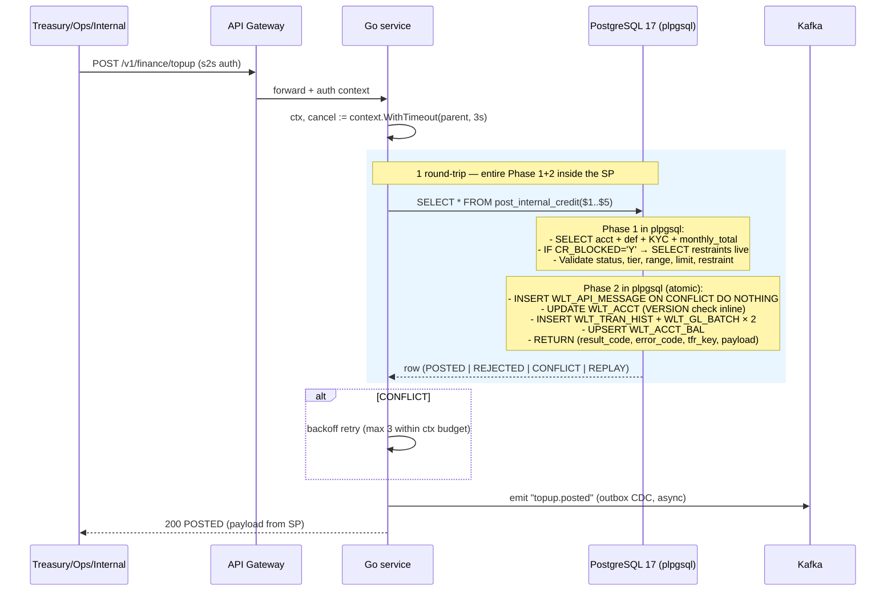
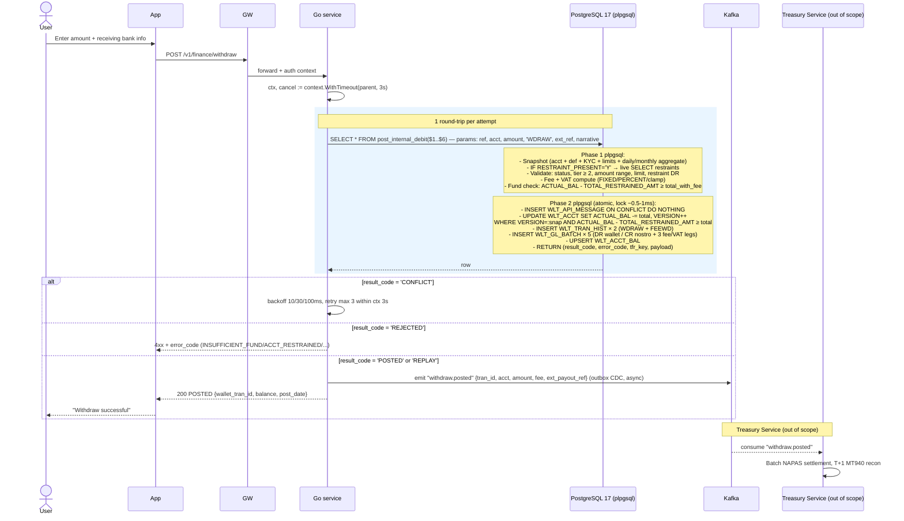
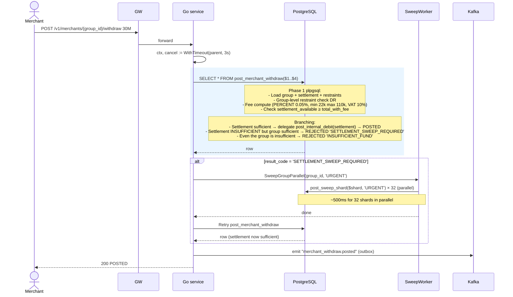
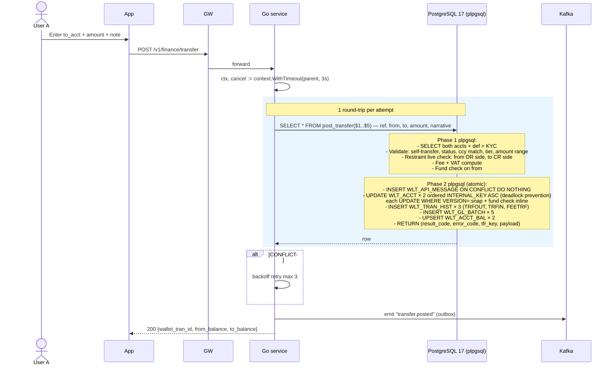
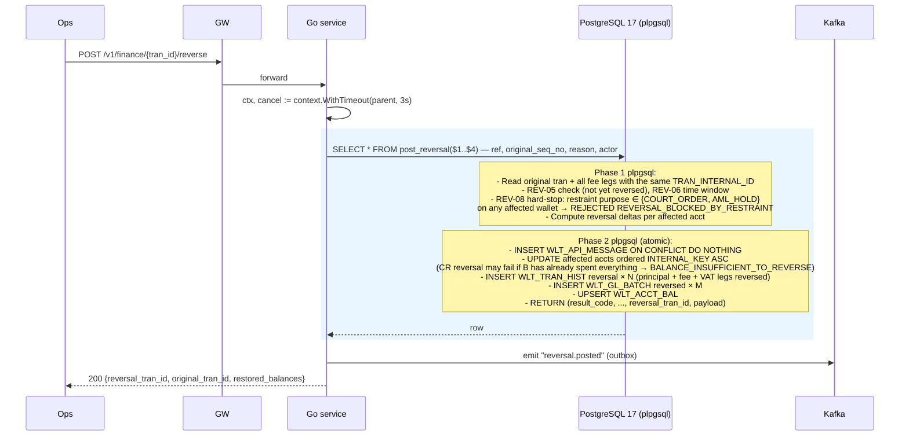

# Finance Transactions — Design

**Version**: 1.0
**Date**: 2026-05-28
**Status**: Draft
**Companion**: `wallet_HLD.md`, `wallet_DLD.md`, `wallet_onboarding.md`, `wallet_seed.sql`

**Changelog**
- v1.6.2 (2026-05-28): **Sub-account sharding for merchant hot wallet**. §3 Deposit adds BR DEP-08/09/10 for the sharded merchant case (auto shard resolve via `fn_resolve_shard_acct_no`, group-level restraint, aggregate balance via view). New §4.8: **Merchant withdraw** flow from the settlement wallet with urgent sweep if there is a shortfall. New API `POST /v1/merchants/{group_id}/withdraw`. New tran types: `SWEEPO`, `SWEEPI`, `MERCHWD`, `FEEMW`. Pattern details in `wallet_DLD.md §3.6.6` + §3.7.
- v1.6.1 (2026-05-28): **Full-DB architecture**. Every posting procedure (topup, deposit, withdraw, transfer, reversal) is now a single SP call. The Go service acts as a thin RPC over pgx/v5, `context.WithTimeout(3s)`. Flow diagrams in §2-§6 are rewritten: 1 round-trip `SELECT * FROM post_<op>(...)` instead of multiple SQL statements.
- v1.6 (2026-05-28): Scope narrowed to **internal sync transactions only**. Removed NAPAS/IPN callback flow at withdraw → sync 1-phase atomic; topup reframed as internal credit (Treasury Service → wallet, service-to-service auth). The **deferred locking pattern** (Phase 1 validate no-lock → Phase 2 atomic UPDATE with VERSION) is applied across all procedures. State machine collapse: removed PENDING/ACCEPTED/COMPLETED/EXPIRED, only POSTED/REJECTED/REVERSED remain.
- v1.0 (2026-05-28): Split the full spec for the 6 financial transaction types (topup, deposit, withdraw, transfer, reversal, history) with fee & VAT integration. Consolidates content scattered across HLD §6 and DLD §3/§4/§7.

---

## 1. Scope & Overview

### 1.1 Transaction types

| # | Type | TRAN_TYPE | Money direction | Has fee? | Has VAT? | Async? |
|---|------|-----------|-------------------|---------|---------|--------|
| 1 | **Top-up** | `TOPUP` | Bank/card/partner → wallet | ❌ (free to encourage adoption) | – | partial |
| 2 | **Deposit** (cash-in) | `DEPOST` | Cash @ agent → wallet | ✅ optional | ✅ | sync |
| 3 | **Withdraw** | `WDRAW` | Wallet → bank | ✅ | ✅ | async |
| 4 | **Transfer in-book** | `TRFOUT` / `TRFIN` | Wallet A → Wallet B (same system) | ✅ | ✅ | sync |
| 5 | **Reversal** | `RV*` (RVTPUP, RVTRF, RVWD, RVFEE) | Reverse the original transaction | – (refund includes fee) | – | sync |
| 6 | **History / Statement** | (read-only) | – | – | – | sync |

### 1.2 Common framework — Posting Pipeline

Every money transaction (1–5) goes through the **7-step pipeline** in DLD §3.1:

```
1.RECEIVE → 2.VALIDATE → 3.AUTHORIZE → 4.GEN ENTRIES (+ 4a. Fee/VAT)
         → 5.COMMIT (atomic) → 6.RESPONSE → 7.EVENT (Kafka)
```

History (6) is **read-only** and does not go through the pipeline.

### 1.3 Common concepts

| Concept | Meaning |
|-----------|---------|
| `REFERENCE` | Idempotency key sent by the client; unique per request |
| `TRAN_INTERNAL_ID` | Group ID linking the legs of one business operation (transfer = 2 base legs + 3 fee/VAT legs) |
| `SEQ_NO` | Unique ID per `WLT_TRAN_HIST` row (IDENTITY) |
| `ORIG_SEQ_NO` | Points to the `SEQ_NO` of the original transaction (only on reversal rows) |
| `POST_DATE` vs `VALUE_DATE` | Posting date vs value date (for interest/reconciliation) |

---

## 2. Top-up — Internal credit (system → wallet)

### 2.1 Use case
Top up the wallet from a **system source** (internal nostro). Caller is the Treasury Service / Ops once funds have been received from an external channel (NAPAS, partner bank, card 3DS — out of scope) or for refund, manual credit, promotion. Within this spec's scope, topup is one internal atomic ledger operation: **DR internal nostro / CR customer wallet**.

### 2.2 Caller scenarios

| Caller | When |
|--------|---------|
| Treasury Service | After NAPAS confirms funds have arrived at the segregated settlement account (TKĐBTT) (Bank has actually credited the nostro) |
| Ops | Manual credit (refund, compensation, promotion) — with maker-checker |
| Internal service | Bonus, cashback, voucher convert |

> **Out of scope**: NAPAS callback flow, card 3DS, partner wallets (MoMo, ZaloPay) — these external channels will be mapped via the Treasury Service which then calls this topup API.

### 2.3 Flow



### 2.4 API spec
```json
POST /v1/finance/topup
Authorization: Bearer <service_token>          // service-to-service, not customer-invoked
Request:
{
  "reference":   "TOPUP_20260528_xyz123",
  "acct_no":     "97010000123456",
  "amount":      1000000,
  "ccy":         "VND",
  "source": {
    "category":    "BANK_NAPAS|CARD_3DS|PARTNER|REFUND|PROMOTION|MANUAL_OPS",
    "external_ref": "NAPAS_2026_xyz",          // ref in the external system
    "settled_at":   "2026-05-28T10:22:00+07:00",
    "approver":     "OPS_USER_42"              // if MANUAL_OPS
  }
}

Response 200:
{
  "wallet_tran_id":   20015,
  "tfr_internal_key": 9999100,
  "status":           "SUCCESS",
  "amount":           1000000,
  "balance":          1200000,
  "ccy":              "VND",
  "post_date":        "2026-05-28T10:23:45+07:00"
}

Errors:
409 DUPLICATE_REFERENCE  → return cached response
404 ACCT_NOT_FOUND
423 ACCT_BLOCKED
423 ACCT_CR_RESTRAINED   → restraint type ∈ {CREDIT, ALL}
422 LIMIT_EXCEEDED       → exceeds tier monthly limit
403 FORBIDDEN            → caller lacks scope `posting:topup`
503 OPTIMISTIC_LOCK_FAILED → after 3 retries
```

### 2.5 Accounting entries (no fee)

| # | Leg | TRAN_NATURE | GL_CODE | Amount |
|---|-----|-------------|---------|--------|
| 1 | DR Internal nostro | DR | 101.02.001 (Internal nostro) | -amount |
| 2 | CR Customer wallet | CR | 201.01.001 (Consumer Wallet) | +amount |

**Σ DR = Σ CR** ✓

> **Internal nostro note**: GL `101.02.001` represents WalletCo's asset — funds available to credit customer wallets. The Treasury Service ensures the actual nostro (segregated settlement account at the Bank) is always ≥ the total wallet balance (SBV compliance). Daily reconciliation via MT940.

### 2.6 Business rules
| ID | Rule |
|----|------|
| TOPUP-01 | `amount` ∈ `[10_000, 500_000_000]` (per `WLT_TRAN_DEF['TOPUP']`) |
| TOPUP-02 | `WLT_ACCT.ACCT_STATUS='A'`, `FM_CLIENT.STATUS='A'` |
| TOPUP-03 | Customer ≥ Tier 1 |
| TOPUP-04 | Monthly topup total ≤ `WLT_ACCT_TYPE.MONTHLY_LIMIT` (per `source.category` may have sub-limit) |
| TOPUP-05 | **Restraint CR check (Phase 1, live)**: if there is an active row with type ∈ {`CREDIT`,`ALL`} → reject `423 ACCT_CR_RESTRAINED`. The caller (Treasury) must handle reversing the external transfer (NAPAS chargeback) — the wallet ledger does not handle it |
| TOPUP-06 | **Restraint INFO**: emit Kafka `restraint.movement_observed {tran_type:'TOPUP', amount, restraint_id, purpose}` |
| TOPUP-07 | `MANUAL_OPS` topup requires `source.approver` (maker-checker); full audit log |
| TOPUP-08 | Service-to-service auth scope `posting:topup` — customers **do not** call this endpoint directly |

---

## 3. Deposit — Cash-in via agent/counter

### 3.1 Use case
A customer goes to an **authorised agent** or **partner branch** to deposit cash → funds enter the wallet.

### 3.2 Differences vs Topup

| | Topup | Deposit |
|---|-------|---------|
| Funding source | Digital (bank/card) | Cash |
| Initiator | Customer via app | Agent via POS/Web |
| Speed | Online | Sync (agent has received cash) |
| Fee | Free | Yes (to fund the agent) |
| Limit | Tier-based | Additional CTR threshold (SBV) |

### 3.3 Flow

```mermaid
sequenceDiagram
  actor Cust as Customer
  actor Agent
  participant POS as Agent POS
  participant GW as API Gateway
  participant GO as Go service
  participant DB as PostgreSQL 17 (plpgsql)
  participant K as Kafka

  Cust->>Agent: Hand over cash + phone/ACCT_NO
  Agent->>POS: Scan/enter ACCT_NO + amount
  POS->>GW: POST /v1/finance/deposit (auth agent token)
  GW->>GO: forward
  GO->>GO: ctx, cancel := context.WithTimeout(parent, 3s)
  
  rect rgba(200,230,255,0.4)
    GO->>DB: SELECT * FROM post_deposit($1..$6) — ref, cust_acct, agent_acct, amount, terminal_id, narrative
    Note over DB: Phase 1: verify both wallets + agent contract;<br/>restraint check both customer wallet CR and agent wallet DR;<br/>fee compute
    Note over DB: Phase 2: idempotency gate; UPDATE 2 wallets ordered ASC;<br/>INSERT history 3-5 legs; batch 5 rows; UPSERT bal
    DB-->>GO: row (POSTED | REJECTED | CONFLICT | REPLAY)
  end
  
  GO->>K: emit "deposit.posted" (outbox)
  GO-->>POS: 200 {wallet_tran_id, balance, fee, ...}
  POS-->>Agent: Print receipt
  Agent-->>Cust: Hand over receipt
```

### 3.4 API spec
```json
POST /v1/finance/deposit
Request:
{
  "reference":      "DEP_20260528_agent42_001",
  "agent_id":       "AGT_001234",
  "agent_acct":     "97010000099001",        // agent's collateral wallet
  "dest_acct":      "97010000123456",        // recipient customer wallet
  "amount":         500000,
  "ccy":            "VND",
  "terminal_id":    "POS_HCM_Q1_042"
}

Response 200:
{ "wallet_tran_id": 20020, "status":"DEPOSITED", "balance": 1500000, "fee": 5500 }
```

### 3.5 Accounting (with fee + VAT)

Customer deposits 500,000, agent charges a fee of 5,500 (VAT 10% inclusive):

| # | Leg | TRAN_NATURE | GL_CODE | Amount |
|---|-----|-------------|---------|--------|
| 1 | CR Customer wallet | CR | 201.01.001 | +500,000 |
| 2 | DR Agent collateral wallet | DR | 201.01.001 | -500,000 |
| 3 | DR Customer wallet (fee) | DR | 201.01.001 | -5,500 |
| 4 | CR Fee revenue net | CR | 401.02 | +5,000 |
| 5 | CR VAT payable | CR | 203.01 | +500 |

> Σ DR and Σ CR on GL Consumer Wallet (201.01.001) net to 0 ↔ funds move between two wallets on the same GL. Total transaction Σ = 505,500.

### 3.6 Business rules

| ID | Rule |
|----|------|
| DEP-01 | `amount` ∈ `[10_000, 100_000_000]` (per `WLT_TRAN_DEF['DEPOST']`); ≥ 20M per transaction requires a CTR report to SBV |
| DEP-02 | Both wallets (customer + agent collateral) must have `ACCT_STATUS='A'` |
| DEP-03 | Agent wallet must have a balance ≥ `amount` (the agent has pre-funded the deposit) |
| DEP-04 | **Restraint CR check on customer wallet**: type ∈ {`CREDIT`,`ALL`} → reject `423 ACCT_CR_RESTRAINED` at the counter (agent keeps the cash; customer collects it back) |
| DEP-05 | **Restraint DR check on customer wallet** (for the fee leg): type ∈ {`DEBIT`,`ALL`} blocks everything → reject `423 ACCT_RESTRAINED`; partial → `422 INSUFFICIENT_FUND` if `available_bal < fee_gross` |
| DEP-06 | **Restraint DR check on agent wallet**: very rare but must still be checked — agent with restraint type ∈ {`DEBIT`,`ALL`} → reject `423 ACCT_RESTRAINED`; ops must intervene |
| DEP-07 | **INFO restraint**: emit `restraint.movement_observed` on both customer and agent wallets if any row has type=`INFO` |
| DEP-08 | **Sharded merchant deposit**: if `cust_target` is a `GROUP_ID` (merchant with `ACCT_ROLE='SHARD'` setup) → the SP calls `fn_resolve_shard_acct_no(group_id, reference)` to pick a shard via `hash(reference) % SHARD_COUNT`. Deterministic routing ⇒ replay of the same REFERENCE lands on the same shard. See `wallet_DLD.md §3.6.6` |
| DEP-09 | **Group-level restraint** applies to ALL shards + settlement: Phase 1 queries `WLT_RESTRAINTS` with the condition `(INTERNAL_KEY = :shard OR GROUP_ID = :group)`. Block then reject similar to acct-level |
| DEP-10 | **Sharded merchant balance display**: the customer/merchant API call `get_balance(group_id)` returns the aggregate via the view `v_wlt_group_balance` (settlement + sum of shards). The customer **does not** know about the 32 physical shards. |

---

## 4. Withdraw — Withdrawal (internal ledger)

### 4.1 Use case
Customer requests to withdraw funds from the wallet. Within this spec's scope, **the wallet ledger is only responsible for the internal posting**: `DR customer wallet / CR internal nostro`. Actual disbursement to the external bank is handled by the **Treasury Service** (out of scope) which consumes the Kafka event `withdraw.posted` to batch-settle via NAPAS and reconcile T+1 via MT940.

### 4.2 Characteristics
- **Synchronous, atomic, single TX** — no 2-phase, no pending/hold state
- **Has fee** (PERCENT 0.1%, min 11k, max 55k per `WLT_TRAN_DEF['WDRAW']`) + VAT 10%
- **Deferred locking pattern** (DLD §3): Phase 1 validate no-lock → Phase 2 atomic UPDATE with optimistic VERSION
- Internal nostro GL `101.02.001` represents "funds awaiting disbursement"

### 4.3 Flow



### 4.4 API spec
```json
POST /v1/finance/withdraw
Request:
{
  "reference":     "WD_20260528_abc",
  "from_acct":     "97010000123456",
  "amount":        2000000,
  "ccy":           "VND",
  "ext_payout_ref":"PAYOUT_2026_xyz",      // optional — handoff to Treasury Service
  "narrative":     "Withdraw to VCB"       // optional
}

Response 200 (sync, posted):
{
  "wallet_tran_id":   20030,
  "tfr_internal_key": 9999300,
  "status":           "SUCCESS",
  "amount":           2000000,
  "fee":              5500,
  "fee_breakdown":    { "fee_net": 5000, "vat": 500 },
  "total_deducted":   2005500,
  "balance":          1093500,
  "post_date":        "2026-05-28T10:25:30+07:00"
}

Errors:
422 INSUFFICIENT_FUND       → includes fee + VAT
409 DUPLICATE_REFERENCE     → return cached response
422 LIMIT_EXCEEDED          → tier/daily/monthly
423 ACCT_RESTRAINED         → restraint type ∈ {DEBIT, ALL} blocks everything
423 ACCT_BLOCKED            → ACCT_STATUS != 'A'
403 KYC_TIER_INSUFFICIENT   → tier < 2
503 OPTIMISTIC_LOCK_FAILED  → after 3 conflict retries
```

> **Out of scope** (handled by Treasury Service after receiving the event):
> - Linking `FM_CLIENT_BANKS` (proof of recipient bank ownership)
> - NAPAS push, async callback
> - 3DS / dual auth
> - T+1 MT940 reconciliation
> - Reversal when disbursement fails (via a separate dispute workflow)

### 4.5 Fee — PERCENT clamping
```
amount = 2,000,000
fee_rate = 0.1% (0.001)
fee_min = 11,000, fee_max = 55,000

raw_fee = 2,000,000 × 0.001 = 2,000
clamped_gross = MAX(2,000, 11,000) = 11,000 (since raw < min)
vat = 11,000 × 0.10 / 1.10 = 1,000
fee_net = 11,000 - 1,000 = 10,000

Total deducted from customer: 2,000,000 + 11,000 = 2,011,000
```

### 4.6 Accounting (5 legs)

| # | Leg | TRAN_NATURE | GL_CODE | Amount |
|---|-----|-------------|---------|--------|
| 1 | DR Customer wallet (principal) | DR | 201.01.001 | -2,000,000 |
| 2 | CR Nostro | CR | 101.02.001 | +2,000,000 |
| 3 | DR Customer wallet (fee) | DR | 201.01.001 | -11,000 |
| 4 | CR Fee revenue | CR | 401.02 (Withdraw fee) | +10,000 |
| 5 | CR VAT payable | CR | 203.01 | +1,000 |

Σ DR = 2,011,000 = Σ CR ✓

### 4.7 Business rules

| ID | Rule |
|----|------|
| WD-01 | `amount` ∈ `[50_000, 200_000_000]` per tran (per `WLT_TRAN_DEF['WDRAW']`) |
| WD-02 | Customer ≥ Tier 2 (Tier 1 can only receive funds, not withdraw) |
| WD-03 | Daily/monthly limit per `WLT_ACCT_TYPE` → 422 `LIMIT_EXCEEDED` |
| WD-04 | **Restraint DR check (Phase 1, live)**: if there is an active row with type ∈ {`DEBIT`,`ALL`} and `PLEDGED_AMT=0` → reject `423 ACCT_RESTRAINED`; partial → already deducted via the `TOTAL_RESTRAINED_AMT` denorm, the fund check fails naturally |
| WD-05 | **Restraint INFO**: emit `restraint.movement_observed {tran_type:'WDRAW', amount, total_with_fee}` for every row with type=`INFO` |
| WD-06 | When `RESTRAINT_PRESENT='N'`, Phase 1 skips the query on `WLT_RESTRAINTS` — fast path |
| WD-07 | **Optimistic conflict**: Phase 2 UPDATE 0 rows → retry Phase 1 max 3 times with backoff 10/30/100ms → exhausted: `503 OPTIMISTIC_LOCK_FAILED` |
| WD-08 | **CR-block does not apply**: pure DR withdraw → no `CR_BLOCKED` check |
| WD-09 | **Disbursement handoff**: posting commits successfully → emit Kafka `withdraw.posted` with `ext_payout_ref` (if any); Treasury Service consumes asynchronously. The wallet ledger is **not** responsible for the actual disbursement |

> **Responsibility separation**:
> - **Wallet ledger** (in scope): atomic DR wallet / CR internal nostro in 1 TX, customer receives a response immediately
> - **Treasury Service** (out of scope): consume the event, batch NAPAS, reconcile MT940. If disbursement fails → file a dispute → ops requests a reversal via the `/reverse` API (§6)
> - The customer sees "withdraw successful" + balance decreases immediately; funds reach the bank a few seconds-minutes later (per Treasury SLA)

### 4.8 Merchant withdraw (sharded group)

A merchant customer with `ACCT_ROLE='SHARD'` setup cannot withdraw directly from a shard (each shard only holds ~1/32 of the balance). They must call a dedicated endpoint → withdraw from the settlement wallet.



**API spec**:
```json
POST /v1/merchants/{group_id}/withdraw
Authorization: Bearer <merchant_token>
Request:
{
  "reference":      "MWD_20260528_xyz",
  "amount":         30000000,
  "ext_payout_ref": "PAYOUT_MCH_001"     // optional, handoff to Treasury
}

Response 200:
{
  "wallet_tran_id":   30001,
  "status":           "SUCCESS",
  "amount":           30000000,
  "fee":              15000,             // 0.05% clamped
  "fee_breakdown":    { "fee_net": 13636, "vat": 1364 },
  "total_deducted":   30015000,
  "settlement_balance_after": 14985000,
  "post_date":        "2026-05-28T10:25:30+07:00"
}

Errors:
422 INSUFFICIENT_FUND     → even the group is insufficient
423 GROUP_RESTRAINED      → COURT_ORDER/AML_HOLD/etc on the group
404 GROUP_NOT_FOUND
403 FORBIDDEN             → merchant token does not belong to this group
504 POSTING_TIMEOUT       → includes urgent sweep if needed
```

**Business rules**:

| ID | Rule |
|----|------|
| MWD-01 | `amount` ∈ `[50_000, 2_000_000_000]` (per `WLT_TRAN_DEF['MERCHWD']`) |
| MWD-02 | Group must have `GROUP_STATUS='A'` |
| MWD-03 | Group-level restraint DR/ALL → reject `423 GROUP_RESTRAINED` |
| MWD-04 | Settlement available ≥ total → delegate `post_internal_debit` on the settlement wallet |
| MWD-05 | Settlement insufficient but group total sufficient → return `SETTLEMENT_SWEEP_REQUIRED`; the Go service triggers `SweepGroupParallel(URGENT)` then retries once |
| MWD-06 | Even the group is insufficient → `422 INSUFFICIENT_FUND` |
| MWD-07 | Urgent sweep: call `post_sweep_shard(force=true)` for 32 shards in parallel with `triggered_by='WITHDRAW_TRIGGERED'`. Full audit log in `WLT_SWEEP_LOG` |
| MWD-08 | Latency budget: 3s total. Parallel sweep of 32 shards ~500ms; settlement_withdraw ~10ms → buffer of 2.5s remains |
| MWD-09 | After commit: emit Kafka `merchant_withdraw.posted` → Treasury Service consumes it to batch disbursement (same as retail `withdraw.posted`) |

---

## 5. Transfer — Wallet → wallet transfer

### 5.1 Transfer types
| Type | Description | Fee |
|------|-------|-----|
| **In-book** | Wallet A → Wallet B within the same `WalletCo` | Yes (TRFOUT configured) |
| **Out-bound** | Wallet → external bank account | Treated as Withdraw → routes through §4 |

> The spec below covers **in-book**. Out-bound uses the withdraw API.

### 5.2 Flow



### 5.3 API spec
```json
POST /v1/finance/transfer
Request:
{
  "reference":  "TRF_20260528_xyz",
  "from_acct":  "97010000123456",
  "to_acct":    "97010000099001",
  "amount":     1000000,
  "ccy":        "VND",
  "narrative":  "Repay lunch"
}

Response 200:
{
  "wallet_tran_id":      20040,
  "tfr_internal_key":    9999200,
  "status":              "SUCCESS",
  "amount":              1000000,
  "fee":                 5500,
  "fee_breakdown": { "fee_net": 5000, "vat": 500 },
  "from_balance":        1093500,
  "to_balance":          1500000,
  "post_date":           "2026-05-28T10:25:30+07:00"
}

Errors:
422 INSUFFICIENT_FUND       → includes fee + VAT
409 DUPLICATE_REFERENCE
404 TO_ACCT_NOT_FOUND
400 SELF_TRANSFER           → from_acct = to_acct
423 ACCT_RESTRAINED         → wallet A is restrained
422 LIMIT_EXCEEDED          → tier limit/daily/monthly
```

### 5.4 Accounting — 5 legs (see DLD §7b)

Customer A transfers 1M to customer B, FIXED fee 5,500 gross (VAT 10%):

| # | Leg | TRAN_NATURE | GL_CODE | Amount |
|---|-----|-------------|---------|--------|
| 1 | DR Wallet A (principal) | DR | 201.01.001 | -1,000,000 |
| 2 | CR Wallet B (principal) | CR | 201.01.001 | +1,000,000 |
| 3 | DR Wallet A (fee gross) | DR | 201.01.001 | -5,500 |
| 4 | CR Fee revenue | CR | 401.01 | +5,000 |
| 5 | CR VAT payable | CR | 203.01 | +500 |

Σ DR = 1,005,500 = Σ CR ✓ — Customer A is deducted 1,005,500, customer B receives 1,000,000.

### 5.5 Lock ordering (deadlock prevention)
```sql
SELECT * FROM WLT_ACCT
WHERE INTERNAL_KEY IN (:from, :to)
ORDER BY INTERNAL_KEY ASC      -- ALWAYS by INTERNAL_KEY ascending
FOR UPDATE;
```

This convention is **mandatory** for every multi-account lock. Violation → deadlock when A→B and B→A occur concurrently.

### 5.6 Business rules

| ID | Rule |
|----|------|
| TRF-01 | `from_acct` ≠ `to_acct` → reject `400 SELF_TRANSFER` |
| TRF-02 | `amount` ∈ `[1_000, 100_000_000]` (per `WLT_TRAN_DEF['TRFOUT']`) |
| TRF-03 | From customer ≥ Tier 1 (Tier 0 can only top up) |
| TRF-04 | `from_acct` and `to_acct` both `ACCT_STATUS='A'` |
| TRF-05 | **Restraint check on wallet A (DR)**: if block-all → `423 ACCT_RESTRAINED`; partial reflected in `available_bal` → may yield `422 INSUFFICIENT_FUND` |
| TRF-06 | **Restraint check on wallet B (CR)**: if type ∈ {`CREDIT`,`ALL`} → `423 ACCT_CR_RESTRAINED` (returned for `to_acct`). Customer A is not debited; the idempotency record is still recorded so replay returns the same error |
| TRF-07 | **INFO restraint on one of the two wallets** → still passes; emit `restraint.movement_observed` per matching wallet |
| TRF-08 | When B is CR-blocked, customer A is notified "Recipient cannot receive funds at this time" — **do not** leak AML details |
| TRF-09 | Fund check on A includes `amount + fee_gross` (including VAT); `available_bal_A = ACTUAL_BAL_A - TOTAL_RESTRAINED_AMT_A` must be ≥ total |
| TRF-10 | Lock by `INTERNAL_KEY ASC` (§5.5) — restraint check is done **after** lock for a consistent snapshot within the TX |

---

## 6. Reversal — Reverse/refund transaction

### 6.1 Scope
- **Dispute**: customer files a complaint
- **Ops cancel**: operations cancel
- **Partner reject**: after posting, partner reports an error
- **Auto rollback**: withdraw fails after debit (rare race condition)

### 6.2 Rules
| ID | Rule |
|----|------|
| REV-01 | Do not UPDATE the original row. Generate a new row with `TRAN_TYPE = REVERSAL_TRAN_TYPE` |
| REV-02 | `ORIG_SEQ_NO` points to the `SEQ_NO` of the original row |
| REV-03 | New `TRAN_INTERNAL_ID` (separate group for the reversal) |
| REV-04 | Must refund **both fee + VAT** if the original transaction had them |
| REV-05 | Do not reverse twice (check for an existing reversal linked via `ORIG_SEQ_NO`) |
| REV-06 | Reversal must be within the **time window** per type (see 6.4) |
| REV-07 | **Restraint bypass policy**: reversal is a **corrective action** by the system and is NOT blocked by ordinary restraints (`DISPUTE_HOLD`, `FRAUD_HOLD`, `PLEDGE`, `TAX_LIEN`, `KYC_REVIEW`, `FRAUD_WATCH`) — blocking would stall dispute resolution |
| REV-08 | **Restraint hard-stop**: reversal is **still blocked** by restraints with `purpose ∈ {COURT_ORDER, AML_HOLD}` — because these two types represent legal/AML orders that supersede operations. To reverse during COURT_ORDER → a court-issued release decision is required first |
| REV-09 | **INFO emit** on both the reverse-CR and reverse-DR wallets (ops need to see every movement on watched wallets) |
| REV-10 | If the reversal is blocked by COURT_ORDER/AML_HOLD → return `423 REVERSAL_BLOCKED_BY_RESTRAINT` + `details: {restraint_id, purpose}` |

### 6.3 TRAN_TYPE mapping
| Original | Reversal |
|-----|----------|
| `TOPUP` | `RVTPUP` (DR wallet, CR nostro) |
| `TRFOUT` | `RVTRF` (CR wallet A) |
| `TRFIN` | `RVTRF` (DR wallet B) |
| `WDRAW` | `RVWD` (CR wallet, DR nostro) |
| `DEPOST` | `RVDEP` (DR customer wallet, CR agent wallet) |
| `FEETRF` / `FEEWD` | `RVFEE` (CR wallet — refund fee + VAT) |

### 6.4 Time window allowed for reversal

| Original tran | Allowed window | After the window |
|----------|----------------|------------|
| Topup | T+0 same day | Must go through dispute workflow |
| Transfer in-book | End of T+1 | Manual approval |
| Withdraw | T+0 before Treasury Service settles disbursement | After handoff → dispute workflow with Treasury |
| Deposit | T+0 immediately at the counter | Original receipt required |

### 6.5 Flow



### 6.6 API spec
```json
POST /v1/finance/{tran_id}/reverse
Request:
{
  "reason":  "USER_DISPUTE",
  "note":    "Wrong recipient, customer requested refund",
  "actor":   "ops_user_42"
}

Response 200:
{
  "reversal_tran_id":   20045,
  "original_tran_id":   20040,
  "tfr_internal_key":   9999201,
  "amount_reversed":    1000000,
  "fee_reversed":       5500,
  "vat_reversed":       500,
  "from_acct_balance":  2099000,    -- A has been refunded 1,005,500
  "to_acct_balance":    500000      -- B has been debited 1,000,000
}

Errors:
404 ORIGINAL_NOT_FOUND
409 ALREADY_REVERSED          → a reversal row already links to this SEQ_NO
410 WINDOW_EXPIRED            → exceeds the REV-06 time window
422 BALANCE_INSUFFICIENT_TO_REVERSE  → wallet B has spent the 1M, cannot refund
423 REVERSAL_BLOCKED_BY_RESTRAINT    → COURT_ORDER/AML_HOLD active (REV-08); remove the restraint first
```

### 6.7 Edge case — Destination wallet has spent the funds

Customer A → B 1M. B receives then immediately withdraws everything. A requests a reverse.
- ❌ Reversal **fails** → escalate to the dispute workflow (manual)
- Options:
  - Hold the dispute, freeze wallet B if reachable
  - Settle the loss using a reserve fund (operational risk)

### 6.8 VAT cross-period reversal

If the reversal falls in the **next VAT filing period** (e.g., original in May, reverse in June):
- `RVFEE` is recorded in June → reduces VAT payable in June
- VAT report 01/GTGT for June = `Σ (FEE - VAT_amt CR) - Σ RVFEE`

Query:
```sql
SELECT SUM(CASE TRAN_NATURE WHEN 'CR' THEN AMOUNT ELSE -AMOUNT END) AS vat_net
FROM WLT_GL_BATCH
WHERE GL_CODE = '203.01'
  AND POST_DATE BETWEEN :start_of_month AND :end_of_month;
```

---

## 7. Get History — Account statement & transaction query

### 7.1 Use case
Customer/Ops view the transaction history of a wallet, filter by time, type, status.

### 7.2 API spec

#### 7.2.1 List transactions
```json
GET /v1/accounts/{acct_no}/transactions
  ?from=2026-05-01
  &to=2026-05-28
  &type=TRFOUT,TRFIN,TOPUP            (CSV; empty = all)
  &min_amount=10000
  &max_amount=1000000
  &cursor=eyJzZXFfbm8iOjIwMDUwfQ==     (opaque pagination cursor)
  &limit=50                            (max 100)
  &sort=desc                           (desc/asc by POST_DATE)

Response 200:
{
  "items": [
    {
      "tran_id":          20045,
      "tfr_internal_key": 9999200,
      "tran_type":        "TRFOUT",
      "direction":        "DR",
      "amount":           1000000,
      "ccy":              "VND",
      "previous_bal":     2100000,
      "actual_bal":       1093500,
      "fee":              5500,
      "post_date":        "2026-05-28T10:25:30+07:00",
      "value_date":       "2026-05-28",
      "narrative":        "Repay lunch",
      "counterparty":     "97010000099001",
      "reference":        "TRF_20260528_xyz",
      "is_reversed":      false,
      "reversal_tran_id": null
    },
    ...
  ],
  "next_cursor": "eyJzZXFfbm8iOjE5OTk5fQ==",
  "has_more": true
}
```

#### 7.2.2 Detail of one transaction
```json
GET /v1/finance/{tran_id}

Response 200:
{
  "tran_id":      20045,
  "status":       "SUCCESS",
  "tran_type":    "TRFOUT",
  ...
  "legs": [                                   -- same TRAN_INTERNAL_ID
    { "seq_no": 20045, "type":"TRFOUT", "amount":-1000000, ... },
    { "seq_no": 20046, "type":"TRFIN",  "amount":+1000000, ... },
    { "seq_no": 20047, "type":"FEETRF", "amount":-5500,    ... }
  ],
  "batch_entries": [                          -- GL view
    { "gl_code":"201.01.001", "nature":"DR", "amount":1005500 },
    { "gl_code":"201.01.001", "nature":"CR", "amount":1000000 },
    { "gl_code":"401.01",     "nature":"CR", "amount":5000 },
    { "gl_code":"203.01",     "nature":"CR", "amount":500 }
  ]
}
```

#### 7.2.3 Statement PDF/CSV
```
GET /v1/accounts/{acct_no}/statement
  ?from=2026-05-01&to=2026-05-31
  &format=pdf       (pdf/csv/json)

Response 200 (async):
{ "statement_id": "STMT_xyz", "status":"GENERATING",
  "download_url": null, "ready_at": "2026-05-28T10:30:00Z" }

# Poll or receive a webhook when ready:
GET /v1/statements/{statement_id}
{ "status":"READY", "download_url":"https://signed.url/..." }
```

### 7.3 Query patterns & indexes

| Pattern | Index used |
|---------|-----------|
| 1 wallet, date range, sort desc | `idx_hist_acct_date(INTERNAL_KEY, POST_DATE DESC)` — partition pruning by POST_DATE |
| Lookup a single transfer (all legs) | `idx_hist_tfr(TRAN_INTERNAL_ID, TFR_SEQ_NO)` |
| Search by reference | `idx_hist_ref(REFERENCE)` |
| Reversal trace | `WHERE ORIG_SEQ_NO = ?` — full partition scan; consider an index if hot |

### 7.4 Performance
- Cursor-based pagination (no OFFSET) to avoid slow skipping on large datasets
- Statement PDF generation is **async** via a background worker, does not block the API
- Cache statement PDF for 24h (signed S3 URL)
- Online window 18 months (HLD NFR); query > 18 months → archive bucket (cold)

### 7.5 Business rules
| ID | Rule |
|----|------|
| HIST-01 | Customer can only view the history of their own wallet (auth check) |
| HIST-02 | Ops can view any wallet, audited in `WLT_OLTP_AUDIT` |
| HIST-03 | Statement older than 18 months → 410 GONE_ONLINE; suggest requesting from archive |
| HIST-04 | Reversed transactions still appear in history with the flag `is_reversed=true` |
| HIST-05 | Fee/VAT legs appear as sub-legs of the original transaction in the mobile UI (grouped by `TRAN_INTERNAL_ID`) |

---

## 8. Restraint — Balance restraint

### 8.1 Use case
Restrain part or all of a wallet's balance per legal/business requirement. **Only ops/system have permission to add/remove** (the customer cannot remove restraints themselves).

### 8.2 Restraint classification — 2 dimensions

Restraints are classified along **2 independent dimensions** (T24 convention):
- `RESTRAINT_TYPE` — **blocking direction** (Debit / Credit / All / Info)
- `RESTRAINT_PURPOSE` — **business reason** (court order / AML / fraud / ...)

> e.g.: AML may block only DR (`DEBIT` + `AML_HOLD`) or both directions (`ALL` + `AML_HOLD`) depending on severity — separating dimensions provides flexibility.

#### 8.2.1 `RESTRAINT_TYPE` — blocking direction

| `RESTRAINT_TYPE` | Block DR? | Block CR? | Deducted from `available_bal`? | Typical use case |
|------------------|----------|----------|---------------------------|--------------------|
| `DEBIT` | ✅ | ❌ | ✅ | Restrain a collateralised portion, tax order — customer can still receive funds |
| `CREDIT` | ❌ | ✅ | ❌ | Block top-ups/incoming (e.g., suspected money laundering — block dirty money flow) — customer can still withdraw existing funds |
| `ALL` | ✅ | ✅ | ✅ | Total freeze — comprehensive court restraint, severe fraud |
| `INFO` | ❌ | ❌ | ❌ | Information flag only, blocks nothing — fraud watch, soft monitoring, audit trail |

**Posting impact** (see details in §8.6):
- DR tran (withdraw, transfer-out, payment, fee) only passes if there is **no** active restraint with type ∈ {`DEBIT`,`ALL`}
- CR tran (topup, deposit, transfer-in) only passes if there is **no** active restraint with type ∈ {`CREDIT`,`ALL`}
- `INFO` never blocks — only logs + raises notification to ops on any movement

#### 8.2.2 `RESTRAINT_PURPOSE` — business reason

| `RESTRAINT_PURPOSE` | Source of the order | Default `TYPE` | Auto-expire? | Notes |
|---------------------|------------|----------------|--------------|---------|
| `COURT_ORDER` | Court / enforcement authority | `ALL` | ❌ — manual removal upon official document | Mandatory attached legal document |
| `AML_HOLD` | AML/CFT unit | `ALL` (may be lowered to `DEBIT`) | ❌ — remove after investigation | Triggered by monitoring rules or STR |
| `DISPUTE_HOLD` | Ops dispute | `DEBIT` | ✅ — `END_DATE` ≤ 60 days | Hold the disputed amount; CR still allowed |
| `FRAUD_HOLD` | Fraud team / system | `ALL` | ✅ — `END_DATE` ≤ 7 days | Auto-release if fraud team does not escalate |
| `TAX_LIEN` | Tax authority | `DEBIT` | ❌ | Per tax enforcement decision |
| `PLEDGE` | Loan/collateral product | `DEBIT` | ❌ — release upon collateral release | Linked to a loan (out of scope P0) |
| `FRAUD_WATCH` | Fraud team monitoring | `INFO` | ✅ — `END_DATE` ≤ 30 days | Does not block — only alerts ops on movement |
| `KYC_REVIEW` | Compliance re-KYC | `INFO` or `DEBIT` | ✅ — `END_DATE` ≤ 30 days | Soft restraint while waiting for customer to provide documents |

> **Rule**: ops can override the default `TYPE` when adding a restraint, **except** `COURT_ORDER` (always `ALL` per the court ruling) and `PLEDGE` (always `DEBIT`).

### 8.3 Add restraint

> **Implemented as** `POST /v1/finance/restraints` with `acct_no` in the body
> (Finance group, Phase 2). SP `add_restraint` (wallet_sp_restraint.sql) validates
> enums/conflict/amount/dates and rolls the hold onto `WLT_ACCT`. Role/maker-checker
> + `X-Idempotency-Key` are gateway concerns (not yet enforced).

```json
POST /v1/finance/restraints                  // body carries acct_no
Authorization: Bearer <ops_token>           // role: OPS_RESTRAINT_MAKER (gateway)

Request:
{
  "restraint_type":    "ALL",                   // DEBIT | CREDIT | ALL | INFO (see §8.2.1)
  "restraint_purpose": "AML_HOLD",              // see §8.2.2; if omitted → infer from default
  "pledged_amt":       500000,                  // 0 or null = restrain everything; ignored if type='INFO'
  "start_date":        "2026-05-28",
  "end_date":          "2026-08-28",            // null if no auto-expire
  "narrative":         "STR-2026-00123 — funds source investigation",
  "reference_doc":     "https://docs.internal/str/2026-00123.pdf",
  "approver":          "OPS_USER_42"            // maker-checker: checker user id
}

Response 201:
{
  "restraint_id":      77001,                   // = WLT_RESTRAINTS.SEQ_NO
  "acct_no":           "97010000123456",
  "restraint_type":    "ALL",
  "restraint_purpose": "AML_HOLD",
  "pledged_amt":       500000,
  "start_date":        "2026-05-28",
  "end_date":          "2026-08-28",
  "status":            "A",
  "created_at":        "2026-05-28T10:23:45+07:00",
  "available_bal_after": 600000                 // only deducts restraints with type ∈ {DEBIT, ALL}
}

Errors:
404 ACCT_NOT_FOUND
409 DUPLICATE_REFERENCE                // same X-Idempotency-Key
422 RESTRAINT_TYPE_INVALID             // not in {DEBIT, CREDIT, ALL, INFO}
422 RESTRAINT_PURPOSE_INVALID          // not in enum §8.2.2
422 RESTRAINT_TYPE_PURPOSE_CONFLICT    // e.g., COURT_ORDER + DEBIT (court must be ALL); PLEDGE + INFO
422 RESTRAINT_AMT_EXCEEDS_BALANCE      // pledged > ACTUAL_BAL (only applies for DEBIT/ALL)
422 RESTRAINT_DATE_INVALID             // end_date < start_date
403 FORBIDDEN_RESTRAINT_ROLE           // user lacks role OPS_RESTRAINT_MAKER
423 ACCT_BLOCKED                       // ACCT_STATUS='C' — cannot add on a closed wallet
```

### 8.4 Remove restraint

> **Implemented as** `POST /v1/finance/restraints/{restraint_id}/release`
> (SP `release_restraint`). `reason` is mandatory for `COURT_ORDER`/`TAX_LIEN`
> (→ `COURT_ORDER_REMOVE_REQUIRES_DOC`). Recomputes account aggregates from the
> remaining active restraints.

```json
POST /v1/finance/restraints/{restraint_id}/release
Authorization: Bearer <ops_token>           // role: OPS_RESTRAINT_CHECKER (gateway)
Headers: X-Idempotency-Key: RSTR_RM_20260828_xyz

Request body:
{
  "reason":        "AML cleared — no violations found",
  "reference_doc": "https://docs.internal/aml/clear-2026-00123.pdf",
  "approver":      "OPS_USER_88"
}

Response 200:
{
  "restraint_id":   77001,
  "status":         "R",                      // R = Removed
  "removed_at":     "2026-08-28T14:10:00+07:00",
  "removed_by":     "OPS_USER_88",
  "reason":         "AML cleared — no violations found",
  "available_bal_after": 1100000
}

Errors:
404 RESTRAINT_NOT_FOUND
409 RESTRAINT_ALREADY_REMOVED       // status already 'R' or 'E' (expired)
403 FORBIDDEN_RESTRAINT_ROLE
403 RESTRAINT_MAKER_CANNOT_CHECK    // maker-checker: same user cannot remove their own
422 COURT_ORDER_REMOVE_REQUIRES_DOC // COURT_ORDER requires reference_doc
```

> **Soft-delete**: the original row in `WLT_RESTRAINTS` is **not DELETED**; only `UPDATE STATUS='R', REMOVED_AT, REMOVED_BY` to retain the audit trail. A daily cron job scans rows where `END_DATE < CURRENT_DATE AND STATUS='A'` → `STATUS='E'` (auto-expired).

### 8.5 List restraints

```json
GET /v1/accounts/{acct_no}/restraints
  ?status=A,E,R              (CSV; default A — active only)
  &type=DEBIT,ALL            (filter by RESTRAINT_TYPE)
  &purpose=AML_HOLD,COURT_ORDER (filter by RESTRAINT_PURPOSE)
  &limit=50

Response 200:
{
  "items": [
    {
      "restraint_id":      77001,
      "restraint_type":    "ALL",
      "restraint_purpose": "AML_HOLD",
      "pledged_amt":       500000,
      "start_date":        "2026-05-28",
      "end_date":          "2026-08-28",
      "status":            "A",
      "narrative":         "STR-2026-00123 — funds source investigation",
      "created_at":        "2026-05-28T10:23:45+07:00",
      "created_by":        "OPS_USER_42"
    }
  ],
  "summary": {
    "active_count":              1,
    "total_pledged_dr_blocking": 500000,    // counts only type ∈ {DEBIT, ALL}
    "total_pledged_cr_blocking": 500000,    // counts only type ∈ {CREDIT, ALL}
    "info_only_count":           0
  }
}
```

### 8.6 Impact on posting

The posting engine validates by **transaction direction** (reads `WLT_TRAN_DEF.CR_DR_MAINT_IND`):

| Tran direction | Blocking type | Behavior on match | Error code |
|-----------|--------------|---------------------|------------|
| **DR** (withdraw, transfer-out, payment, fee) | `DEBIT` ∪ `ALL` | Reject; if `pledged_amt > 0` → deduct from available, may yield `INSUFFICIENT_FUND`; if `pledged_amt = 0` → `ACCT_RESTRAINED` | `422 INSUFFICIENT_FUND` or `423 ACCT_RESTRAINED` |
| **CR** (topup, deposit, transfer-in, reversal-in) | `CREDIT` ∪ `ALL` | Reject CR — block funds into the wallet | `423 ACCT_CR_RESTRAINED` |
| **any** | `INFO` | Does **not** block; emit Kafka `restraint.movement_observed` for the ops dashboard | – |

**Validation pseudocode (extending DLD §3.1 step 2):**

```sql
-- DR validate
IF tran.direction = 'DR' AND EXISTS (
  SELECT 1 FROM WLT_RESTRAINTS
  WHERE INTERNAL_KEY = :acct
    AND STATUS = 'A'
    AND RESTRAINT_TYPE IN ('DEBIT','ALL')
    AND CURRENT_DATE BETWEEN START_DATE AND COALESCE(END_DATE,'9999-12-31')
    AND (PLEDGED_AMT = 0 OR PLEDGED_AMT IS NULL)   -- total block
) THEN RAISE 'ACCT_RESTRAINED';

-- Partial DR block → already deducted in available_bal via TOTAL_RESTRAINED_AMT
IF tran.direction = 'DR' AND available_bal < tran_amt + fee_gross
  THEN RAISE 'INSUFFICIENT_FUND';

-- CR validate
IF tran.direction = 'CR' AND EXISTS (
  SELECT 1 FROM WLT_RESTRAINTS
  WHERE INTERNAL_KEY = :acct
    AND STATUS = 'A'
    AND RESTRAINT_TYPE IN ('CREDIT','ALL')
    AND CURRENT_DATE BETWEEN START_DATE AND COALESCE(END_DATE,'9999-12-31')
) THEN RAISE 'ACCT_CR_RESTRAINED';
```

**Fast-path flags on `WLT_ACCT`** (denormalised, maintained in the same TX as `WLT_RESTRAINTS`):
- `RESTRAINT_PRESENT VARCHAR(4)` — any active restraint (existing)
- `TOTAL_RESTRAINED_AMT NUMERIC(18,2)` — sums only `RESTRAINT_TYPE ∈ {DEBIT, ALL}` (new proposal, see §9.2)
- `CR_BLOCKED VARCHAR(1) DEFAULT 'N'` — has ≥ 1 active restraint with type ∈ {`CREDIT`,`ALL`} (new proposal)

When `RESTRAINT_PRESENT='N'`, the posting engine fully skips the JOIN to `WLT_RESTRAINTS`.

### 8.7 Business rules

| ID | Rule |
|----|------|
| RST-01 | Maker-checker is mandatory: the user who adds a restraint **cannot** be the same user who removes it |
| RST-02 | `COURT_ORDER` and `TAX_LIEN` **require** a `reference_doc` (URL of the legal document) for both add and remove |
| RST-03 | `PLEDGED_AMT = 0` or `NULL` → treated as restraining everything (blocks any DR regardless of amount) |
| RST-04 | `END_DATE` ≤ `START_DATE` → reject with 422 `RESTRAINT_DATE_INVALID` |
| RST-05 | Add restraint on a closed wallet (`ACCT_STATUS='C'`) → reject 423 `ACCT_BLOCKED` |
| RST-06 | Every add/remove is recorded in `WLT_OLTP_AUDIT` (actor, before/after, reference_doc) |
| RST-07 | When `END_DATE` is reached, the cron `restraint_expire_job` sets `STATUS='E'`; **no** notification to the customer (to avoid leaking AML investigation) |
| RST-08 | Restraint `purpose='AML_HOLD'` active → hide balance in the customer app (only show "Contact CSKH") per AML policy |
| RST-09 | `RESTRAINT_TYPE='INFO'` does not participate in any blocking logic; it only emits `restraint.movement_observed` Kafka when a tran flows through |
| RST-10 | `PLEDGED_AMT` is meaningful only for type ∈ {`DEBIT`,`ALL`}; for `CREDIT` it blocks the entire CR direction (no concept of partial CR); for `INFO` → ignore |
| RST-11 | `purpose='COURT_ORDER'` requires `type='ALL'`; `purpose='PLEDGE'` requires `type='DEBIT'` → mismatch → 422 `RESTRAINT_TYPE_PURPOSE_CONFLICT` |

### 8.8 Authorization

| Action | Required role |
|--------|---------------|
| Add restraint | `OPS_RESTRAINT_MAKER` |
| Remove restraint | `OPS_RESTRAINT_CHECKER` (different user from the maker) |
| List restraints on own wallet | `CUSTOMER` (sees only `restraint_type='PLEDGE'` of their own) |
| List restraints on any wallet | `OPS_VIEWER` |
| `COURT_ORDER` / `TAX_LIEN` add/remove | `OPS_LEGAL_MAKER` / `OPS_LEGAL_CHECKER` (higher tier) |

---

## 9. Get Balance — Balance query

### 9.1 Use case
Customer views realtime balance in the app; ops view balance for dispute/CSKH; downstream (DW, notification) takes a snapshot.

### 9.2 Balance field semantics

| Field | Source | Meaning |
|--------|-------|---------|
| `actual_bal` | `WLT_ACCT.ACTUAL_BAL` | Actual balance (committed to ledger) |
| `ledger_bal` | `WLT_ACCT.LEDGER_BAL` | Balance on the accounting ledger (= actual if no pending GL feed) |
| `restrained_amt` | `WLT_ACCT.TOTAL_RESTRAINED_AMT` (denormalised: SUM `PLEDGED_AMT` WHERE `STATUS='A'` AND `RESTRAINT_TYPE ∈ {'DEBIT','ALL'}`) | Total DR-direction restraint — only this portion is deducted from available |
| `cr_blocked` | `WLT_ACCT.CR_BLOCKED` (flag `'Y'/'N'`) | Has ≥ 1 active CR-blocking restraint (type ∈ {`CREDIT`,`ALL`}) — does not deduct balance, only blocks CR trans |
| `calc_bal` | `WLT_ACCT.CALC_BAL` | `= actual_bal − restrained_amt` (CHECK constraint, DLD §2.2 v1.6) |
| `available_bal` | computed | `= actual_bal − restrained_amt` ≡ `calc_bal` |
| `previous_day_bal` | `WLT_ACCT.PREV_DAY_ACTUAL_BAL` | End-of-previous-day balance (for displaying movement) |

> **Important**: the public API response does **not** return `ledger_bal` to the customer (internal only). The customer sees only `actual_bal`, `available_bal`, `restrained_amt`.

### 9.3 API spec

#### 9.3.1 Realtime balance (customer view)

```json
GET /v1/accounts/{acct_no}/balance
Authorization: Bearer <customer_token>

Response 200:
{
  "acct_no":         "97010000123456",
  "ccy":             "VND",
  "actual_bal":      1100000,
  "available_bal":   600000,
  "restrained_amt":  500000,
  "as_of":           "2026-05-28T10:23:45.123+07:00",
  "last_tran_date":  "2026-05-28T09:15:22+07:00"
}

Errors:
404 ACCT_NOT_FOUND
403 FORBIDDEN_NOT_OWNER          // customer calling another customer's wallet balance
423 ACCT_BLOCKED                 // still returned but status field = 'B' (see 9.3.2)
```

#### 9.3.2 Ops/internal balance (full view)

```json
GET /v1/ops/accounts/{acct_no}/balance
Authorization: Bearer <ops_token>          // role: OPS_VIEWER

Response 200:
{
  "acct_no":            "97010000123456",
  "client_no":          "C0000000123",
  "ccy":                "VND",
  "acct_status":        "A",
  "actual_bal":         1100000,
  "ledger_bal":         1100000,
  "calc_bal":           600000,
  "available_bal":      600000,
  "restrained_amt":     500000,
  "restraint_present":  "Y",
  "cr_blocked":         "N",
  "active_restraints": [
    { "restraint_id": 77001, "type":"AML_HOLD", "pledged_amt": 500000,
      "end_date": "2026-08-28" }
  ],
  "version":            142,
  "as_of":              "2026-05-28T10:23:45.123+07:00",
  "previous_day_bal":   1050000,
  "last_tran_date":     "2026-05-28T09:15:22+07:00"
}
```

#### 9.3.3 Balance as-of date (historical)

```json
GET /v1/accounts/{acct_no}/balance?as_of_date=2026-04-30

Response 200:
{
  "acct_no":      "97010000123456",
  "ccy":          "VND",
  "actual_bal":   980000,
  "tran_date":    "2026-04-30",
  "source":       "WLT_ACCT_BAL"            // snapshot table, not realtime
}

Errors:
410 GONE_ONLINE                  // as_of_date > 18 months → query archive
422 INVALID_DATE                 // as_of_date > today
```

#### 9.3.4 Batch balance (multiple wallets — for ops/DW)

```json
POST /v1/ops/accounts/balance/batch
Authorization: Bearer <ops_token>

Request:
{
  "acct_nos": ["97010000123456", "97010000123457", ...],   // max 100/call
  "fields":   ["actual_bal","available_bal","restrained_amt"]    // projection
}

Response 200:
{
  "items": [
    { "acct_no":"97010000123456", "actual_bal":1100000, "available_bal":600000, "restrained_amt":500000 },
    { "acct_no":"97010000123457", "error":"ACCT_NOT_FOUND" },
    ...
  ],
  "as_of": "2026-05-28T10:23:45+07:00"
}

Errors:
422 BATCH_SIZE_EXCEEDED          // > 100 acct_nos
```

### 9.4 Realtime vs snapshot

| Endpoint | Source | Latency target | Consistency |
|----------|-------|----------------|----------------|
| §9.3.1 / §9.3.2 (realtime) | `WLT_ACCT` (primary, no replica) | p99 < 50ms | Strong (read-after-write) |
| §9.3.3 (historical) | `WLT_ACCT_BAL` partitioned by month | p99 < 200ms | End-of-day snapshot, drift up to 1 day |
| §9.3.4 (batch) | `WLT_ACCT` via read replica if available | p99 < 500ms for 100 accts | Eventual (replica lag ≤ 1s) |

### 9.5 Cache strategy

- **Do not cache** §9.3.1/9.3.2 at the gateway — the customer needs accurate numbers after a transaction (read-after-write).
- The mobile app may cache locally for **≤ 5 seconds** + re-fetch after every write action (topup/withdraw/transfer success).
- `WLT_ACCT_BAL` historical: cached for 24h at the CDN (immutable per `as_of_date`).
- Redis is **not** used as a source for balance (only idempotency cache).

### 9.6 Business rules

| ID | Rule |
|----|------|
| BAL-01 | Customer can only view their own wallet balance; ops requires role `OPS_VIEWER` |
| BAL-02 | Customer with `AML_HOLD` active → hide `actual_bal` + `available_bal`, return `{"masked": true, "message": "Contact CSKH"}` (RST-08) |
| BAL-03 | `available_bal` is never < 0 (clamp to 0 if compute goes negative — only happens if restraint > balance, an ops case) |
| BAL-04 | `as_of_date` query must be < `CURRENT_DATE` (today uses the realtime endpoint) |
| BAL-05 | Every `/balance` call logs `WLT_API_TRACE` but **does not** log `WLT_OLTP_AUDIT` (read-only, avoid bloat) |
| BAL-06 | After a posting transaction, the balance **must** be consistent within the same connection (strong read) — not via replica |

### 9.7 Acceptance criteria

| AC | Scenario | Expected |
|----|----------|----------|
| BAL-AC-01 | Customer calls balance after a 100k topup | `actual_bal` increases by exactly 100k, `available_bal` increases correspondingly |
| BAL-AC-02 | Wallet has AML_HOLD restraint of 500k | `restrained_amt=500000`, `available_bal = actual - 500000` |
| BAL-AC-03 | Wallet has AML_HOLD + customer calls /balance | Returns `{"masked":true}`, balance not leaked |
| BAL-AC-04 | Customer calls another customer's wallet balance | `403 FORBIDDEN_NOT_OWNER` |
| BAL-AC-05 | Query `as_of_date=yesterday` | Reads from `WLT_ACCT_BAL`, includes `source:"WLT_ACCT_BAL"` |
| BAL-AC-06 | Query `as_of_date` > 18 months | `410 GONE_ONLINE` |
| BAL-AC-07 | Batch 150 accts | `422 BATCH_SIZE_EXCEEDED` |
| BAL-AC-08 | Concurrent: transfer + balance query | Balance reflects state **after** the transfer commits (strong consistency) |

---

## 10. Fee & VAT — Engine details

### 8.1 Config storage
Per-tran configuration in `WLT_TRAN_DEF` (DLD §2.4):

```
FEE_TYPE:      'NONE' / 'FIXED' / 'PERCENT'
FEE_AMT:       (FIXED) gross fee amount (VAT inclusive)
FEE_RATE:      (PERCENT) ratio, e.g., 0.001 = 0.1%
FEE_MIN, MAX:  (PERCENT) clamp range
VAT_RATE:      default 0.10 = 10%
FEE_GL_CODE:   GL revenue (401.x)
VAT_GL_CODE:   GL VAT payable (203.x)
FEE_TRAN_TYPE: TRAN_TYPE of the fee leg (e.g., 'FEETRF')
```

### 8.2 Calculation

```python
# Pseudo-code
def compute_fee(tran_def, tran_amt):
    if tran_def.FEE_TYPE == 'NONE':
        return None

    if tran_def.FEE_TYPE == 'FIXED':
        fee_gross = tran_def.FEE_AMT
    elif tran_def.FEE_TYPE == 'PERCENT':
        raw = tran_amt * tran_def.FEE_RATE
        fee_gross = clamp(raw, tran_def.FEE_MIN, tran_def.FEE_MAX)

    # Split VAT from the gross (customer sees the VAT-inclusive number)
    vat_amt = fee_gross * tran_def.VAT_RATE / (1 + tran_def.VAT_RATE)
    fee_net = fee_gross - vat_amt

    return FeeBreakdown(
        gross=fee_gross,
        net=fee_net,
        vat=vat_amt,
        fee_gl=tran_def.FEE_GL_CODE,
        vat_gl=tran_def.VAT_GL_CODE,
        fee_tran_type=tran_def.FEE_TRAN_TYPE
    )
```

### 8.3 Fee posting — 3 additional legs

Same `TRAN_INTERNAL_ID` as the original transaction:

```
1 row WLT_TRAN_HIST: TRAN_TYPE=FEE_TRAN_TYPE, DR wallet, amount=fee_gross
3 rows WLT_GL_BATCH:
  - DR customer wallet (GL 201.x), amount = fee_gross
  - CR Fee revenue (GL FEE_GL_CODE, 401.x), amount = fee_net
  - CR VAT payable (GL VAT_GL_CODE, 203.x), amount = vat_amt
```

### 8.4 Round handling (VND rounding)
VND has no decimals. Calculations use `NUMERIC(18,2)` then:
- `ROUND(... , 0)` — banker's rounding
- `ROUND(vat_amt, 0)` → adjust `fee_net = fee_gross - rounded_vat` to keep the sum balanced
- Ensures: `fee_gross = fee_net + vat_amt` always holds after rounding (INV-12)

### 8.5 End-of-month VAT report
```sql
-- Total VAT collected for month T
SELECT SUM(CASE TRAN_NATURE WHEN 'CR' THEN AMOUNT ELSE -AMOUNT END) AS vat_net
FROM   WLT_GL_BATCH
WHERE  GL_CODE = '203.01'
  AND  POST_DATE BETWEEN '2026-05-01' AND '2026-05-31'
  AND  STATUS = 'P';

-- Breakdown by tran type
SELECT  d.TRAN_TYPE, d.TRAN_DESC,
        SUM(CASE WHEN b.GL_CODE = d.FEE_GL_CODE THEN b.AMOUNT END) AS fee_net,
        SUM(CASE WHEN b.GL_CODE = d.VAT_GL_CODE THEN b.AMOUNT END) AS vat
FROM    WLT_GL_BATCH b
JOIN    WLT_TRAN_DEF d ON b.GL_CODE IN (d.FEE_GL_CODE, d.VAT_GL_CODE)
WHERE   b.POST_DATE BETWEEN :start AND :end
  AND   b.TRAN_NATURE = 'CR'
GROUP BY d.TRAN_TYPE, d.TRAN_DESC;
```

### 8.6 Free promotion (first X free transfers)
Implement **without** schema changes:
- Count the customer's monthly transactions in the app/Redis
- If within the free threshold → override `compute_fee()` to return `None`
- Still record `WLT_TRAN_HIST` for the original, no fee leg
- Promotion cost tracked separately (not deducted from `401.x`)

---

## 11. State Machine — Transaction lifecycle (v1.6 — sync internal only)

```
                    create_request
                          │
                          ▼
                    ┌──────────┐
                    │ RECEIVED │ (Phase 1 entry)
                    └─────┬────┘
            validate fail │ pass
                  ┌───────┴───────┐
                  ▼               ▼
            ┌──────────┐    ┌───────────┐
            │ REJECTED │    │ VALIDATED │ (Phase 1 done, ready for Phase 2)
            └──────────┘    └─────┬─────┘
            (terminal,            │ Phase 2 commit
             4xx, no row)         ▼
                            ┌──────────┐    reverse    ┌──────────┐
                            │  POSTED  ├──────────────▶│ REVERSED │
                            └──────────┘               └──────────┘
                            (terminal)                 (projection from
                                                        the existence of
                                                        a reversal row)
```

| State | Description |
|-------|-------|
| RECEIVED | Just received request, Phase 1 in progress (in-memory only, no DB row) |
| VALIDATED | Passed Phase 1 (in-memory transient) |
| REJECTED | Phase 1 failed → 4xx error response, no history/batch row generated |
| POSTED | Phase 2 committed successfully → row exists in `WLT_TRAN_HIST` + `WLT_GL_BATCH` |
| REVERSED | A reversal row exists in `WLT_TRAN_HIST` linked via `ORIG_SEQ_NO` |

> **v1.6**: removed states `PENDING`, `ACCEPTED`, `COMPLETED`, `EXPIRED` (only existed with async pending settle). Sync model: every tran is posted within one request.

---

## 12. Consolidated error code matrix

| HTTP | Code | Applies to | Caller action |
|------|------|---------|---------------|
| 400 | INVALID_PAYLOAD | All | Fix request schema |
| 400 | SELF_TRANSFER | Transfer | Pick a different to_acct |
| 401 | UNAUTHORIZED | All | Re-auth |
| 403 | KYC_TIER_INSUFFICIENT | Transfer, Withdraw | Upgrade tier |
| 404 | ACCT_NOT_FOUND | All | Check acct_no |
| 404 | ORIGINAL_NOT_FOUND | Reversal | Check tran_id |
| 409 | DUPLICATE_REFERENCE | All write | Return cached response |
| 409 | ALREADY_REVERSED | Reversal | No action needed |
| 410 | WINDOW_EXPIRED | Reversal | Manual dispute |
| 410 | GONE_ONLINE | History > 18m | Request archive |
| 422 | INSUFFICIENT_FUND | Transfer, Withdraw, Deposit fee | Top up more |
| 422 | LIMIT_EXCEEDED | All write | Wait/upgrade tier |
| 422 | EKYC_FAIL_LOW_SCORE | (onboarding ref) | Retry eKYC |
| 423 | ACCT_BLOCKED | All write | Contact CSKH |
| 423 | ACCT_RESTRAINED | DR side | Restraint type ∈ {DEBIT, ALL} blocks everything |
| 423 | ACCT_CR_RESTRAINED | CR side | Restraint type ∈ {CREDIT, ALL} |
| 423 | REVERSAL_BLOCKED_BY_RESTRAINT | Reversal | COURT_ORDER / AML_HOLD active |
| 429 | RATE_LIMITED | All | Backoff |
| 500 | INTERNAL_ERROR | All | Retry with backoff (idempotent) |
| 503 | OPTIMISTIC_LOCK_FAILED | All write | After 3 conflict retries → alert |

---

## 13. Consolidated acceptance criteria

| AC | Scenario | Expected |
|----|----------|----------|
| FT-01 | Valid topup → CR wallet + DR nostro, Σ DR = Σ CR | 2 BATCH rows balanced, balance correct |
| FT-02 | Duplicate REFERENCE topup | Return cached response, no new row |
| FT-03 | Deposit via agent → CR customer wallet + DR agent wallet + 3 fee legs | 5 BATCH rows balanced |
| FT-04 | Withdraw with sufficient funds → POSTED immediately (sync internal) | `WLT_TRAN_HIST` 2 rows (WDRAW + FEEWD); `WLT_GL_BATCH` 5 rows; `ACTUAL_BAL` decreases; emit `withdraw.posted` Kafka |
| FT-05 | Withdraw with insufficient funds (incl fee) → reject | `422 INSUFFICIENT_FUND`, no row |
| FT-06 | Transfer 1M + fee 5.5k → 5 legs, A loses 1,005,500, B receives 1,000,000 | DR=CR=1,005,500, balance correct |
| FT-07 | Transfer with insufficient funds including fee | 422 INSUFFICIENT_FUND, no row |
| FT-08 | Race: 2 transfers from the same A | 1 succeeds, 1 retries/fails clearly |
| FT-09 | Reverse transfer same day | Balance returns to initial, 3 reversal legs + 5 offset batch entries |
| FT-10 | Reverse when B has spent everything | 422 BALANCE_INSUFFICIENT_TO_REVERSE → dispute |
| FT-11 | Reverse same tran twice | Second attempt: 409 ALREADY_REVERSED |
| FT-12 | Cross-period VAT reverse | RVFEE reduces VAT for the month in which the reverse occurs |
| FT-13 | History list pagination | Cursor consistent, no skip/dup, max 100 |
| FT-14 | History > 18m | 410 GONE_ONLINE, suggest archive |
| FT-15 | EOD: Σ DR = Σ CR per TRAN_KEY | INV-01 query returns 0 rows |
| FT-16 | EOD: VAT report matches `203.01` GL net | VAT report = SUM CR - SUM DR on 203.01 |

---

## 14. Table mapping (operation → table writes)

| Operation | INSERT tables | UPDATE tables | DELETE tables |
|-----------|-------------|-------------|-------------|
| Topup | `WLT_API_MESSAGE`, `WLT_TRAN_HIST`, `WLT_GL_BATCH` ×2 | `WLT_ACCT`, `WLT_ACCT_BAL` (upsert) | – |
| Deposit (+fee) | + `WLT_TRAN_HIST` ×3, `WLT_GL_BATCH` ×5 | `WLT_ACCT` ×2 | – |
| Withdraw (sync, +fee) | `WLT_API_MESSAGE`, `WLT_TRAN_HIST` ×2, `WLT_GL_BATCH` ×5 | `WLT_ACCT`, `WLT_ACCT_BAL` (upsert) | – |
| Transfer (+fee+VAT) | `WLT_API_MESSAGE`, `WLT_TRAN_HIST` ×3, `WLT_GL_BATCH` ×5 | `WLT_ACCT` ×2, `WLT_ACCT_BAL` ×2 | – |
| Reversal | `WLT_TRAN_HIST` ×N (principal+fee legs), `WLT_GL_BATCH` ×M | `WLT_ACCT` (rollback) | – |
| History list | – | – | – |
| Statement gen | (background) | – | – |

---

## 15. Open items / TODO

- [ ] **Multi-CCY transfer**: out of scope P0; requires an FX rate table when enabled
- [ ] **Recurring transfer**: scheduler service + retry policy
- [ ] **Split bill** (split invoice across multiple people): wrapper of N atomic transfers
- [ ] **QR code payment** (merchant): flow details differ from a regular transfer
- [ ] **Free quota tracking**: store/retrieve "5 free transfers/month" — Redis vs DB?
- [ ] **Promotion engine**: voucher/cashback — `WLT_PROMOTION_USAGE` table?
- [ ] **Fraud scoring** at which step (real-time vs near-real-time)?
- [ ] **Cross-border withdraw**: per licence; requires a dedicated PSP partner
- [ ] **Disputes workflow**: state machine for dispute cases beyond the time window
- [ ] **Archive retrieval**: SLA for query history > 18 months (proposed: 24h)
