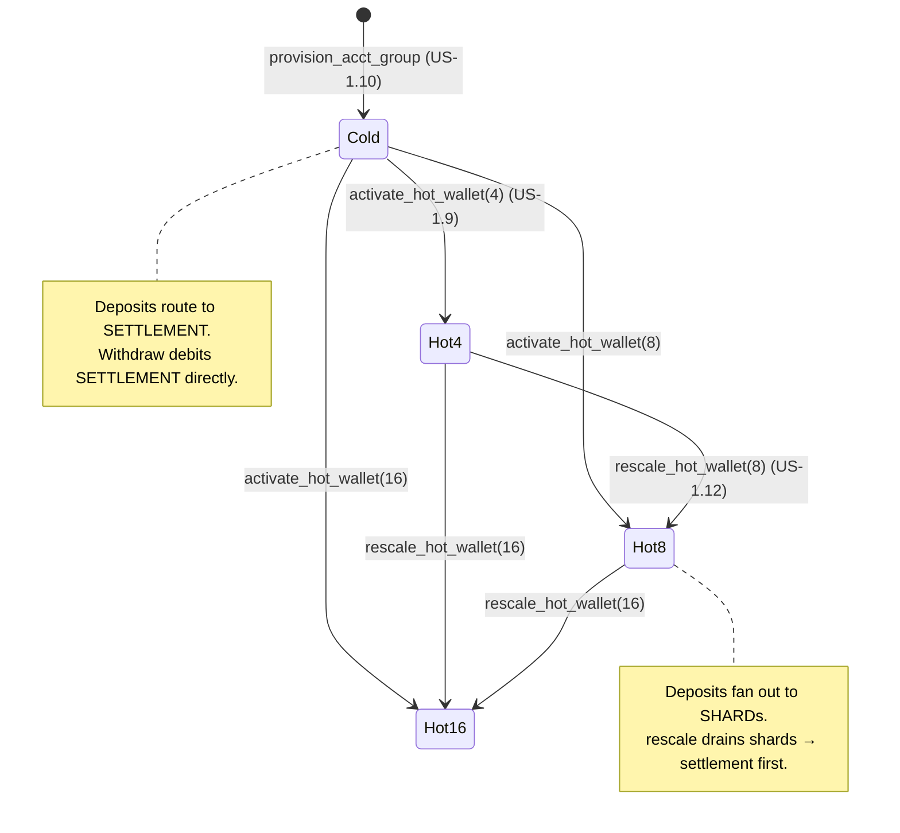
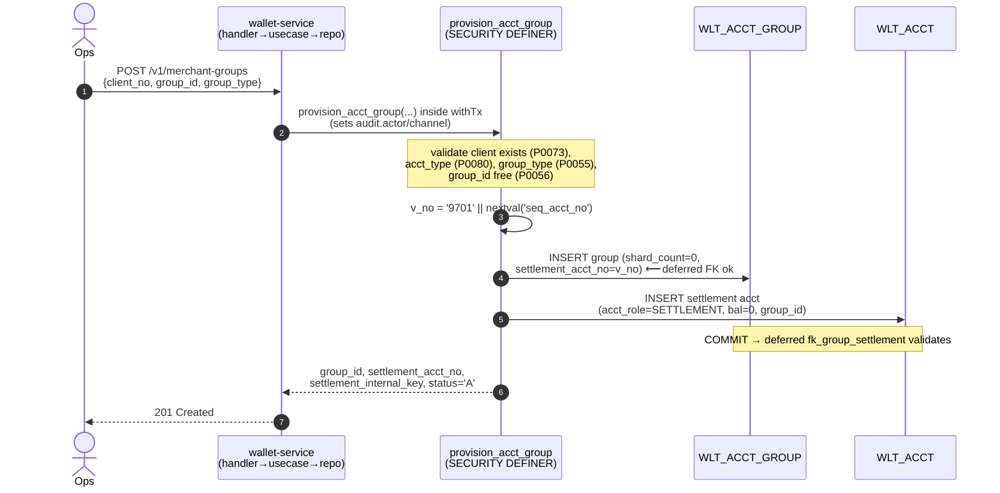
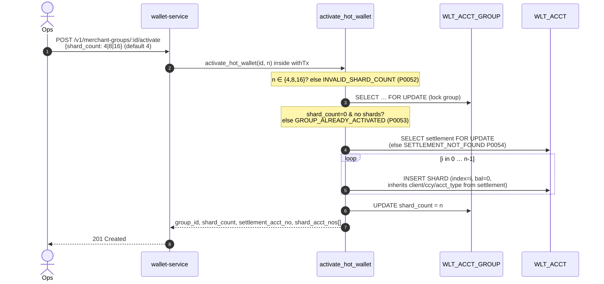
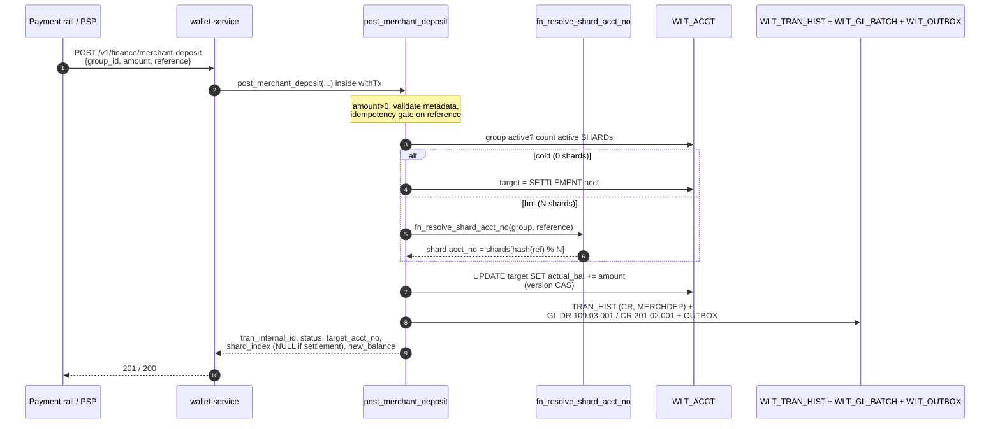
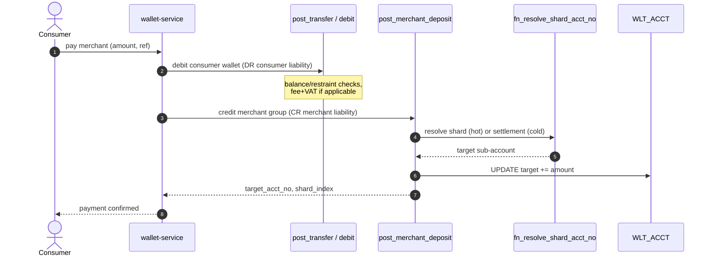
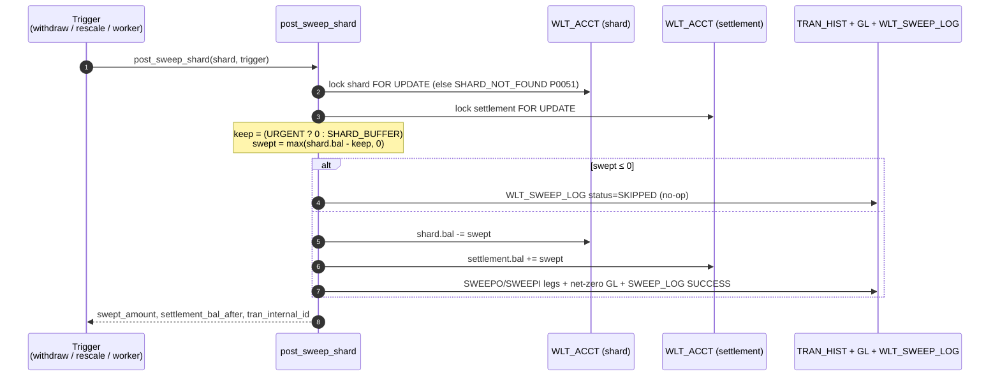

# Hot Wallet — Merchant/Agent Sub-Account Sharding

**Version**: 1.0
**Date**: 2026-06-04
**Status**: Implemented (US-1.9–1.12, US-2.4)
**Companion**: `finance_transaction.md`, `wallet_DLD.md` (§2.2a, §3.6.6, §3.7), `wallet_onboarding.md`

> 🇻🇳 Tài liệu mô tả chi tiết **ví nóng (hot wallet)** cho merchant/đại lý: từ
> onboarding → tạo shard → nạp (topup/deposit) → thanh toán (payment) → rút
> (withdraw) → gom quỹ (sweep) → mở rộng (rescale). Mỗi luồng có sequence diagram.

---

## 1. Cách hoạt động — tổng quan / Overview

A high-volume merchant (QR collections, marketplace payouts) can exceed the write
throughput a **single** wallet row sustains: every credit/debit locks and bumps
`WLT_ACCT.VERSION` on one row, so concurrent postings serialize on that row and TPS
plateaus (~30 TPS per row under contention). The **hot wallet** removes that single
hot row by splitting one logical merchant balance across an **account group**:

- **1 `SETTLEMENT` account** — the source of truth for the merchant's money. All
  outbound (withdraw) debits and the consolidated balance live here.
- **N `SHARD` sub-accounts** (N ∈ {4, 8, 16}) — write-contention buffers that absorb
  **inbound** deposits/payments in parallel. A deposit is routed to one shard by a
  hash of its reference, so concurrent deposits hit *different* rows and don't
  serialize.
- A **sweep** periodically (or on demand) drains shards back into settlement, so the
  money re-consolidates and shards return to near-zero.

```mermaid
flowchart LR
  subgraph G["WLT_ACCT_GROUP &nbsp;(group_id, shard_count, thresholds)"]
    direction TB
    SET["SETTLEMENT<br/>acct_role=SETTLEMENT<br/>(source of truth)"]
    S0["SHARD #0"]
    S1["SHARD #1"]
    S2["SHARD #…"]
    SN["SHARD #N-1"]
  end
  DEP["Deposits / Payments<br/>(inbound)"] -->|hash(reference) % N| S0 & S1 & S2 & SN
  S0 & S1 & S2 & SN -->|sweep ↑| SET
  SET -->|withdraw ↓| NOS["Nostro @ Bank<br/>(Treasury payout)"]
```

**Key invariant:** sharding moves **no money off-ledger**. Shards are created with a
zero balance, every deposit/sweep/withdraw is balanced double-entry, and the group's
*total* balance = `SETTLEMENT.actual_bal + Σ SHARD.actual_bal` at all times
(materialised by the `v_wlt_group_balance` view).

**Cold vs hot.** A group is **cold** when `SHARD_COUNT = 0` (settlement only) and
**hot** once activated to N shards. Routing adapts automatically: while cold, inbound
funds land on settlement; once hot, they fan out to shards. A merchant can run
perfectly well cold (low volume) and be promoted to hot — and later rescaled to a
larger fan-out — with **no downtime and no balance movement off-ledger**.

### 1.1 Roles & tables

| Table / column | Meaning |
|----------------|---------|
| `WLT_ACCT_GROUP` | One row per merchant/agent group. Holds `shard_count`, `settlement_acct_no`, and the sweep knobs `shard_threshold` / `shard_buffer` / `sweep_interval_sec`. |
| `WLT_ACCT.acct_role` | `STANDALONE` (normal wallet) \| `SETTLEMENT` (group anchor) \| `SHARD` (buffer). Enforced by `chk_shard_consistency`. |
| `WLT_ACCT.group_id` / `shard_index` | A `SHARD` carries both; a `SETTLEMENT` carries `group_id` only; a `STANDALONE` carries neither. |
| `WLT_SWEEP_LOG` | Append-only audit of every sweep (amount, before/after, trigger, status). |
| `v_wlt_group_balance` | Aggregate view: settlement bal, shards total, group total, available, active-shard count. |

### 1.2 Lifecycle



### 1.3 The SP catalog

| Operation | SP | US | Endpoint |
|-----------|----|----|----------|
| Provision a cold group + settlement | `provision_acct_group` | 1.10 | `POST /v1/merchant-groups` |
| Activate (cold → N shards) | `activate_hot_wallet` | 1.9 | `POST /v1/merchant-groups/:group_id/activate` |
| Rescale (grow tier + rebalance) | `rescale_hot_wallet` | 1.12 | `POST /v1/merchant-groups/:group_id/rescale` |
| Deposit/topup routing | `post_merchant_deposit` | 1.11 | `POST /v1/finance/merchant-deposit` |
| Pick a shard (read-only) | `fn_resolve_shard_acct_no` | — | (internal) |
| Sweep one shard → settlement | `post_sweep_shard` | — | (internal / worker) |
| Withdraw (settlement, auto-sweep) | `post_merchant_withdraw` | 2.4 | `POST /v1/finance/merchant-withdraw` |
| Withdraw reversal | `post_merchant_withdraw_reversal` | 3.4 | (SP only — no route yet) |

All SPs are `SECURITY DEFINER` (the app role `wallet_app` holds only `SELECT` on
`WLT_ACCT_GROUP`) and run through the Go repo's `withTx` so audit GUCs
(`audit.actor` / `audit.channel` / `app.trace_id`) attribute every change.

---

## 2. Onboarding & provisioning (US-1.10)

A merchant is first onboarded as a **client** (`onboard_client` / `create_client`,
see `wallet_onboarding.md`). The group itself is then provisioned in **one
transaction** by `provision_acct_group`, which creates the `WLT_ACCT_GROUP` row
(cold, `shard_count = 0`) **and** its `SETTLEMENT` account together.

The two tables have a circular reference — `WLT_ACCT_GROUP.settlement_acct_no` is
`NOT NULL`, while `WLT_ACCT.group_id` has a (non-deferred) FK to the group. This is
resolved by the **deferred** `fk_group_settlement` constraint: insert the group
first (its `settlement_acct_no` points at a not-yet-existing account, tolerated until
COMMIT), then the settlement account, then commit.



**Result:** a cold group ready to accept funds on its settlement account. Optional
sizing args (`shard_threshold`, `shard_buffer`, `sweep_interval_sec`) fall back to
SP defaults (200 000 / 50 000 / 60s) when omitted.

---

## 3. Activation — creating shards (US-1.9)

`activate_hot_wallet(group_id, shard_count)` promotes a cold group to hot by
materialising N empty `SHARD` sub-accounts (index `0 … N-1`, balance 0) and flipping
`WLT_ACCT_GROUP.SHARD_COUNT`. **No funds move** — settlement keeps the whole balance;
the shards just become available targets for inbound routing.

Activation is **one-way from cold**: re-activating a hot group raises
`GROUP_ALREADY_ACTIVATED` (P0053). To grow an already-hot group, use **rescale** (§8).



---

## 4. Topup / Deposit routing (US-1.11)

`post_merchant_deposit(group_id, amount, reference, …)` credits inbound money into
the group and **routes it to the right sub-account**:

- **Cold group (0 active shards)** → credit the **settlement** account.
- **Hot group** → credit a **shard** chosen by `fn_resolve_shard_acct_no`, which
  hashes the `reference` deterministically: `OFFSET (abs(hashtextextended(ref)) % N)`
  over the active shards ordered by `shard_index`. The same reference always maps to
  the same shard (idempotency-friendly); different references spread across shards.

The settlement-vs-shard decision lives in the **caller** (`post_merchant_deposit`),
*not* in `fn_resolve_shard_acct_no` — the resolver stays shard-only and still raises
`GROUP_NOT_FOUND` (P0050) for a cold group. Accounting mirrors a top-up: **DR payment
clearing** (`109.03.001`, the `MERCHDEP` tran-def contra) / **CR merchant wallet
liability** (`201.02.001`). The deposit is idempotent by `reference` (the
`WLT_API_MESSAGE` gate) and writes a `WLT_OUTBOX` event.



> **Idempotency:** replaying the same `reference` returns `status = DUPLICATE` with
> the original result and **no second credit**.

---

## 5. Payment (consumer → merchant)

A consumer paying a merchant (QR, in-app checkout) is a **transfer of liability**:
the consumer wallet is debited and the merchant group is credited. There are two
on-ledger shapes depending on who initiates the merchant-side credit:

1. **Wallet-to-merchant transfer** (`post_transfer`, consumer → settlement) — used by
   the load-test merchant-collection path; the payer may bear a fee (`TRFOUT`).
2. **Routed merchant credit** (`post_merchant_deposit`) — when the merchant-side
   credit should fan out to a shard for throughput (the §4 flow), with the payer
   debited separately by the payment app.

The diagram below shows the throughput-oriented variant: the consumer debit and the
routed merchant credit, ending on a **shard** when the group is hot.



> 💡 The shards exist purely to spread **inbound write contention**. The merchant's
> spendable balance is always the group total (`v_wlt_group_balance.total_available`),
> regardless of which shard a given payment landed on.

---

## 6. Withdraw (US-2.4)

`post_merchant_withdraw(group_id, amount, reference, …)` pays the merchant out to
their bank (via Treasury). It debits the **settlement** account only — shards never
pay out directly. Fee + VAT follow the `MERCHWD` tran-def (PERCENT 0.05%, clamped
22 000 … 110 000, VAT-inclusive).

The subtlety is **liquidity**: the money may be sitting on shards, not settlement. So
the SP checks two levels of availability:

1. **Group available** (`v_wlt_group_balance.total_available`) < total → hard
   `INSUFFICIENT_FUNDS` (P0026). The merchant genuinely lacks funds.
2. **Settlement available** < total but group has enough → funds are stranded on
   shards. Two outcomes by `p_auto_sweep`:
   - `auto_sweep = false` → return `SETTLEMENT_SWEEP_REQUIRED` (no debit) so the Go
     layer can orchestrate a **parallel** sweep and retry (lowest latency).
   - `auto_sweep = true` (default) → the SP itself runs an **URGENT sweep of every
     shard** into settlement (DB-side fallback), re-reads, and proceeds.

```mermaid
sequenceDiagram
    autonumber
    actor Mer as Merchant/Ops
    participant API as wallet-service
    participant SP as post_merchant_withdraw
    participant V as v_wlt_group_balance
    participant SW as post_sweep_shard (URGENT)
    participant A as WLT_ACCT (settlement)
    participant L as TRAN_HIST + GL + OUTBOX

    Mer->>API: POST /v1/finance/merchant-withdraw<br/>{group_id, amount, reference}
    API->>SP: post_merchant_withdraw(...) inside withTx
    Note over SP: validate MERCHWD, amount range,<br/>group active, idempotency, group DR-restraint (P0025)
    SP->>SP: fee + VAT, total = amount + fee
    SP->>V: group_available ≥ total?  else INSUFFICIENT_FUNDS (P0026)
    SP->>A: lock settlement; settlement_available ≥ total?
    alt settlement short & auto_sweep=false
        SP-->>API: SETTLEMENT_SWEEP_REQUIRED (no debit)
        Note over API: Go sweeps shards in parallel, retries
    else settlement short & auto_sweep=true
        loop each active shard
            SP->>SW: post_sweep_shard(shard, 'URGENT')
            SW->>A: shard → settlement (drain to 0)
        end
        SP->>A: re-read settlement available
    end
    SP->>A: UPDATE settlement -= total (version CAS + fund guard)
    SP->>L: MERCHWD + FEEMW legs;<br/>GL DR liability / CR nostro + fee/VAT;<br/>OUTBOX → wallet.withdrawals
    SP-->>API: tran_internal_id, amount, fee, vat,<br/>total_deducted, settlement_balance_after
    API-->>Mer: 200 (Treasury disburses async)
```

> The withdraw emits a `wallet.merchant_withdraw.posted.v1` outbox event on the
> `wallet.withdrawals` topic — Treasury consumes it for the actual bank payout
> (out of scope here; see the Treasury Service).

---

## 7. Sweep

`post_sweep_shard(shard_acct_no, trigger, triggered_by)` moves a shard's balance into
settlement as a balanced internal transfer (`SWEEPO` on the shard / `SWEEPI` on
settlement, net-zero GL on `201.02.001`), and logs it to `WLT_SWEEP_LOG`.

- **`PERIODIC`** — keep `SHARD_BUFFER` on the shard (sweep only the excess). The
  buffer avoids draining a shard that is actively receiving deposits.
- **`URGENT`** — keep 0 (drain fully). Used by withdraw shortfall (§6) and rescale
  rebalance (§8).

A zero/at-buffer shard logs a `SKIPPED` no-op row (auditability) and moves nothing.



**Sweep triggers — implemented vs design:**

| Trigger | Mechanism | Status |
|---------|-----------|--------|
| Withdraw shortfall | URGENT loop inside `post_merchant_withdraw` (or Go-orchestrated on `SETTLEMENT_SWEEP_REQUIRED`) | ✅ implemented |
| Rescale rebalance | URGENT loop inside `rescale_hot_wallet` | ✅ implemented |
| Periodic background sweep | A worker calling `post_sweep_shard(..,'PERIODIC')` every `sweep_interval_sec` for shards above `shard_threshold` | ⬜ **design-only** — `shard_threshold` / `sweep_interval_sec` are stored config but no scheduler/worker exists yet (same status as the outbox relay, US-7.2) |

---

## 8. Rescale (US-1.12)

`rescale_hot_wallet(group_id, new_shard_count)` grows an **already-hot** group up a
tier (4 → 8 → 16). It is **upscale-only**: a non-increasing count raises
`INVALID_SHARD_COUNT` (P0052), and a cold group raises `GROUP_NOT_ACTIVATED` (P0057)
(use activate first).

**Rebalance strategy:** before adding capacity, every existing shard is drained to
settlement via `post_sweep_shard(..,'URGENT')`. The wider fan-out then starts from a
clean, even state (all shards 0; settlement holds the consolidated balance). This is
consistent with the sweep model — shards are transient buffers, settlement is the
source of truth — and keeps the **group total conserved** (verified by test). New
shards are materialised at the high end of the index range.

```mermaid
sequenceDiagram
    autonumber
    actor Ops
    participant API as wallet-service
    participant SP as rescale_hot_wallet
    participant G as WLT_ACCT_GROUP
    participant SW as post_sweep_shard (URGENT)
    participant A as WLT_ACCT

    Ops->>API: POST /v1/merchant-groups/:id/rescale<br/>{new_shard_count: 8|16}
    API->>SP: rescale_hot_wallet(id, new) inside withTx
    Note over SP: new ∈ {4,8,16}; lock group;<br/>cold → P0057; new ≤ current → P0052
    loop each existing active shard (rebalance)
        SP->>SW: post_sweep_shard(shard, 'URGENT')
        SW->>A: shard → settlement (drain to 0)
    end
    Note over SP: re-assert audit GUCs<br/>(post_sweep_shard switched channel to SWEEP)
    loop i in old_count … new-1
        SP->>A: INSERT SHARD (index=i, bal=0)
    end
    SP->>G: UPDATE shard_count = new
    SP-->>API: old/new shard_count, settlement_acct_no,<br/>added_acct_nos[], rebalanced_amount
    API-->>Ops: 200 OK
```

---

## 9. Accounting reference (GL legs)

All flows are balanced double-entry (`ΣDR = ΣCR` per `tran_key`, enforced by the
deferred `trg_batch_balanced` constraint trigger).

| Flow | DR | CR |
|------|----|----|
| Deposit (`MERCHDEP`) | `109.03.001` payment & settlement clearing | `201.02.001` merchant wallet liability |
| Sweep (`SWEEPO`/`SWEEPI`) | `201.02.001` (shard) | `201.02.001` (settlement) — net-zero |
| Withdraw principal (`MERCHWD`) | `201.02.001` merchant liability | `101.02.001` nostro @ bank |
| Withdraw fee (`FEEMW`) | `201.02.001` merchant liability | `401.02` fee revenue (net) + `203.01` VAT payable |

---

## 10. Config knobs (`WLT_ACCT_GROUP`)

| Column | Default | Meaning |
|--------|---------|---------|
| `shard_count` | 0 | Current tier: 0 (cold) \| 4 \| 8 \| 16. Set by activate/rescale. |
| `shard_threshold` | 200 000 | Per-shard balance above which a **periodic** sweep should fire (consumed by the not-yet-built sweep worker). |
| `shard_buffer` | 50 000 | Amount a PERIODIC sweep leaves on a shard (URGENT keeps 0). |
| `sweep_interval_sec` | 60 | Intended cadence of the periodic sweep worker. |
| `group_status` | `A` | `A` active. Withdraw/deposit reject a non-active group (`GROUP_NOT_ACTIVE`, P0022). |

---

## 11. Error codes

| Code | SQLSTATE | HTTP | Raised by |
|------|----------|------|-----------|
| `GROUP_NOT_FOUND` | P0050 | 404 | deposit / withdraw / rescale / resolver |
| `SHARD_NOT_FOUND` | P0051 | 404 | sweep |
| `INVALID_SHARD_COUNT` | P0052 | 422 | activate / rescale (bad tier or non-increasing) |
| `GROUP_ALREADY_ACTIVATED` | P0053 | 409 | activate (group already hot) |
| `SETTLEMENT_NOT_FOUND` | P0054 | 404 | activate / rescale / deposit |
| `INVALID_GROUP_TYPE` | P0055 | 422 | provision |
| `GROUP_ALREADY_EXISTS` | P0056 | 409 | provision |
| `GROUP_NOT_ACTIVATED` | P0057 | 409 | rescale (group still cold) |
| `GROUP_NOT_ACTIVE` | P0022 | 403 | deposit / withdraw (group_status ≠ A) |
| `GROUP_RESTRAINED` | P0025 | 423 | withdraw (DR/ALL restraint on group/settlement) |
| `INSUFFICIENT_FUNDS` | P0026 | 422 | withdraw |

(Family fallbacks: `*_NOT_FOUND` → 404, `*_NOT_ACTIVE` → 403, `*_CONFLICT` → 409 —
see `repo/errors.go::httpStatusFor`.)

---

## 12. Implementation status & boundaries

| Capability | Status |
|------------|--------|
| Provision / activate / rescale / deposit-routing / withdraw / sweep SPs | ✅ implemented, `SECURITY DEFINER`, audited via `withTx` |
| Go wiring (domain/repo/usecase/handler/dto/routes) | ✅ implemented |
| SQL tests | ✅ `wallet_merchant_group_lifecycle_test.sql` (17), `wallet_activate_hotwallet_test.sql` (12), `wallet_merchant_flow_test.sql` (10), `wallet_cold_merchant_test.sql` (7) |
| Periodic sweep worker (`shard_threshold` / `sweep_interval_sec`) | ⬜ design-only — no scheduler yet |
| Merchant-withdraw reversal HTTP route | ⬜ SP exists (`post_merchant_withdraw_reversal`), not wired to a route (US-3.4) |
| Treasury payout (NAPAS, MT940 recon) | 🚫 out of scope — separate Treasury Service |
