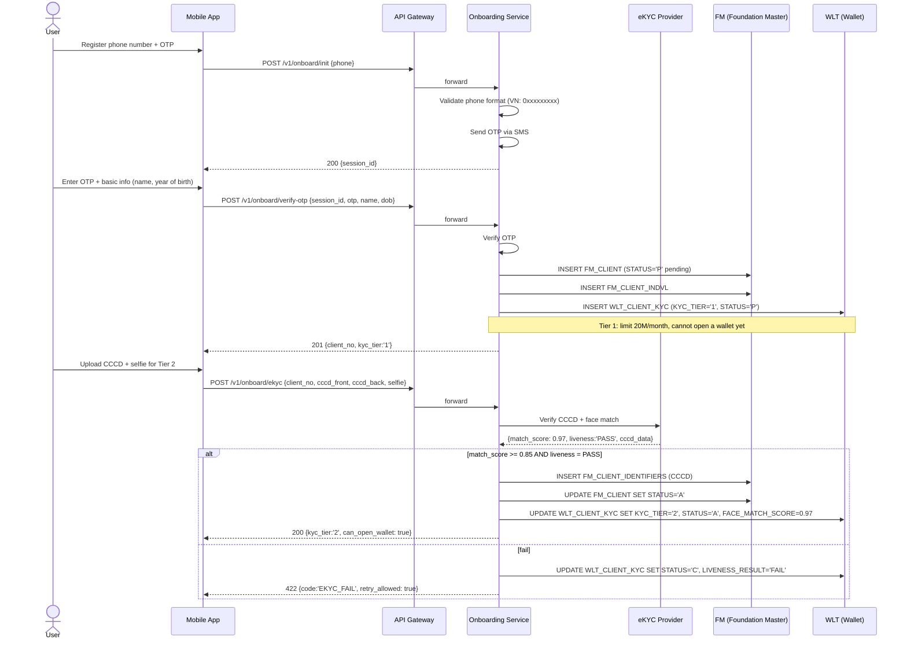
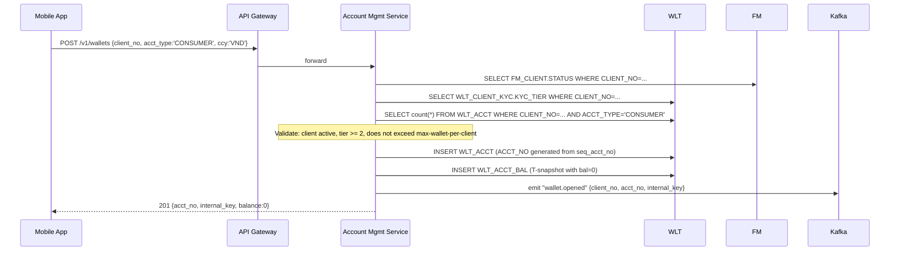

# Onboarding & Wallet Opening — Design

**Version**: 1.0
**Date**: 2026-05-28
**Status**: Draft
**Companion**: `wallet_HLD.md`, `wallet_DLD.md`, `wallet_seed.sql`

**Changelog**
- v1.0 (2026-05-28): Split out from the old scope (which was trimmed in DLD v1.2). Covers the BRD for individual customer onboarding + wallet opening flow, KYC tier rules, API spec, state machine.

---

## 1. Objectives & Scope

### 1.1 In scope
- **Client onboarding** for individuals (IND): create a profile in `FM_CLIENT`, identification, KYC
- **Wallet opening**: open a `WLT_ACCT` wallet for a customer who already has a `CLIENT_NO`
- **KYC tier upgrade**: upgrade/downgrade tier (1 → 2 → 3)
- **Status lifecycle**: client/wallet pending → active → blocked/closed

### 1.2 Out of scope
- Corporate clients (CORP) — later phase
- Periodic re-KYC (yearly) — later phase
- Joint account / authorized signatory
- Card issuance attached to a wallet

### 1.3 Stakeholders
| Stakeholder | Role |
|-------------|------|
| User | Registers via mobile app |
| eKYC provider (VNG/FPT/TS) | Verify CCCD (citizen ID) + liveness |
| Compliance | Approve tier 3, AML check |
| Operations | Manual review for cases that fail eKYC |

---

## 2. Concepts — Client vs Wallet

```
1 FM_CLIENT (CLIENT_NO)  ─┬─▶ N WLT_ACCT (INTERNAL_KEY, ACCT_NO)
                          ├─▶ 1 WLT_CLIENT_KYC (tier + eKYC info)
                          ├─▶ N FM_CLIENT_IDENTIFIERS (CCCD, passport)
                          └─▶ N FM_CLIENT_BANKS (linked bank accounts)
```

- **Client (`CLIENT_NO`)**: legal entity/individual, the **golden source** shared across wallet + lending + payment
- **Wallet (`ACCT_NO`)**: a transactional account; one customer may open multiple wallets (e.g., a main VND wallet, a savings wallet, a merchant wallet if the customer has a shop)
- **KYC tier**: attached to `CLIENT_NO` (1 customer = 1 tier), applied to **all wallets** of that customer

---

## 3. Onboarding flow — Individual customer (Tier 1 → Tier 2)

### 3.1 Sequence diagram



### 3.2 Steps mapping

| Step | Endpoint | Tables written | Status after step |
|------|----------|----------------|-------------------|
| 1. Init | `POST /v1/onboard/init` | (OTP cache) | – |
| 2. Verify OTP + basic info | `POST /v1/onboard/verify-otp` | `FM_CLIENT` (P), `FM_CLIENT_INDVL`, `WLT_CLIENT_KYC` (T1, P) | T1 pending |
| 3. eKYC | `POST /v1/onboard/ekyc` | `FM_CLIENT_IDENTIFIERS`, UPDATE `FM_CLIENT` (A), UPDATE `WLT_CLIENT_KYC` (T2, A) | T2 active |
| 4. (Tier 3) Bank linkage | `POST /v1/onboard/link-bank` | `FM_CLIENT_BANKS`, UPDATE `WLT_CLIENT_KYC` (T3) | T3 active |

---

## 4. Wallet opening flow

> Prerequisite: the customer already has a `CLIENT_NO` with `WLT_CLIENT_KYC.STATUS='A'` and `KYC_TIER >= '2'` (Tier 1 only has a profile, cannot open a wallet yet).

### 4.1 Sequence



### 4.2 ACCT_NO generation

Format: `9701` + 10-digit serial from `seq_acct_no`
- `9701` = example wallet BIN (must be registered with SBV/NAPAS in practice)
- 10 digits = monotonic serial, supports up to 10 billion wallets

Example: `9701` + `0000123456` → `97010000123456`

### 4.3 Wallet count rules per customer

| ACCT_TYPE | Max wallets / client | Reason |
|-----------|---------------------|--------|
| CONSUMER  | 3 (same CCY) | Prevent abuse via splitting to exceed limits |
| MERCHANT  | 10 | Each branch/POS has its own wallet |

---

## 5. KYC tier rules

| Tier | Eligibility conditions | Limit/month | Can open wallet? | Receive only? |
|------|------------------------|-------------|------------------|---------------|
| **0** | Initialized, no OTP yet | – | ❌ | ❌ |
| **1** | OTP + name + DOB | 20M VND | ❌ | ✅ (waiting for tier upgrade) |
| **2** | + CCCD eKYC + face match ≥ 0.85 + liveness PASS | 100M VND | ✅ | ✅ |
| **3** | + Linkage of ≥ 1 owned bank account + at least 1 transaction | Per signed customer contract | ✅ | ✅ |

### 5.1 eKYC pass criteria (Tier 2 gate)
- `FACE_MATCH_SCORE >= 0.85` (configured in the app, not hard-coded in DB)
- `LIVENESS_RESULT = 'PASS'`
- CCCD has not been used for another `CLIENT_NO` (unique on `FM_CLIENT_IDENTIFIERS.GLOBAL_ID`)
- CCCD has not expired (`EXPIRY_DATE > CURRENT_DATE`)

### 5.2 Tier downgrade
- Suspicious activity (AML/CFT) → manual downgrade to Tier 1, freeze all wallets
- Customer requests closure → soft-delete (`STATUS='C'`), wallets → `ACCT_STATUS='C'`

---

## 6. State machine

### 6.1 Client (`FM_CLIENT.STATUS` + `WLT_CLIENT_KYC.STATUS`)

```
       OTP only       eKYC pass           AML flag
  ┌───────┐  ────▶  ┌───────┐  ────▶  ┌───────┐  ────▶  ┌──────────┐
  │   P   │         │ T1/A  │         │ T2/A  │         │ BLOCKED  │
  └───────┘         └───────┘         └───────┘         └──────────┘
  (pending)         (active)          (active)          │
                                       │                ▼
                                       │  Customer    ┌──────────┐
                                       │  closes      │  CLOSED  │
                                       └──────────▶   └──────────┘
```

### 6.2 Wallet (`WLT_ACCT.ACCT_STATUS`)

| Code | Name | Transactable? | Transitions from | Transitions to |
|------|------|---------------|------------------|----------------|
| `A`  | Active | ✅ | `P` (auto upon successful opening) | `B`, `C` |
| `B`  | Blocked | ❌ DR, ✅ CR only | `A` | `A` (unblock), `C` |
| `C`  | Closed | ❌ | `A`, `B` | (terminal) |
| `P`  | Pending | ❌ | (initial) | `A` |

Transitioning `A → C` is only allowed when `ACTUAL_BAL = 0` and there is no active restraint.

---

## 7. API specifications

### 7.1 POST /v1/onboard/init
```json
Request:
{ "phone": "0901234567", "device_id": "ABC-XYZ" }

Response 200:
{ "session_id": "sess_abc123", "otp_expires_in": 180 }

Error 400: { "code": "INVALID_PHONE_FORMAT" }
Error 429: { "code": "OTP_RATE_LIMITED", "retry_after_sec": 60 }
```

### 7.2 POST /v1/onboard/verify-otp
```json
Request:
{ "session_id": "sess_abc123", "otp": "482931",
  "name": "NGUYEN VAN A", "dob": "1990-05-15" }

Response 201:
{ "client_no": "C0000001234", "kyc_tier": "1",
  "status": "A", "can_open_wallet": false }

Error 401: { "code": "OTP_INVALID" }
Error 410: { "code": "OTP_EXPIRED" }
```

### 7.3 POST /v1/onboard/ekyc
```json
Request (multipart):
{ "client_no": "C0000001234",
  "cccd_front": <file>, "cccd_back": <file>, "selfie": <file> }

Response 200:
{ "kyc_tier": "2", "status": "A",
  "face_match_score": 0.97, "liveness": "PASS",
  "can_open_wallet": true }

Error 422: { "code": "EKYC_FAIL_LOW_SCORE", "score": 0.62 }
Error 409: { "code": "CCCD_ALREADY_USED", "existing_client": "C0000000999" }
```

### 7.4 POST /v1/wallets
```json
Request:
{ "client_no": "C0000001234", "acct_type": "CONSUMER", "ccy": "VND" }

Response 201:
{ "acct_no": "97010000123456",
  "internal_key": 5001,
  "balance": 0,
  "ccy": "VND",
  "status": "A",
  "opened_at": "2026-05-28T10:23:45+07:00" }

Error 403: { "code": "KYC_TIER_INSUFFICIENT", "current_tier": "1", "required": "2" }
Error 409: { "code": "MAX_WALLET_PER_CLIENT_EXCEEDED", "current_count": 3, "max": 3 }
Error 423: { "code": "CLIENT_BLOCKED" }
```

---

## 8. Business rules / Validations

| ID | Rule | Mechanism |
|----|------|-----------|
| BR-01 | One phone number maps to only one active `CLIENT_NO` | UNIQUE constraint on `WLT_CLIENT_KYC.PHONE_NO` |
| BR-02 | One CCCD belongs to only one active `CLIENT_NO` | UNIQUE check in the app (FM_CLIENT_IDENTIFIERS has a composite PK; the app must validate the active scope) |
| BR-03 | Customer under 15 years old → reject (Vietnamese law) | App checks `DOB`; DB does not enforce |
| BR-04 | Customer ≥ 70 years old → flag for additional review | App checks, no hard reject |
| BR-05 | Opening a wallet requires `KYC_TIER >= '2'` | App checks before INSERT into `WLT_ACCT` |
| BR-06 | Max wallets/client by `ACCT_TYPE` (§4.3) | App checks before INSERT |
| BR-07 | Closing a wallet requires `ACTUAL_BAL = 0` AND no active restraint | App check + optional DB check constraint |
| BR-08 | eKYC score < 0.85 → 1 retry; after 3 failures → manual review | Counter in app/Redis |
| BR-09 | OTP is 6 digits, expires in 3 minutes, max 5 resends/hour | Rate limit at the gateway |
| BR-10 | CCCD must still be valid (`EXPIRY_DATE > CURRENT_DATE`) | Validated at the eKYC step |

---

## 9. Error handling

| HTTP | Code | Scenario | Caller action |
|------|------|----------|---------------|
| 400 | INVALID_PHONE_FORMAT | Phone number does not match VN format | Validate again |
| 401 | OTP_INVALID | Wrong OTP | Allow retry, count attempts |
| 410 | OTP_EXPIRED | OTP older than 3 minutes | Resend |
| 409 | PHONE_ALREADY_REGISTERED | Phone number already has an active client | Log in instead of registering |
| 409 | CCCD_ALREADY_USED | CCCD overlaps with another client | Contact customer service |
| 422 | EKYC_FAIL_LOW_SCORE | Face match < 0.85 | Retry with a clearer photo |
| 422 | EKYC_LIVENESS_FAIL | Liveness FAIL (anti-spoof) | Retry; after 3 failures → manual |
| 422 | CCCD_EXPIRED | CCCD expired | Update the ID document |
| 403 | KYC_TIER_INSUFFICIENT | Tier too low for the action | Upgrade tier first |
| 423 | CLIENT_BLOCKED | Customer is blocked (AML) | Contact operations |
| 429 | OTP_RATE_LIMITED | OTP spamming | Wait for cooldown |

---

## 10. Acceptance criteria

| AC | Scenario | Expected |
|----|----------|----------|
| AC-01 | Valid new registration → Tier 1 | `FM_CLIENT.STATUS='A'`, `WLT_CLIENT_KYC.KYC_TIER='1'` |
| AC-02 | eKYC pass → Tier 2 | Update 3 tables atomically; can_open_wallet=true |
| AC-03 | eKYC liveness fail → reject, no upgrade to Tier 2 | `LIVENESS_RESULT='FAIL'`, no `FM_CLIENT_IDENTIFIERS` row created |
| AC-04 | Open wallet at Tier=1 → 403 | No `WLT_ACCT` row generated |
| AC-05 | Open wallet correctly → has a `WLT_ACCT` row + 1 `WLT_ACCT_BAL` snapshot row with bal=0 | INSERT into 2 tables atomically; emit "wallet.opened" Kafka event |
| AC-06 | 2 concurrent open-wallet requests for the same customer → at most 1 exceeds the limit | Validation in app + check `count(*)` within the tx |
| AC-07 | CCCD overlaps with another customer → 409 | App rejects; no UPDATE/INSERT |
| AC-08 | Close wallet when balance > 0 → 422 | Not allowed |

---

## 11. Table mapping

| Step | Table | Action | When |
|------|-------|--------|------|
| Verify OTP | `FM_CLIENT` | INSERT | New registration |
| Verify OTP | `FM_CLIENT_INDVL` | INSERT | Individual customer |
| Verify OTP | `WLT_CLIENT_KYC` | INSERT (T1) | Every new customer |
| eKYC pass | `FM_CLIENT_IDENTIFIERS` | INSERT (CCCD) | Tier 2 |
| eKYC pass | `FM_CLIENT` | UPDATE STATUS='A' | Tier 2 |
| eKYC pass | `WLT_CLIENT_KYC` | UPDATE KYC_TIER='2' | Tier 2 |
| Link bank | `FM_CLIENT_BANKS` | INSERT | Tier 3 |
| Link bank | `WLT_CLIENT_KYC` | UPDATE KYC_TIER='3' | Tier 3 |
| Open wallet | `WLT_ACCT` | INSERT | After Tier ≥ 2 |
| Open wallet | `WLT_ACCT_BAL` | INSERT (snapshot bal=0) | Same tx |
| Block wallet | `WLT_ACCT` | UPDATE ACCT_STATUS='B' | Ops/AML |
| Close wallet | `WLT_ACCT` | UPDATE ACCT_STATUS='C' | Customer request, bal=0 |

---

## 12. Implementation reference

SQL helper functions for **test/seed** (not a production code path):
- `fn_create_client()` — create a client + basic KYC tier 1
- `fn_open_wallet()` — open a wallet with an initial balance
- Bulk generator of 100K wallets for load testing

See `wallet_seed.sql` §3, §4.

> **Production**: the onboarding service is written in Java/Spring Boot (HLD §9 tech stack), and calls the Posting Engine for creating the opening GL entry. The SQL functions in `wallet_seed.sql` are for test data only and **must not** be used by production endpoints.

---

## 13. Open items / TODO

- [ ] Periodic re-KYC process (12 months): automatically ping the customer to update CCCD if it is about to expire?
- [ ] Corporate onboarding (CORP) — schema `FM_CLIENT.CLIENT_TYPE='CORP'`, missing tables for legal representatives/UBO
- [ ] Joint wallet / authorized signatory — design not yet available
- [ ] At which step is AML scoring integrated? Real-time at eKYC or daily batch?
- [ ] CIC (Credit Information Center) linkage for tier 3?
- [ ] PEP (Politically Exposed Person) check — manual or automated?
