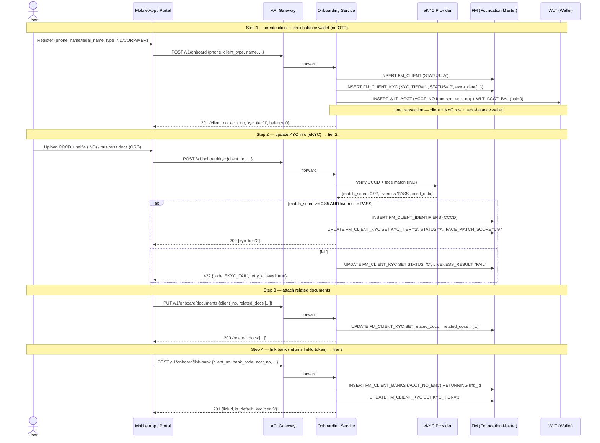

# Onboarding & Wallet Opening — Design

**Version**: 1.1
**Date**: 2026-05-31
**Status**: Draft
**Companion**: `wallet_HLD.md`, `wallet_DLD.md`, `wallet_seed.sql`

**Changelog**
- v1.1 (2026-05-31): **Removed OTP** from registration. Reworked onboarding into a **4-step workflow** (create client + zero-balance wallet → update KYC → attach related documents → link bank with a `linkId` token). **Centralized KYC** for individuals **and** organizations into one `FM_CLIENT_KYC` table (renamed from `WLT_CLIENT_KYC`, US-9.16) with a JSONB `extra_data` key-value bag — `FM_CLIENT_INDVL` folds in (US-1.15). Corporate/organization onboarding is now in scope.
- v1.0 (2026-05-28): Split out from the old scope (which was trimmed in DLD v1.2). Covers the BRD for individual customer onboarding + wallet opening flow, KYC tier rules, API spec, state machine.

---

## 1. Objectives & Scope

### 1.1 In scope
- **Client onboarding** for individuals (IND) **and** organizations (CORP / MER): create a profile in `FM_CLIENT`, capture KYC in `FM_CLIENT_KYC`
- **Combined create**: one step creates the client **and** opens a zero-balance `WLT_ACCT` wallet
- **KYC tier upgrade**: update KYC info / eKYC to raise the tier (1 → 2 → 3)
- **Related documents**: attach / update document links (CCCD images, business licence, UBO proofs)
- **Bank linkage**: link an owned bank account; the link returns a `linkId` token
- **Status lifecycle**: client / wallet pending → active → blocked / closed

### 1.2 Out of scope
- One-time-password (OTP) verification — **removed** from registration (v1.1); phone capture stays, phone *verification* is a gateway/channel concern, not part of this flow
- Periodic re-KYC (yearly) — later phase
- Joint account / authorized signatory
- Card issuance attached to a wallet

### 1.3 Stakeholders
| Stakeholder | Role |
|-------------|------|
| User | Registers via mobile app (individual) |
| Organization | Registers via ops / portal (CORP / MER) |
| eKYC provider (VNG/FPT/TS) | Verify CCCD (citizen ID) + liveness |
| Compliance | Approve tier 3, AML check, UBO review |
| Operations | Manual review for cases that fail eKYC |

---

## 2. Concepts — Client vs Wallet vs KYC

```
1 FM_CLIENT (CLIENT_NO)  ─┬─▶ N WLT_ACCT (INTERNAL_KEY, ACCT_NO)
                          ├─▶ 1 FM_CLIENT_KYC (tier + eKYC + extra_data JSONB + related_docs JSONB)
                          ├─▶ N FM_CLIENT_IDENTIFIERS (CCCD, passport)
                          └─▶ N FM_CLIENT_BANKS (linked bank accounts, linkId token)
```

- **Client (`CLIENT_NO`)**: legal entity / individual, the **golden source** shared across wallet + lending + payment
- **Wallet (`ACCT_NO`)**: a transactional account; one customer may open multiple wallets (e.g., a main VND wallet, a savings wallet, a merchant wallet if the customer has a shop)
- **KYC (`FM_CLIENT_KYC`)**: attached to `CLIENT_NO` (1 customer = 1 KYC row), applied to **all wallets** of that customer

### 2.1 Centralized KYC — one table for IND & ORG (US-1.15)

KYC for **every** client type lives in a single `FM_CLIENT_KYC` row. Common columns are
typed; **type-specific** attributes go into a JSONB `extra_data` key-value bag, so there
is **no per-type child table** (`FM_CLIENT_INDVL` folds in here).

| Column | Notes |
|--------|-------|
| `kyc_id` (PK), `client_no` (FK → `FM_CLIENT`) | one KYC row per client |
| `phone_no_enc`, `phone_no_hash`, `email_enc` | PII via pgcrypto (cf. US-8.4); hash is the lookup/uniqueness key |
| `kyc_tier` (`0`–`3`), `status` (`A/B/C/P`), `risk_level` | tier + lifecycle |
| `ekyc_provider`, `ekyc_ref`, `face_match_score`, `liveness_result`, `verified_at`, `verified_by` | eKYC result (tier 2) |
| **`extra_data` JSONB** | type-specific key-value attributes (below) |
| **`related_docs` JSONB** | array of document links (replaces scalar `doc_url`) — §2.3 |
| audit cols (`created_at/by`, `updated_at/by`, `channel`) | populated by the audit trigger |

**`extra_data` keys by client type:**

| Type | Keys folded into `extra_data` |
|------|-------------------------------|
| **IND** (from `FM_CLIENT_INDVL`) | `surname`, `given_name`, `birth_date`, `sex`, `resident_status`, `marital_status`, `occupation_code` |
| **ORG** (CORP / MER) | `legal_name`, `business_reg_no`, `incorporation_date`, `industry_code`, `tax_id`, `legal_rep` `{name, id_no}`, `ubo` `[{name, id_no, pct}]` |

> Common, queryable, or constraint-bearing fields stay as real columns; `extra_data`
> is for the long tail of type-specific attributes. The rename `WLT_CLIENT_KYC` →
> `FM_CLIENT_KYC` is tracked in **US-9.16** (do the rename + the `extra_data`
> centralization in one migration).

### 2.2 Bank linkage — the `linkId` token (US-1.14)

Linking a bank account inserts a `FM_CLIENT_BANKS` row and returns its identity
`link_id` as an **opaque `linkId` token**. The client uses this token to reference the
linked bank (e.g., to set it as default) without ever handling the raw account number —
the bank account number is stored encrypted (`ACCT_NO_ENC`, pgcrypto) and never returned.

### 2.3 Related documents — `related_docs` JSONB (US-1.13)

The single scalar `doc_url` is replaced by a `related_docs` JSONB array so a client can
carry many documents:

```json
"related_docs": [
  { "doc_type": "CCCD_FRONT",   "link": "s3://kyc/C0000001234/cccd_front.jpg", "status": "VERIFIED", "uploaded_at": "2026-05-31T10:02:00+07:00" },
  { "doc_type": "BUSINESS_LICENCE", "link": "s3://kyc/...", "status": "PENDING", "uploaded_at": "..." }
]
```

`link` is an object-store URL / handle (the file bytes are **not** stored in the DB).

---

## 3. Onboarding flow — 4-step workflow (OTP-free)

### 3.1 Sequence diagram



### 3.2 Steps mapping

| Step | Endpoint | Tables written | Status after step |
|------|----------|----------------|-------------------|
| 1. Create client + wallet | `POST /v1/onboard` | `FM_CLIENT` (A), `FM_CLIENT_KYC` (T1, P), `WLT_ACCT` + `WLT_ACCT_BAL` (bal=0) | T1, wallet open (0 balance) |
| 2. Update KYC (eKYC) | `POST /v1/onboard/kyc` | `FM_CLIENT_IDENTIFIERS`, UPDATE `FM_CLIENT_KYC` (T2, A) | T2 active |
| 3. Related documents | `PUT /v1/onboard/documents` | UPDATE `FM_CLIENT_KYC.related_docs` | docs attached |
| 4. Link bank | `POST /v1/onboard/link-bank` | `FM_CLIENT_BANKS` (→ `linkId`), UPDATE `FM_CLIENT_KYC` (T3) | T3 active |

> **Implemented today (client API, outside the onboarding wrapper):** the building
> blocks of step 1 exist separately — `create_client` (`POST /v1/clients`, US-1.8) and
> `open_account` (`POST /v1/accounts`, US-1.3) — but no single `/v1/onboard` call chains
> them in one TX (US-1.1). Step 4's primitive is live: `POST /v1/clients/:client_no/banks`
> (SP `link_client_bank`, encrypts `acct_no` → `ACCT_NO_ENC`, returns `link_id`; `is_default`
> flag) and `PUT /v1/clients/:client_no/banks/:link_id/default` (SP `set_default_client_bank`).
> Both are audited into `FM_CLIENT_AUDIT_LOG` via `trg_audit_fm_client_bk`. The onboarding
> wrappers (`/v1/onboard/*`, with KYC-tier side effects) are still pending.

---

## 4. Wallet opening (folded into step 1)

> In the OTP-free flow, the **first wallet is opened in step 1** alongside client
> creation (zero balance). This section documents the wallet rules; a customer can open
> **additional** wallets later via the same `open_account` primitive.

### 4.1 ACCT_NO generation

Format: `9701` + 10-digit serial from `seq_acct_no`
- `9701` = example wallet BIN (must be registered with SBV/NAPAS in practice)
- 10 digits = monotonic serial, supports up to 10 billion wallets

Example: `9701` + `0000123456` → `97010000123456`

### 4.2 Wallet count rules per customer

| ACCT_TYPE | Max wallets / client | Reason |
|-----------|---------------------|--------|
| CONSUMER  | 3 (same CCY) | Prevent abuse via splitting to exceed limits |
| MERCHANT  | 10 | Each branch/POS has its own wallet |

Enforced in `open_account` → `MAX_WALLET_PER_CLIENT_EXCEEDED` (409).

---

## 5. KYC tier rules

| Tier | Eligibility conditions | Limit/month | Can transact? |
|------|------------------------|-------------|---------------|
| **1** | Registered (basic identity, **no OTP**) — created in step 1 | 20M VND | Receive only |
| **2** | + CCCD eKYC + face match ≥ 0.85 + liveness PASS (IND) / verified business docs (ORG) | 100M VND | ✅ |
| **3** | + Linkage of ≥ 1 owned bank account (`linkId`) + at least 1 transaction | Per signed customer contract | ✅ |

> Tier **0** (initialized, no profile) is retired — there is no pre-registration
> placeholder now that OTP is gone; the client row is created directly at **tier 1**.

### 5.1 eKYC pass criteria (Tier 2 gate, individuals)
- `FACE_MATCH_SCORE >= 0.85` (configured in the app, not hard-coded in DB)
- `LIVENESS_RESULT = 'PASS'`
- CCCD has not been used for another `CLIENT_NO` (unique on `FM_CLIENT_IDENTIFIERS.GLOBAL_ID`)
- CCCD has not expired (`EXPIRY_DATE > CURRENT_DATE`)

For **organizations**, the tier-2 gate is verified business documents (business licence,
legal-rep ID) captured in `extra_data` + `related_docs` and reviewed by compliance.

### 5.2 Tier downgrade
- Suspicious activity (AML/CFT) → manual downgrade to Tier 1, freeze all wallets
- Customer requests closure → soft-delete (`STATUS='C'`), wallets → `ACCT_STATUS='C'`

---

## 6. State machine

### 6.1 Client (`FM_CLIENT.STATUS` + `FM_CLIENT_KYC.STATUS`)

```
   create (step 1)    eKYC pass (step 2)       AML flag
  ┌───────┐  ────▶  ┌───────┐  ────▶  ┌───────┐  ────▶  ┌──────────┐
  │ T1/P  │         │ T1/A  │         │ T2/A  │         │ BLOCKED  │
  └───────┘         └───────┘         └───────┘         └──────────┘
  (pending KYC)     (active)          (active)          │
                                       │                ▼
                                       │  Customer    ┌──────────┐
                                       │  closes      │  CLOSED  │
                                       └──────────▶   └──────────┘
```

### 6.2 Wallet (`WLT_ACCT.ACCT_STATUS`)

| Code | Name | Transactable? | Transitions from | Transitions to |
|------|------|---------------|------------------|----------------|
| `A`  | Active | ✅ | `P` (auto upon successful opening) | `B`, `C` |
| `B`  | Blocked | ❌ DR, ✅ CR only | `A` | `A` (unblock), `C` |
| `C`  | Closed | ❌ | `A`, `B` | (terminal) |
| `P`  | Pending | ❌ | (initial) | `A` |

Transitioning `A → C` is only allowed when `ACTUAL_BAL = 0` and there is no active restraint.

---

## 7. API specifications

### 7.1 POST /v1/onboard — create client + zero-balance wallet (step 1)
```json
Request:
{ "client_type": "IND", "name": "NGUYEN VAN A",
  "phone": "0901234567", "email": "a@example.com",
  "ccy": "VND", "acct_type": "CONSUMER",
  "extra_data": { "birth_date": "1990-05-15", "sex": "M" } }

Response 201:
{ "client_no": "C0000001234",
  "acct_no": "97010000123456",
  "internal_key": 5001,
  "kyc_tier": "1", "status": "P",
  "balance": 0, "ccy": "VND" }

Error 400: { "code": "INVALID_PHONE_FORMAT" }
Error 409: { "code": "PHONE_ALREADY_REGISTERED" }
Error 422: { "code": "INVALID_CLIENT_TYPE" }
```

> For an organization: `"client_type": "CORP"` (or `"MER"`) with
> `extra_data: { "business_reg_no": "...", "legal_rep": {...}, "ubo": [...] }`.

### 7.2 POST /v1/onboard/kyc — update KYC / eKYC (step 2)
```json
Request (multipart, IND):
{ "client_no": "C0000001234",
  "cccd_front": <file>, "cccd_back": <file>, "selfie": <file> }

Response 200:
{ "kyc_tier": "2", "status": "A",
  "face_match_score": 0.97, "liveness": "PASS" }

Error 422: { "code": "EKYC_FAIL_LOW_SCORE", "score": 0.62 }
Error 409: { "code": "CCCD_ALREADY_USED", "existing_client": "C0000000999" }
```

### 7.3 PUT /v1/onboard/documents — attach related documents (step 3)
```json
Request:
{ "client_no": "C0000001234",
  "related_docs": [
    { "doc_type": "CCCD_FRONT", "link": "s3://kyc/.../cccd_front.jpg" },
    { "doc_type": "SELFIE",     "link": "s3://kyc/.../selfie.jpg" }
  ] }

Response 200:
{ "client_no": "C0000001234",
  "related_docs": [ { "doc_type": "CCCD_FRONT", "link": "...", "status": "PENDING", "uploaded_at": "..." }, ... ] }
```

### 7.4 POST /v1/onboard/link-bank — link bank, returns linkId token (step 4)
```json
Request:
{ "client_no": "C0000001234", "bank_code": "970418",
  "acct_no": "0123456789", "acct_holder_name": "NGUYEN VAN A",
  "is_default": true }

Response 201:
{ "linkId": 88001, "client_no": "C0000001234",
  "is_default": 1, "status": "A", "kyc_tier": "3" }

Error 404: { "code": "CLIENT_NOT_FOUND" }
Error 400: { "code": "INVALID_REQUEST", "detail": "bank_code required" }
```

> `linkId` is the opaque token the client uses to reference the linked bank
> (e.g. `PUT /v1/onboard/link-bank/{linkId}/default`). The raw `acct_no` is
> encrypted (`ACCT_NO_ENC`) and never returned.

### 7.5 POST /v1/wallets — open an additional wallet
```json
Request:
{ "client_no": "C0000001234", "acct_type": "CONSUMER", "ccy": "VND" }

Response 201:
{ "acct_no": "97010000123457", "internal_key": 5002,
  "balance": 0, "ccy": "VND", "status": "A" }

Error 403: { "code": "KYC_TIER_INSUFFICIENT", "current_tier": "1", "required": "2" }
Error 409: { "code": "MAX_WALLET_PER_CLIENT_EXCEEDED", "current_count": 3, "max": 3 }
Error 423: { "code": "CLIENT_BLOCKED" }
```

---

## 8. Business rules / Validations

| ID | Rule | Mechanism |
|----|------|-----------|
| BR-01 | One phone number maps to only one active `CLIENT_NO` | UNIQUE on `FM_CLIENT_KYC.PHONE_NO_HASH` |
| BR-02 | One CCCD belongs to only one active `CLIENT_NO` | UNIQUE check in the app (`FM_CLIENT_IDENTIFIERS` has a composite PK; the app validates the active scope) |
| BR-03 | Individual under 15 years old → reject (Vietnamese law) | App checks `extra_data.birth_date`; DB does not enforce |
| BR-04 | Individual ≥ 70 years old → flag for additional review | App checks, no hard reject |
| BR-05 | The **first** wallet is opened in step 1 at tier 1; **additional** wallets require `KYC_TIER >= '2'` | App / `open_account` check |
| BR-06 | Max wallets/client by `ACCT_TYPE` (§4.2) | `open_account` check |
| BR-07 | Closing a wallet requires `ACTUAL_BAL = 0` AND no active restraint | App check + DB check |
| BR-08 | eKYC score < 0.85 → 1 retry; after 3 failures → manual review | Counter in app/Redis |
| BR-09 | Organization onboarding requires `extra_data.business_reg_no` + ≥ 1 `legal_rep` | App validates the ORG payload |
| BR-10 | CCCD must still be valid (`EXPIRY_DATE > CURRENT_DATE`) | Validated at the eKYC step |

---

## 9. Error handling

| HTTP | Code | Scenario | Caller action |
|------|------|----------|---------------|
| 400 | INVALID_PHONE_FORMAT | Phone number does not match VN format | Validate again |
| 422 | INVALID_CLIENT_TYPE | `client_type` not IND/CORP/MER | Fix the request |
| 409 | PHONE_ALREADY_REGISTERED | Phone number already has an active client | Log in instead of registering |
| 409 | CCCD_ALREADY_USED | CCCD overlaps with another client | Contact customer service |
| 422 | EKYC_FAIL_LOW_SCORE | Face match < 0.85 | Retry with a clearer photo |
| 422 | EKYC_LIVENESS_FAIL | Liveness FAIL (anti-spoof) | Retry; after 3 failures → manual |
| 422 | CCCD_EXPIRED | CCCD expired | Update the ID document |
| 403 | KYC_TIER_INSUFFICIENT | Tier too low for the action | Raise tier first |
| 404 | CLIENT_NOT_FOUND | `client_no` unknown (link-bank/documents) | Check the client_no |
| 423 | CLIENT_BLOCKED | Customer is blocked (AML) | Contact operations |

---

## 10. Acceptance criteria

| AC | Scenario | Expected |
|----|----------|----------|
| AC-01 | Valid new registration (step 1) | `FM_CLIENT.STATUS='A'`, `FM_CLIENT_KYC.KYC_TIER='1'`, **one `WLT_ACCT` + one `WLT_ACCT_BAL` (bal=0)** created in the same TX |
| AC-02 | eKYC pass (step 2) → Tier 2 | Update KYC + INSERT identifier atomically |
| AC-03 | eKYC liveness fail → reject, no upgrade to Tier 2 | `LIVENESS_RESULT='FAIL'`, no `FM_CLIENT_IDENTIFIERS` row created |
| AC-04 | Attach documents (step 3) | `FM_CLIENT_KYC.related_docs` JSONB grows; existing entries preserved |
| AC-05 | Link bank (step 4) | `FM_CLIENT_BANKS` row created; response returns `linkId`; `KYC_TIER='3'` |
| AC-06 | 2 concurrent open-wallet requests for the same customer → at most 1 exceeds the limit | `count(*)` check within the tx |
| AC-07 | CCCD overlaps with another customer → 409 | App rejects; no UPDATE/INSERT |
| AC-08 | Organization onboarding without `business_reg_no` → 422 | Rejected (BR-09) |
| AC-09 | No OTP endpoint exists | `/v1/onboard/init` and `/v1/onboard/verify-otp` are **removed** |

---

## 11. Table mapping

| Step | Table | Action | When |
|------|-------|--------|------|
| Create (step 1) | `FM_CLIENT` | INSERT | New registration |
| Create (step 1) | `FM_CLIENT_KYC` | INSERT (T1, `extra_data` per type) | Every new customer |
| Create (step 1) | `WLT_ACCT` | INSERT | Same TX (first wallet) |
| Create (step 1) | `WLT_ACCT_BAL` | INSERT (snapshot bal=0) | Same TX |
| Update KYC (step 2) | `FM_CLIENT_IDENTIFIERS` | INSERT (CCCD) | Tier 2 |
| Update KYC (step 2) | `FM_CLIENT_KYC` | UPDATE KYC_TIER='2' | Tier 2 |
| Documents (step 3) | `FM_CLIENT_KYC` | UPDATE `related_docs` JSONB | Any time after step 1 |
| Link bank (step 4) | `FM_CLIENT_BANKS` | INSERT (→ `linkId`) | Tier 3 |
| Link bank (step 4) | `FM_CLIENT_KYC` | UPDATE KYC_TIER='3' | Tier 3 |
| Open more wallets | `WLT_ACCT` + `WLT_ACCT_BAL` | INSERT | After Tier ≥ 2 |
| Block wallet | `WLT_ACCT` | UPDATE ACCT_STATUS='B' | Ops/AML |
| Close wallet | `WLT_ACCT` | UPDATE ACCT_STATUS='C' | Customer request, bal=0 |

---

## 12. Implementation reference

SQL helper functions for **test/seed** (not a production code path):
- `fn_create_client()` — create a client + basic KYC tier 1
- `fn_open_wallet()` — open a wallet with an initial balance
- Bulk generator of 100K wallets for load testing

See `wallet_seed.sql` §3, §4.

> **Production**: the onboarding service is written in Java/Spring Boot (HLD §9 tech stack), and calls the Posting Engine for creating the opening GL entry. The SQL functions in `wallet_seed.sql` are for test data only and **must not** be used by production endpoints.

---

## 13. Open items / TODO

- [ ] `FM_CLIENT_KYC` rename + `extra_data`/`related_docs` JSONB migration (US-9.16 + US-1.15) — sequence in one migration
- [ ] Combined `POST /v1/onboard` SP/endpoint chaining client + KYC + wallet in one TX (US-1.1)
- [ ] Periodic re-KYC process (12 months): auto-ping the customer to update CCCD if it is about to expire (US-1.6)
- [ ] Organization onboarding payload + UBO capture in `extra_data`, compliance review path (US-1.7)
- [ ] Joint wallet / authorized signatory — design not yet available
- [ ] At which step is AML scoring integrated? Real-time at eKYC or daily batch?
- [ ] CIC (Credit Information Center) linkage for tier 3?
- [ ] PEP (Politically Exposed Person) check — manual or automated?
